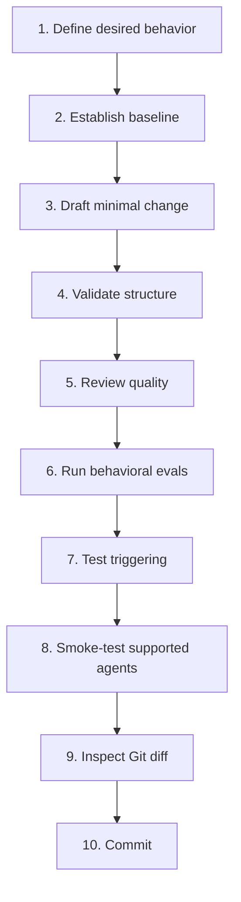

# Agent Skills

> **Portable, testable Agent Skills with an evidence-driven authoring workflow.**

This repository contains reusable [Agent Skills](https://agentskills.io/) for AI coding agents like Claude Code, Cursor, Codex, and others.

It also contains the local tooling used to create, modify, validate, and evaluate them.

The repository follows one core rule:

> [!IMPORTANT]
> **Edit the canonical skill under [`skills/`](./skills/) — never an installed copy under `.agents/skills/` or `.claude/skills/`.**
> Those agent-facing directories are generated local development state and may be deleted and recreated at any time.

## Available Skills

* **[committing-to-git](https://github.com/Hadden-Industries/agent-skills/tree/main/skills/committing-to-git/SKILL.md)**: Draft, review, create, verify, and optionally push Git commits from the current local workspace. Use when asked to draft or revise a commit message or commit current uncommitted changes. Also use when pushing a commit created by this workflow.

* **[defining-concepts](https://github.com/Hadden-Industries/agent-skills/tree/main/skills/defining-concepts/SKILL.md)**: Generates strictly ISO/IEC 11179-4 compliant concept definitions from a designation. It features advanced etymological analysis, worldwide vocabulary reuse checking, and strict ontological category error prevention.

* **[reading-epubs](https://github.com/Hadden-Industries/agent-skills/tree/main/skills/reading-epubs/SKILL.md)**: Convert and read EPUB ebook files through a deterministic Pandoc-to-Markdown workflow. Use whenever an input or referenced file is EPUB, has an .epub extension, or the user asks to inspect, search, quote, summarize, analyze, or extract content from an EPUB. Always use this workflow instead of treating EPUB as natively readable or relying on an agent/runtime EPUB preview.

## Installation

You can install these skills using the open skills CLI, which automatically detects your supported AI agents and places the files in the correct directories.

To install all skills in this repository, run:
```bash
npx skills add Hadden-Industries/agent-skills
```

To install only the e.g. Defining Concepts skill, run:
```bash
npx skills add Hadden-Industries/agent-skills --skill defining-concepts
```

## How It Works

These skills are built on the open [Agent Skills specification](https://agentskills.io/specification), and designed with industry best practices in mind e.g. [agentskills.io](https://agentskills.io/skill-creation/best-practices). They rely on a progressive disclosure model designed to protect your agent's context window. At startup, the agent only loads the skill's name and description. The full instructional body is only read into context when the agent explicitly decides the skill is relevant to your current prompt.

## For Developers

| I want to… | Go to |
|---|---|
| Set up a fresh clone | [Bootstrap the repository](#bootstrap-the-repository) |
| Create a new skill | [Create a new skill](#create-a-new-skill) |
| Change an existing skill | [Modify an existing skill](#modify-an-existing-skill) |
| Change code under a skill's `scripts/` directory | [Working on scripts inside a skill](#working-on-scripts-inside-a-skill) |
| Validate or evaluate a skill | [Validation and evaluation](#validation-and-evaluation) |
| Understand which tool to use | [Toolchain at a glance](#toolchain-at-a-glance) |
| Know when a change is finished | [Definition of done](#definition-of-done) |
| Refresh the local tooling | [Update the development environment](#update-the-development-environment) |
| Diagnose setup problems | [Troubleshooting](#troubleshooting) |

---

## Repository philosophy

A good Agent Skill is not merely valid Markdown. It should:

- **trigger for the right requests** and stay out of unrelated requests;
- produce **materially better behavior** than the agent without the skill;
- contain only the instructions needed at activation time;
- progressively load detailed references rather than spending context up front;
- use scripts for deterministic or repetitive work when that is better than generating code dynamically;
- remain portable across compatible Agent Skills hosts wherever practical;
- be testable against representative prompts and failure cases;
- make its dependencies, limitations, and expected outputs clear.

The workflow therefore separates three questions:

1. **Is the skill structurally valid?**
2. **Is the skill well designed?**
3. **Does the skill actually improve agent behavior?**

No single validator answers all three.


---

## Repository layout

This repository is structured so that compatible package managers and agents automatically crawl the root `skills/` directory to discover available capabilities.

The important paths are:

```text
agent-skills/
├── .gitattributes
├── .gitignore
├── LICENSE
├── README.md
├── skills-lock.json                     # Source for scripts/set_up_skill_engineering_profile.py — COMMITTED
│
├── skills/                              # Canonical skills — COMMITTED
│   ├── committing-to-git/
│   │   ├── SKILL.md
│   │   └── scripts/
│   │       ├── commit-message-validation.schema.json
│   │       └── validate-commit-message.mjs
│   ├── defining-concepts/
│   │   ├── SKILL.md
│   │   └── references/
│   │       └── judicial_plea_status_definition.md
│   ├── reading-epubs/
│   │   ├── SKILL.md
│   │   ├── evals/
│   │   │   ├── README.md                 # How to run both eval sets
│   │   │   ├── evals.json                # Behavioral evals
│   │   │   ├── trigger-evals.json        # Should/should-not-trigger prompts
│   │   │   └── fixtures/
│   │   │       └── sample.epub           # Generated by tests/helpers/epub.mjs
│   │   ├── references/
│   │   │   ├── conversion-troubleshooting.md
│   │   │   └── pandoc-installation.md
│   │   └── scripts/
│   │       ├── _pandoc.py
│   │       ├── _styles.py                # Derives Markdown semantics from the book's CSS
│   │       ├── check_pandoc.py
│   │       ├── clean_epub.lua
│   │       ├── conversion-result.schema.json
│   │       ├── convert_epub.py
│   │       └── pandoc-check.schema.json
│   └── ...
│
├── scripts/
│   └── set_up_skill_engineering_profile.py
│                                         # Development bootstrap — COMMITTED
│
├── tests/                                # Script contract tests — COMMITTED
│   ├── helpers/
│   │   ├── epub.mjs                      # EPUB fixture builder
│   │   ├── json-schema.mjs               # Dependency-free schema checker
│   │   └── json-schema.test.mjs
│   ├── committing-to-git/
│   │   └── validate-commit-message.test.mjs
│   └── reading-epubs/
│       ├── check-pandoc.test.mjs
│       ├── convert-epub.test.mjs
│       ├── eval-fixture.test.mjs
│       └── harness.mjs
│
├── .tessl-plugin/
│   └── plugin.json                       # Tessl package root — COMMITTED
│
├── .agents/
│   ├── skills/                           # Generated Codex/Antigravity skills
│   └── plugins/
│       └── marketplace.json              # Generated local plugin metadata
│
├── .claude/
│   └── skills/                           # Generated Claude Code skills
│
├── .agent-tools/                         # Generated local tooling
├── .venv/                                # Generated Python environment
└── plugins/
    └── plugin-eval                       # Generated link/junction
```

### Source versus generated state

| Path | Purpose | Commit? |
|---|---|:---:|
| `skills/` | Canonical skills maintained by this repository | **Yes** |
| `scripts/set_up_skill_engineering_profile.py` | Reproducible development bootstrap | **Yes** |
| `.tessl-plugin/plugin.json` | Tessl package root that makes `tessl skill lint` resolvable | **Yes** |
| `tests/` | Contract tests for skill scripts and their committed schemas | **Yes** |
| `.agents/skills/` | Local Codex/Antigravity authoring skills | No |
| `.claude/skills/` | Local Claude Code authoring skills | No |
| `.venv/` | Local `skills-ref` environment | No |
| `.agent-tools/` | Tessl, Plugin Eval checkout, and wrappers | No |
| `.agents/plugins/marketplace.json` | Generated local Plugin Eval metadata | No |
| `plugins/plugin-eval` | Generated Plugin Eval junction/symlink | No |

Generated paths belong in the repository's committed `.gitignore`. They should not rely on a developer-specific `.git/info/exclude`.

---

# Bootstrap the repository

## Prerequisites

The bootstrap expects:

- **Git**
- **Python 3.11 or newer**
- **Node.js 20 or newer**
- **npm / npx**

Check the basics:

```powershell
git --version
py --version
node --version
npm --version
npx --version
```

On macOS/Linux, use `python3` instead of `py` where appropriate.

## Run the bootstrap

From the repository root:

```powershell
py scripts\set_up_skill_engineering_profile.py
```

The script derives the repository root from its own location rather than trusting the shell's current working directory.

For an intentional fork or unusual worktree without the canonical repository remote:

```powershell
py scripts\set_up_skill_engineering_profile.py --allow-unverified-repo
```

> [!NOTE]
> The development toolchain deliberately follows **current upstream versions** rather than pinning them. Rerunning the bootstrap is both setup **and** update.

## What the bootstrap installs

The local authoring profile exposes these Agent Skills to Codex, Antigravity, and Claude Code:

| Skill | Role |
|---|---|
| `skill-creator` | Create, improve, benchmark, and optimize Agent Skills |
| `writing-skills` | Apply a test-driven methodology to skill authoring |
| `test-driven-development` | Supports the RED → GREEN → REFACTOR discipline used by `writing-skills` |
| `skill-check` | Additional static/semantic review for common skill-quality problems |
| `committing-to-git` | Produce disciplined commits after the work is verified |

The bootstrap also installs local evaluation tooling:

| Tool | Local entry point | Primary role |
|---|---|---|
| `skills-ref` | `.agent-tools/bin/skills-ref.cmd` | Official Agent Skills format validation |
| Tessl CLI | `.agent-tools/bin/tessl.cmd` | Independent lint of the plugin package (local); cloud review of skills (Tessl account required) |
| OpenAI Plugin Eval | `.agent-tools/bin/plugin-eval.cmd` | Codex-oriented analysis, token-budget analysis, and benchmarks |

On macOS/Linux, the generated wrappers omit the `.cmd` suffix.

## Verify setup

A successful run verifies that the expected authoring skills and local wrappers exist.

You can also validate a canonical skill directly:

```powershell
.\.agent-tools\bin\skills-ref.cmd validate .\skills\committing-to-git
```

---

# The golden workflow

Use this workflow for meaningful skill work.



The evaluation depth should be proportional to the change. A spelling fix does not need a benchmark suite; a change to triggering behavior or core workflow does.

---

# Create a new skill

## 1. Define the behavior before writing instructions

Be explicit about:

- **what problem the skill solves;**
- **when it should trigger;**
- **when it should not trigger;**
- what successful behavior looks like;
- what failure modes you are trying to prevent;
- whether deterministic work belongs in a script rather than prose instructions;
- what information belongs in `SKILL.md` versus lazily loaded references.

A useful skill should have a narrower purpose than “make the agent better at X”.

## 2. Establish a baseline

Before adding the skill, exercise representative prompts **without the skill**.

Capture:

- what the agent already does well;
- the specific mistakes, omissions, or inefficiencies the skill should correct;
- outputs that can be compared after the skill exists.

This prevents writing instructions for behavior the underlying agent already performs reliably.

For behavioral or discipline-oriented skills, include pressure cases where appropriate:

- time pressure;
- ambiguous requirements;
- competing instructions;
- tempting shortcuts;
- already-invested effort;
- incomplete evidence.

## 3. Create the canonical skill directory

Use a lowercase, hyphenated Agent Skills name:

```text
skills/
└── my-skill/
    └── SKILL.md
```

The official Agent Skills specification requires the `name` to use lowercase letters, numbers, and hyphens and to be no more than 64 characters.

A minimal `SKILL.md` starts with:

```markdown
---
name: my-skill
description: What the skill does and the concrete situations in which it should be used.
---

# My Skill

...
```

The `description` is not a summary alone. It is a key discovery signal, so state both **what the skill does** and **when to use it**.

## 4. Ask the agent to use the authoring skills

A useful starting prompt is:

```text
Use `skill-creator` and `writing-skills` to create the Agent Skill described
below under `skills/<skill-name>`.

Treat the Agent Skills specification as normative. Establish baseline behavior
without the skill before relying on the new instructions. Keep SKILL.md focused
and progressively disclose detailed material through references or scripts.
Create behavioral and triggering evaluations appropriate to the skill.

[Describe the required skill here.]
```

The installed authoring skills should guide the detailed workflow; avoid duplicating their entire instructions in this README.

## 5. Keep `SKILL.md` focused

The Agent Skills specification recommends:

- metadata of roughly **100 tokens**;
- activated `SKILL.md` instructions below roughly **5,000 tokens**;
- keeping `SKILL.md` under **500 lines**;
- loading supporting resources only when needed.

Prefer:

```text
my-skill/
├── SKILL.md
├── scripts/
│   └── deterministic_operation.py
├── references/
│   ├── detailed-rules.md
│   └── troubleshooting.md
└── assets/
    └── template.json
```

over putting every detail directly into `SKILL.md`.

### Use `references/` for

- detailed domain rules;
- long examples;
- edge-case catalogs;
- troubleshooting;
- schemas or protocols;
- material needed only for a subset of tasks.

### Use `scripts/` for

- deterministic transformations;
- validation;
- repeatable extraction or conversion;
- work where generating fresh code on every invocation is wasteful or risky.

Scripts should be self-contained where practical, document unavoidable dependencies, validate inputs, emit actionable errors, and fail clearly rather than silently producing questionable output.

## 6. Validate and evaluate

Continue with [Validation and evaluation](#validation-and-evaluation).

---

# Modify an existing skill

Changing an existing skill should be treated as a behavioral change, not merely a text-editing exercise.

## 1. Understand the current contract

Read:

```text
skills/<skill-name>/SKILL.md
```

and every referenced resource needed to understand the behavior you are changing.

Identify:

- the current trigger description;
- required workflow;
- MUST/SHOULD-style constraints;
- scripts or external dependencies;
- existing evals or examples;
- behavior that must remain unchanged.

## 2. Preserve a baseline

For meaningful changes, compare against the **old skill**, not against no skill at all.

Before editing, preserve the old version for evaluation—for example through Git or a temporary snapshot used by the evaluation workflow.

The question becomes:

> Does the proposed version outperform the currently committed version on the behavior this change is meant to improve **without regressing important existing behavior**?

## 3. Make the smallest change that solves the observed problem

Avoid opportunistically rewriting unrelated sections.

This improves:

- reviewability;
- attribution of behavioral changes;
- benchmark usefulness;
- rollback safety;
- confidence that a regression came from the intended change.

## 4. Re-run the appropriate evaluation depth

Use the [change-risk matrix](#change-risk-matrix) to decide how much evaluation is proportionate.

---

# Working on scripts inside a skill

A skill's `scripts/` directory is part of the shipped capability, so changes to scripts require ordinary software-engineering discipline **plus** skill-level evaluation.

For a script change:

1. understand how `SKILL.md` invokes the script;
2. add or update script-level tests where practical;
3. reproduce the pre-change failure or limitation;
4. implement the smallest fix;
5. run the script-level tests;
6. validate the containing Agent Skill;
7. run at least one end-to-end agent scenario that exercises the script;
8. verify that error output remains useful to an agent, not only to a human developer.

Prefer machine-readable output for machine-consumed results. Keep diagnostics separate where the script's calling convention benefits from clean stdout.

Do not move large deterministic programs into `SKILL.md` merely to avoid maintaining a script.

---

# Validation and evaluation

Validation is layered. Passing an earlier layer does not replace later layers.

## Layer 1 — normative Agent Skills validation

Run the reference validator first:

```powershell
$Skill = "my-skill"

.\.agent-tools\bin\skills-ref.cmd validate ".\skills\$Skill"
```

This checks the Agent Skills structure and frontmatter against the reference implementation.

**Passing `skills-ref` means the skill is structurally valid. It does not prove the skill is useful.**

## Layer 2 — independent lint and review

Tessl splits into a local half and an account-gated half. Know which is which before relying on either.

### Lint (local, no account)

Tessl lint operates on a **plugin package root**, not on an individual skill directory. This repository provides one at `.tessl-plugin/plugin.json`, so lint runs against the whole `skills/` tree at once and needs no Tessl account:

```powershell
.\.agent-tools\bin\tessl.cmd skill lint .
```

Passing a single skill path fails with `Not a Tessl plugin: no .tessl-plugin/plugin.json or tile.json found in the package root`. That is the expected result of pointing lint below the package root, not a broken install.

### Review (cloud, account required)

`tessl skill review` is deprecated. The current command runs an asynchronous review on Tessl's servers, so it requires a Tessl account, an authenticated session, and a workspace:

```powershell
.\.agent-tools\bin\tessl.cmd login
.\.agent-tools\bin\tessl.cmd review run ".\skills\$Skill"
```

Without `tessl login` the command exits with `Skill review requires you to be logged in`. The bootstrap deliberately does not authenticate, so this layer is optional; skipping it leaves Layers 1, 3 and 4 intact.

Treat automated recommendations as review input, not unquestionable truth. In particular, do not let an external optimizer silently rewrite a carefully designed behavioral contract. If deliberately using Tessl's fix mode, inspect every resulting diff:

```powershell
.\.agent-tools\bin\tessl.cmd review fix ".\skills\$Skill"
```

## Layer 3 — `skill-check`

Ask an agent with the repository's authoring profile loaded to review the canonical skill using `skill-check`.

Use it as a second-opinion static/semantic review for issues such as:

- vague WHAT/WHEN descriptions;
- ambiguous instructions;
- stale or brittle assumptions;
- oversized `SKILL.md`;
- hollow sections;
- naming or structure problems;
- contradictory or unsafe guidance.

Do not substitute it for behavioral evaluation.

## Layer 4 — OpenAI Plugin Eval

For Codex-oriented static analysis:

```powershell
.\.agent-tools\bin\plugin-eval.cmd analyze ".\skills\$Skill" --format markdown
```

For token-budget analysis:

```powershell
.\.agent-tools\bin\plugin-eval.cmd explain-budget ".\skills\$Skill" --format markdown
```

For a recommended next workflow:

```powershell
.\.agent-tools\bin\plugin-eval.cmd start ".\skills\$Skill" `
    --request "Evaluate this skill." `
    --format markdown
```

For material skills, Plugin Eval can also initialize and run a benchmark:

```powershell
.\.agent-tools\bin\plugin-eval.cmd init-benchmark ".\skills\$Skill"
.\.agent-tools\bin\plugin-eval.cmd benchmark ".\skills\$Skill" --dry-run
```

Only run the real benchmark after reviewing its configuration.

## Layer 5 — behavioral evaluation

For a **new skill**:

```text
same representative prompt
        │
        ├── without skill
        └── with skill
```

For an **existing skill**:

```text
same representative prompt
        │
        ├── old skill
        └── proposed skill
```

Evaluate what matters for that skill, for example:

- correctness;
- completeness;
- adherence to required process;
- avoidance of prohibited shortcuts;
- output quality;
- efficiency;
- appropriate tool use;
- robustness under ambiguity;
- recovery from errors.

When the difference is subjective or high-impact, use blind comparison where the available authoring tooling supports it.

## Layer 6 — trigger evaluation

A well-written skill that never activates is ineffective. A skill that activates everywhere wastes context and can distort unrelated work.

Create both:

```text
SHOULD TRIGGER
✓ realistic requests that need the skill
✓ indirect wording
✓ synonyms / alternative terminology
✓ borderline-but-valid use cases

SHOULD NOT TRIGGER
✗ nearby but unrelated tasks
✗ requests sharing vocabulary but not intent
✗ generic coding tasks
✗ cases another specialist skill should own
```

Anthropic's `skill-creator` includes a description-optimization workflow for should-trigger and should-not-trigger prompts. Use it when trigger behavior materially matters.

Avoid optimizing only against the same examples used to design the description; keep held-out cases where practical.

## Layer 7 — cross-agent smoke test

When a skill is intended to be portable, test it in the supported hosts available to you:

- **Codex**
- **Claude Code**
- **Antigravity**

Look for host-specific assumptions such as:

- unavailable tool names;
- shell-specific commands;
- implicit filesystem locations;
- unsupported frontmatter extensions;
- assumptions about subagents;
- assumptions about how skills are discovered or activated.

A cross-agent skill should avoid host-specific instructions unless the host distinction is intentional and clearly handled.

---

# Change-risk matrix

Use the smallest evaluation set that provides credible evidence for the change.

| Change | Minimum expected evaluation |
|---|---|
| Typo / prose clarification with no semantic change | `skills-ref`, diff review |
| Reference documentation change | `skills-ref`, affected scenario smoke test |
| Script implementation change | `node --test` suite + `skills-ref` + end-to-end scenario |
| Script output-shape change | `node --test` suite, with the committed JSON schema updated in the same change |
| `description` / trigger change | `skills-ref` + positive/negative trigger evals |
| Core workflow instruction change | old-vs-new behavioral eval + static review |
| New mandatory constraint | pressure/failure cases + regression scenarios |
| New skill | baseline-without-skill + behavioral eval + trigger eval + static review |
| Large/refactored skill | full layered review + token/progressive-disclosure review |
| Host-specific behavior change | affected-host test + at least one portability sanity check |

---

# Toolchain at a glance

The tools intentionally overlap, but they answer different questions.

| Tool | Best question to ask it |
|---|---|
| **Agent Skills specification** | “What is valid and portable?” |
| **`skills-ref`** | “Does this artifact conform to the specification?” |
| **`skill-creator`** | “How should I create/improve and empirically evaluate this skill?” |
| **`writing-skills`** | “What failure am I correcting, and can I prove the skill changes behavior?” |
| **`test-driven-development`** | “Can I establish RED before implementing GREEN?” |
| **`skill-check`** | “What static/semantic quality smells have we missed?” |
| **Tessl** | “What does an independent Agent Skills reviewer/linter find?” |
| **OpenAI Plugin Eval** | “How does this look from Codex/plugin evaluation and token-budget perspectives?” |
| **`committing-to-git`** | “How do I turn the verified change into an accurate commit?” |

### Authority order

When recommendations disagree, use this hierarchy:

```text
Agent Skills specification
        ↓
current host requirements
        ↓
repository requirements
        ↓
authoring/evaluation methodologies
        ↓
style preferences
```

A methodology may be intentionally stricter than the specification. It should not silently redefine the specification.

---

# Agent Skills authoring principles

## Frontmatter

At minimum:

```yaml
---
name: my-skill
description: Describe what the skill does and when it should be used.
---
```

Current Agent Skills constraints include:

- `name` is required;
- maximum name length: 64 characters;
- lowercase letters, numbers, and hyphens only;
- no leading or trailing hyphen;
- `description` is required;
- maximum description length: 1,024 characters.

## Progressive disclosure

Design for three stages:

```text
1. Metadata
   name + description
   loaded for discovery

2. SKILL.md
   loaded when activated

3. references / scripts / assets
   loaded or executed only when needed
```

Do not make every agent pay the context cost of details needed by only a small proportion of invocations.

## File references

Prefer direct, skill-root-relative references:

```markdown
See [conversion troubleshooting](references/conversion-troubleshooting.md).

Run:

python scripts/convert.py input.epub
```

Keep reference chains shallow. The Agent Skills specification recommends direct references from `SKILL.md` rather than deeply nested “read this, which tells you to read that” chains.

## Instructions

Prefer instructions that are:

- imperative;
- testable;
- unambiguous;
- ordered when order matters;
- explicit about stopping conditions;
- explicit about required evidence;
- clear about exceptions.

Avoid padding a skill with general advice the model already follows reliably.

---

# Definition of done

For a meaningful new or modified skill:

- [ ] The canonical change is under `skills/<skill-name>/`.
- [ ] The skill solves an observed or clearly defined behavior problem.
- [ ] The `name` and `description` satisfy the Agent Skills specification.
- [ ] The description says both **what** the skill does and **when** it should activate.
- [ ] `SKILL.md` contains only activation-time instructions that deserve context.
- [ ] Detailed material is progressively disclosed through `references/`, `scripts/`, or `assets/`.
- [ ] File references resolve correctly.
- [ ] Scripts have been exercised independently where applicable.
- [ ] `skills-ref validate` passes.
- [ ] Static/semantic review has been performed at a depth appropriate to the change.
- [ ] Behavioral evaluation demonstrates the intended improvement.
- [ ] Trigger-sensitive changes include should-trigger and should-not-trigger cases.
- [ ] Important existing behavior has not regressed.
- [ ] Portability has been checked on relevant agent hosts.
- [ ] `git status` and the complete uncommitted diff have been reviewed.
- [ ] The commit message describes only the verified uncommitted change.

---

# Git workflow

## Before editing

Start from a clean understanding of repository state:

```powershell
git status
git diff HEAD
```

Do not assume that every existing uncommitted change belongs to your task.

## Before committing

Repeat:

```powershell
git status
git diff HEAD
```

Inspect untracked files explicitly.

The commit should describe **only** the changes actually present in the verified uncommitted diff.

Use the repository's `committing-to-git` skill for the detailed commit workflow.

---

# Update the development environment

There is no separate updater.

Rerun:

```powershell
py scripts\set_up_skill_engineering_profile.py
```

The bootstrap converges the local skill-engineering environment on current upstream tooling.

In particular, it refreshes:

- the project-local authoring skills;
- `skills-ref`;
- Tessl CLI;
- the OpenAI Plugin Eval checkout;
- generated wrappers and activation views.

Because the toolchain follows latest upstream versions, behavior can legitimately change between runs.

The **canonical skills in this repository are not replaced by the bootstrap**. It refreshes the tools used to work on them.

---

# How the bootstrap works

<details>
<summary><strong>Expand implementation details</strong></summary>

### Repository identity

The script derives the repository root from:

```text
<repo>/scripts/set_up_skill_engineering_profile.py
```

and verifies the Git repository identity before making generated changes.

`--allow-unverified-repo` exists for intentional forks or worktrees.

### Generated Agent Skill views

The script rebuilds:

```text
.agents/skills/
.claude/skills/
```

rather than allowing stale development skills to accumulate indefinitely.

Before removing generated paths, it checks Git tracking state and refuses to delete tracked repository content.

### Python tooling

The script creates:

```text
.venv/
```

and installs the current `skills-ref` reference implementation from the Agent Skills repository.

The bootstrap deliberately force-reinstalls `skills-ref` so changes on the upstream branch are picked up even when package-version metadata has not changed.

`PyYAML` is also available to authoring tooling that requires it.

### Tessl

Tessl is installed under:

```text
.agent-tools/tessl/
```

rather than globally.

Use the generated wrapper:

```text
.agent-tools/bin/tessl.cmd
```

The bootstrap does not log in to Tessl. Authentication/preferences used later by Tessl may be user-level state.

`tessl skill lint` needs no account, but it resolves a plugin package root rather than a skill directory. The committed `.tessl-plugin/plugin.json` supplies that root, so lint works immediately after bootstrap. `tessl review run` and `tessl review fix` execute on Tessl's servers and require `tessl login` plus a workspace; without them, Layer 2's review half is unavailable.

### OpenAI Plugin Eval

The bootstrap maintains a sparse local checkout under:

```text
.agent-tools/openai-plugins/
```

and exposes Plugin Eval through:

```text
.agent-tools/bin/plugin-eval.cmd
```

A local `plugins/plugin-eval` link/junction and workspace plugin metadata may also be generated for compatible Codex workflows.

The direct wrapper is the unambiguous command-line entry point; do not assume generated workspace metadata by itself performs user-level plugin registration.

### Latest-following policy

The development environment intentionally follows current upstream tools instead of pinning versions.

That policy optimizes this repository for **current skill-engineering practice** rather than bit-for-bit reproduction of an old toolchain.

</details>

---

# Adding or changing an authoring dependency

The bootstrap's authoring dependencies are repository infrastructure. Change them deliberately.

For an Agent Skill dependency:

1. confirm the canonical upstream source;
2. decide whether it adds a distinct capability rather than duplicating existing tooling;
3. add it to the explicit `npx skills@latest add ... --skill ...` setup commands;
4. add the expected skill name to bootstrap verification;
5. update the [Toolchain at a glance](#toolchain-at-a-glance) table if its role is user-visible;
6. run the bootstrap twice to check idempotence;
7. verify both `.agents/skills/` and `.claude/skills/`;
8. inspect `git status` to ensure generated state remains ignored.

For a CLI/tool dependency:

1. install it repository-locally where practical;
2. avoid mutating user-global configuration during bootstrap;
3. provide a stable wrapper under `.agent-tools/bin/`;
4. verify the executable exists;
5. document authentication or user-level state separately from installation;
6. make reruns converge safely to the desired current state.

---

# Common workflows

## Validate one skill

```powershell
$Skill = "committing-to-git"

.\.agent-tools\bin\skills-ref.cmd validate ".\skills\$Skill"
.\.agent-tools\bin\plugin-eval.cmd analyze ".\skills\$Skill" --format markdown
```

Tessl lint is not per-skill; it validates the whole plugin package root at once:

```powershell
.\.agent-tools\bin\tessl.cmd skill lint .
```

`tessl review run` additionally requires an authenticated Tessl account (see Layer 2).

## Run the script contract tests

```powershell
node --test "tests/**/*.test.mjs"
```

These cover skills that ship executable scripts. They run the script the way the skill does — as a subprocess against a throwaway Git repository — and assert that its JSON output still conforms to the schema committed alongside it.

This matters because a skill's instructions branch on specific output fields. `committing-to-git` Section 3 keys off `valid`, `manualReviewRequired`, and the `error`/`review` severities; if the script's output shape changes and the schema is not updated with it, those instructions silently become wrong while every structural check still passes. The suite also cross-checks that the validator's issue codes and the schema's declared enum are the same set.

The tests use only the Node standard library and a small committed schema checker, so the repository needs no `package.json`, no lockfile, and no third-party dependency. Node 24 treats the test runner's positional arguments as glob patterns, so pass the quoted glob rather than a bare `tests/` directory.

## Inspect token-budget concerns

```powershell
$Skill = "committing-to-git"

.\.agent-tools\bin\plugin-eval.cmd explain-budget ".\skills\$Skill" `
    --format markdown
```

## Refresh all authoring tools

```powershell
py scripts\set_up_skill_engineering_profile.py
```

## Review the final repository change

```powershell
git status
git diff HEAD
```

---

# Troubleshooting

<details>
<summary><strong>The bootstrap refuses to remove a generated path because Git tracks files there</strong></summary>

This is a safety feature.

Do **not** bypass it automatically.

First determine why repository content exists inside a path that is supposed to be generated:

```powershell
git ls-files -- .agents/skills
git ls-files -- .claude/skills
```

If the files are canonical project content, move them to an appropriate committed location rather than deleting them.

</details>

<details>
<summary><strong>Generated skill/tool files appear in <code>git status</code></strong></summary>

Generated development state should be covered by the repository's committed `.gitignore`.

Use:

```powershell
git check-ignore -v .agents/skills/skill-creator/SKILL.md
git check-ignore -v .claude/skills/skill-creator/SKILL.md
```

to see the exact ignore rule.

Project-wide generated artifacts belong in `.gitignore`, not in a developer-specific `.git/info/exclude`.

</details>

<details>
<summary><strong><code>skills-ref</code> appears stale after an upstream change</strong></summary>

Rerun:

```powershell
py scripts\set_up_skill_engineering_profile.py
```

The bootstrap force-reinstalls the current upstream `skills-ref` implementation rather than relying solely on package-version comparison.

</details>

<details>
<summary><strong>Tessl asks for authentication</strong></summary>

The bootstrap installs Tessl locally but intentionally does not authenticate it.

Authentication and preferences are separate user concerns. Follow Tessl's current authentication flow when a command requires it; do not add credentials to this repository.

</details>

<details>
<summary><strong>Plugin Eval exists locally but Codex does not show a plugin installation</strong></summary>

Use the direct wrapper:

```powershell
.\.agent-tools\bin\plugin-eval.cmd analyze .\skills\<skill-name> --format markdown
```

The local checkout and generated workspace metadata are development conveniences; they should not be confused with user-level plugin registration.

</details>

<details>
<summary><strong>An automated reviewer recommends a change that conflicts with the Agent Skills specification</strong></summary>

Follow the authority order:

1. Agent Skills specification;
2. current requirements of the agent host;
3. this repository's explicit requirements;
4. authoring/evaluation methodology;
5. stylistic preference.

Record or explain intentional deviations when they are likely to surprise a future contributor.

</details>

---

# Maintainer guidance

## Keep the repository's own authoring profile narrow

Adding another development skill has costs:

- more discovery metadata loaded by agents;
- more overlapping methodologies;
- more chances for contradictory instructions;
- more tooling to update and understand.

Add a skill when it provides a distinct, recurring benefit—not merely because it is interesting.

## Prefer upstream canonical sources

When adding external authoring tooling:

- use the original maintainer's repository;
- avoid mirrored skill collections when a canonical source exists;
- verify that the selected skill is still maintained;
- understand whether it expects sibling files, external tools, or host-specific capabilities.

## Treat automated rewrites as code changes

An optimizer that edits a skill has changed executable agent behavior.

Always inspect the diff and re-run relevant evals.

## Keep generated state disposable

A fresh clone plus:

```powershell
py scripts\set_up_skill_engineering_profile.py
```

should be sufficient to reconstruct the development environment.

If important knowledge exists only in `.venv/`, `.agent-tools/`, `.agents/skills/`, `.claude/skills/`, or another ignored directory, the repository is missing source-controlled documentation or configuration.

---

# Standards and upstream references

These are the primary external references for this workflow:

- [Agent Skills specification](https://agentskills.io/specification)
- [Agent Skills reference repository](https://github.com/agentskills/agentskills)
- [Anthropic `skill-creator`](https://github.com/anthropics/skills/tree/main/skills/skill-creator)
- [Superpowers `writing-skills`](https://github.com/obra/superpowers/tree/main/skills/writing-skills)
- [Superpowers `test-driven-development`](https://github.com/obra/superpowers/tree/main/skills/test-driven-development)
- [Tessl skill tooling](https://docs.tessl.io/reference)
- [OpenAI Plugin Eval](https://github.com/openai/plugins/tree/main/plugins/plugin-eval)
- [GitHub Flavored Markdown documentation](https://docs.github.com/en/get-started/writing-on-github)

When upstream guidance changes, prefer updating this repository's development workflow over preserving obsolete local conventions.

---

## In one sentence

**Define the behavior, prove the baseline, make the smallest skill change, validate the artifact, measure the behavior, test the trigger, review the diff, then commit only what the evidence supports.**
