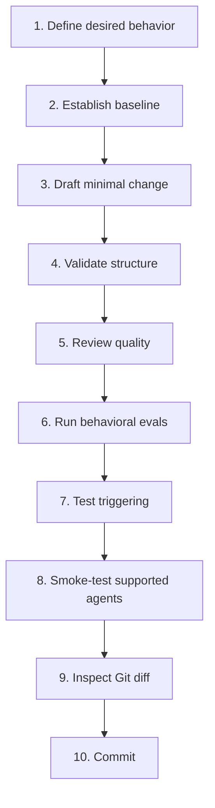

# Agent Skills

> **Portable, testable Agent Skills with an evidence-driven authoring workflow.**

This repository contains reusable [Agent Skills](https://agentskills.io/) for AI coding agents like Claude Code, Cursor, Codex, and others.

It also contains the local tooling used to create, modify, validate, and evaluate them.

The repository follows one core rule:

> [!IMPORTANT]
> **Edit the canonical skill under [`skills/`](./skills/) — never an installed copy under `.agents/skills/` or `.claude/skills/`.**
> Those agent-facing directories are generated local development state and may be deleted and recreated at any time.

## Available Skills

* **[committing-to-git](https://github.com/Hadden-Industries/agent-skills/tree/main/skills/committing-to-git/SKILL.md)**: Builds and validates WHY-first commit messages from an exact Git snapshot, guides creation of an explicitly approved signed root or ordinary one-parent commit, reports whether the result matches, and can guide an explicitly authorized push of that exact commit. Use for message drafts, new local commits, or a later push from this workflow; not for amending history or continuing merge, rebase, cherry-pick, or revert operations.

* **[defining-concepts](https://github.com/Hadden-Industries/agent-skills/tree/main/skills/defining-concepts/SKILL.md)**: Engineers definition-first concept entries: it frames intended use and boundaries, researches and qualifies evidence, separates semantic reuse from wording permission, chooses among adopt/adapt/formulate/defer, validates identity and neighboring concepts, and projects the same entry as a compact answer, revision audit, concept package, or requested machine representation. It composes data-definition, ontology, knowledge-organization, multilingual, and epistemic-governance profiles only when applicable; an otherwise-unqualified deliberate definition request uses ISO/IEC 11179 data-definition discipline as a fallback without claiming registration or standards conformance. It is not for dictionary lookup, naming-only work, prose explanation, schema or ontology implementation without concept-definition work, or unsupported certification claims.

* **[naming-objects-in-software-engineering](https://github.com/Hadden-Industries/agent-skills/tree/main/skills/naming-objects-in-software-engineering/SKILL.md)**: Create, assess, and refactor semantically precise, ecosystem-conformant names for programming and data artefacts. Use whenever naming or renaming files, directories, packages, modules, types, functions, methods, parameters, arguments, variables, fields, properties, constants, APIs, CLI commands/options, environment variables, or database objects; and during code review when naming quality, consistency, ambiguity, or terminology is relevant. Enforces conceptual discrimination before casing and separators.

* **[reading-epubs](https://github.com/Hadden-Industries/agent-skills/tree/main/skills/reading-epubs/SKILL.md)**: Convert and read EPUB ebook files through a deterministic Pandoc-to-Markdown workflow. Use whenever a task needs the content of an EPUB; not for producing EPUBs, for other formats such as PDF, MOBI, or AZW3, for managing ebook files without reading them, or for writing code that parses EPUB.

  Measured against the same agent working without it, on a real standards document: **45% fewer tokens for Haiku 4.5, 9% for Opus**, with correctness unchanged in every arm. Across 80 books the converted text is 17% smaller than the spine documents an agent would otherwise read, rising to 30% on heavily styled standards and 49% on a code-dense technical book. See [the evaluation record](https://github.com/Hadden-Industries/agent-skills/tree/main/evals/reading-epubs/README.md) for the method, the null results, and the limits.

### What `committing-to-git` adds

The skill is an opinionated proportional review and transaction workflow, not a claim that Git itself requires Conventional Commit subjects, inventories, or a `File Changes:` section. It separates agent judgment from mechanically enforceable guarantees:

- the public CLI is organized around `workflow prepare`, the transaction-bound `workflow review-next` reader, optional message finalization, draft promotion, helper-witnessed checks, exact commit, optional publication, and focused recovery/detail commands;
- a targeted exact-path diff can establish a small dependency, integrity-hash, lock-entry, or metadata-scalar change without extended ceremony; concise preparation then returns complete bounded evidence inline;
- extended preparation creates hash-bound packets only for unresolved uncertainty, and `workflow review-next` returns one complete verified packet plus an opaque replay-safe cursor until the helper records a catalog-bound receipt;
- evidence depth and presentation depth are independent: a reviewed change may use a concise checked subject, while an already understood change may use a structured body when that adds durable information;
- a transport-safe ASCII subject can go directly from preparation and exact approval to commit with no workflow-artifact reads; schema-version-3 `content.json` contains only editable semantics for agent-authored bodies and inventories, while helper-owned review and rendering state remains in the transaction;
- nonportable subjects and exact user- or repository-supplied bytes use the one fixed transaction-local `message-input.txt` plus `message check`; arbitrary external message paths remain unsupported;
- every checked or structured proposal reaches `message-ready` before it is shown for exact approval, so formatter corrections stay inside authorship and requested sections are not discarded to avoid another approval round;
- the agent treats a strong user hint as direction to improve against evidence, not as a demand for exact Conventional Commit type, scope, wording, rationale, UX consequence, or path selection;
- draft `full` and `paths` isolate the real index, actual preparation records the exact intended tree, and only an unchanged draft can cross to actual through `workflow promote`;
- exact manifests and bounded scope synopses prevent accidental inclusion; optional detailed or counted-domain presentation is derived only when it adds durable value;
- optional `workflow check` receipts bind an exact argv and observed child outcome to the prepared tree; they never reconstruct passes from prose or stdout, and bounded retained output is available through `workflow check-detail`;
- the approved tree and raw message bytes are compared with the one journaled signed commit, and unknown outcomes are observed rather than replayed;
- signature policy is `required`, `advisory`, or `skipped`, but every created commit still requires a signature header and recovery remains bound to the exact full OID; and
- an authorized push uses the exact reported object ID and full destination ref, with [durable recovery rules](./skills/committing-to-git/references/publication-recovery.md) for an uncertain result.

Runtime requirements are Git 2.45 or newer, Node.js 24 or newer, and configured Git commit signing. Git 2.45 is the floor because the helper preflights `--no-lazy-fetch`, making its `GIT_NO_LAZY_FETCH=1` read-only inspection boundary enforceable instead of allowing an older Git to hide a network fetch. Under `required` policy, trusted SSH identity verification also needs the configured allowed-signers source. The helper distinguishes missing, denied, invalid, and unexpected trust-source failures; the user may explicitly choose `advisory` or `skipped`.

The helper enforces deterministic mechanics, but it does not establish authorization, semantic truth, or whether an agent actually read an artifact before acknowledging it. The current boundaries, primary-source rationale, tests, and residual limitations are documented in the [witnessed-check assurance case](./docs/assurance-cases/2026-08-25-committing-to-git-witnessed-checks.md), with the broader proportional-workflow evidence preserved in its predecessor. Historical design decisions are recorded separately in dated implementation plans.

## Installation

The primary installation path is the repository's `main` tree through the open skills CLI. It automatically detects supported AI agents and places the selected skills in the correct directories.

To install all skills in this repository, run:

```bash
npx skills add Hadden-Industries/agent-skills
```

To install only one skill, for example `defining-concepts`, run:

```bash
npx skills add Hadden-Industries/agent-skills --skill defining-concepts
```

Each complete `skills/<name>/` directory is deployable through this path. Runtime instructions, references, scripts, and assets therefore live with the skill. Maintainer evals are deliberately separate: prompts, fixtures, cost profiles, retained results, and evaluation programs under [`evals/<name>/`](./evals/README.md) test the deployable content but are not installed with it.

## How It Works

These skills are built on the open [Agent Skills specification](https://agentskills.io/specification), and designed with industry best practices in mind e.g. [agentskills.io](https://agentskills.io/skill-creation/best-practices). They rely on a progressive disclosure model designed to protect your agent's context window. At startup, the agent only loads the skill's name and description. The full instructional body is only read into context when the agent explicitly decides the skill is relevant to your current prompt.

## For Developers

| I want to… | Go to |
|---|---|
| Set up a fresh clone | [Bootstrap the repository](#bootstrap-the-repository) |
| Create a new skill | [Create a new skill](#create-a-new-skill) |
| Change an existing skill | [Modify an existing skill](#modify-an-existing-skill) |
| Change code shipped as a skill executable | [Working on skill executables](#working-on-skill-executables) |
| Validate or evaluate a skill | [Validation and evaluation](#validation-and-evaluation) |
| Understand which tool to use | [Toolchain at a glance](#toolchain-at-a-glance) |
| Know when a change is finished | [Definition of done](#definition-of-done) |
| Review the evidence behind `committing-to-git` | [Current assurance case](./docs/assurance-cases/2026-08-25-committing-to-git-witnessed-checks.md) |
| Refresh the local tooling | [Update the development environment](#update-the-development-environment) |
| Diagnose setup problems | [Troubleshooting](#troubleshooting) |

---

## Repository philosophy

A good Agent Skill is not merely valid Markdown. It should:

- **trigger for the right requests** and stay out of unrelated requests;
- produce **materially better behavior** than the agent without the skill, or reach the same result at materially lower cost;
- contain only the instructions needed at activation time;
- progressively load detailed references rather than spending context up front;
- use scripts for deterministic or repetitive work when that is better than generating code dynamically;
- remain portable across compatible Agent Skills hosts wherever practical;
- be testable against representative prompts and failure cases;
- make its dependencies, limitations, and expected outputs clear.

The workflow therefore separates three questions:

1. **Is the skill structurally valid?**
2. **Is the skill well designed?**
3. **Does the skill actually improve agent behavior?**

No single validator answers all three.


---

## Repository layout

This repository is structured so that compatible package managers and agents automatically crawl the root `skills/` directory to discover available capabilities. Every file beneath one `skills/<name>/` directory is treated as part of that deployable skill; repository-maintainer evaluation material is deliberately kept in the parallel top-level `evals/<name>/` tree.

The important paths are:

```text
agent-skills/
├── .editorconfig                         # Cross-editor whitespace defaults
├── .gitattributes
├── .gitignore
├── .prettierignore                       # Deliberate formatter boundaries
├── AGENTS.md                             # Repository-local agent policy
├── eslint.config.js                      # Repository JavaScript lint policy
├── LICENSE                               # Mozilla Public License 2.0
├── package.json                          # Authoring commands and compatible dependency ranges
├── package-lock.json                     # Reproducible authoring dependency graph
├── README.md
├── skills-lock.json                     # Declares every authoring skill — COMMITTED
│
├── skills/                              # Canonical deployable skills — COMMITTED
│   ├── committing-to-git/
│   │   ├── SKILL.md                      # Signed snapshot transaction workflow
│   │   ├── references/
│   │   │   ├── check-evidence.md         # Witnessed checks, bounded output, and recovery
│   │   │   ├── inspection-recovery.md    # Exceptional evidence and packet recovery
│   │   │   ├── message-format.md         # Optional sections and structured formatting
│   │   │   ├── publication-recovery.md   # Exact-OID push recovery policy
│   │   │   ├── signature-recovery.md     # Trust and verification recovery
│   │   │   └── transaction-recovery.md   # Permission, lock, and outcome recovery
│   │   └── scripts/
│   │       └── commitWorkflow.mjs         # Generated, self-contained workflow CLI
│   ├── defining-concepts/
│   │   ├── SKILL.md                      # Universal concept-engineering router and workflow
│   │   └── references/
│   │       ├── concept-entry-model.md     # Format-neutral semantic record
│   │       ├── concept-entry-presentation.md # Definition-first human renderers
│   │       ├── concept-entry-serialization.md # Machine projections and missing states
│   │       ├── evidence-and-provenance.md # Research, authority, version, and licensing evidence
│   │       └── profiles/
│   │           ├── data-definitions.md    # ISO/IEC 11179 data and metadata discipline
│   │           ├── epistemic-governance.md # Authority, standpoint, consent, and deferral
│   │           ├── formal-ontology.md     # Ontology semantics and honest tool validation
│   │           ├── knowledge-organization-systems.md # KOS relations and mappings
│   │           └── multilingual-terminology.md # Cross-language designation and equivalence
│   ├── naming-objects-in-software-engineering/
│   │   ├── SKILL.md                      # Conceptual discrimination and lexical release gate
│   │   ├── assets/
│   │   │   └── naming-policy.json        # Bundled lexical profiles and vague-token dictionary
│   │   ├── references/
│   │   │   ├── language-conventions.md   # Ecosystem profiles and baseline conventions
│   │   │   ├── policy-precedence.md      # Authority, legacy, and exception handling
│   │   │   ├── semantic-naming.md        # Conceptual decomposition and verb precision
│   │   │   └── source-authorities.md     # External standards and explicit house policies
│   │   └── scripts/
│   │       └── check-name.py             # Offline standard-library lexical checker
│   ├── reading-epubs/
│   │   ├── SKILL.md
│   │   ├── references/
│   │   │   ├── conversion-troubleshooting.md
│   │   │   └── pandoc-installation.md
│   │   └── scripts/
│   │       ├── _pandoc.py
│   │       ├── _repair.py                 # Targeted pre-Pandoc markup repair
│   │       ├── _styles.py                # Derives Markdown semantics from the book's CSS
│   │       ├── _toc.py                    # Table-of-contents normalization
│   │       ├── check_pandoc.py
│   │       ├── clean_epub.lua
│   │       ├── conversion-result.schema.json
│   │       ├── convert_epub.py
│   │       └── pandoc-check.schema.json
│   └── ...
│
├── evals/                               # Maintainer-only evaluation suites — COMMITTED
│   ├── README.md                         # Deployable/evaluation boundary
│   ├── committing-to-git/
│   │   ├── README.md                     # Method, evidence, and limitations
│   │   ├── create-fixture-repository.mjs # Disposable executable Git scenarios
│   │   ├── evals.json                    # Workflow pressure scenarios
│   │   ├── trigger-evals.json            # Should/should-not-trigger prompts
│   │   └── results/                      # Compact retained run evidence
│   ├── defining-concepts/
│   │   ├── README.md                     # Concept-engineering campaign and grading protocol
│   │   ├── evals.json                    # Sixteen stratified semantic cases
│   │   ├── evaluation-runner.mjs         # Three-arm preparation, durable execution, status, blinding, and aggregation
│   │   ├── run-evaluation-session.mjs    # Packet-bound provider session
│   │   ├── session-controller.mjs        # Exact scripted-turn controller
│   │   ├── trigger-evals.json            # Should/should-not-trigger prompts
│   │   └── results/                      # Immutable legacy and current campaign evidence
│   └── reading-epubs/
│       ├── README.md                     # Method, evidence, and limitations
│       ├── evals.json                    # Behavioral evals
│       ├── measure_conversion.py         # Corpus resource measurement
│       ├── trigger-evals.json            # Should/should-not-trigger prompts
│       └── fixtures/
│           └── sample.epub               # Generated by tests/helpers/epub.mjs
│
├── src/                                  # Maintainable source for generated skill scripts
│   └── committing-to-git/
│       ├── checks/                       # Witnessed check receipts and bounded output
│       ├── cli/                          # Published command boundary
│       ├── command/                      # Snapshot, message, report, and publication adapters
│       ├── git/                          # Git process and path semantics
│       ├── inspection/                   # Bounded deletion-aware change inspection
│       ├── message/                      # Commit-message rendering and validation
│       ├── report/                       # Post-commit fact collection and rendering
│       ├── schema/                       # Versioned workflow contracts
│       ├── signature/                    # Signature verification policy
│       ├── snapshot/                     # Approved Git-tree snapshots
│       ├── transaction/                  # Durable journals, recovery, and cleanup
│       └── workflow/                     # Public workflow orchestration
│
├── scripts/                              # Repository authoring and bootstrap commands
│   ├── buildRepository.js                # Validation + artifact build orchestration
│   ├── buildSkillArtifacts.js            # Generated skill artifact registry and build
│   ├── validateSkillRepository.js        # Deployable skill and evaluation validation
│   ├── validateSkills.js                 # All canonical skills through skills-ref
│   ├── lintSkills.js                     # Repository plugin package through Tessl
│   ├── set_up_development_environment.py # Runner: sequences the three below
│   ├── set_up_agent_skills.py            # Skills declared in skills-lock.json
│   ├── set_up_evaluation_tools.py        # skills-ref, Tessl, Plugin Eval
│   ├── set_up_mcp_servers.py             # MCP servers + each host's config
│   ├── _commands.py                      # Running external commands
│   └── _repository.py                    # Locating the Git working tree
│
├── tests/                                # Script contract tests — COMMITTED
│   ├── helpers/
│   │   ├── epub.mjs                      # EPUB fixture builder
│   │   ├── json-schema.mjs               # Dependency-free schema checker
│   │   ├── json-schema.test.mjs
│   │   └── python.mjs                    # Shared interpreter probing
│   ├── committing-to-git/
│   │   ├── artifact-schemas.test.mjs
│   │   ├── change-inspection.test.mjs
│   │   ├── commit-message-renderer.test.mjs
│   │   ├── commit-message-snapshot-validation.test.mjs
│   │   ├── commit-message-validator.test.mjs
│   │   ├── commit-report.test.mjs
│   │   ├── commit-snapshot.test.mjs
│   │   ├── commit-workflow-cli.test.mjs
│   │   ├── harness.mjs
│   │   ├── publication.test.mjs
│   │   ├── report-artifact-contract.test.mjs
│   │   ├── signature-policy.test.mjs
│   │   └── workflow-e2e.test.mjs
│   ├── reading-epubs/
│   │   ├── check-pandoc.test.mjs
│   │   ├── code-blocks.test.mjs
│   │   ├── code-language.test.mjs
│   │   ├── convert-epub.test.mjs
│   │   ├── eval-fixture.test.mjs
│   │   ├── harness.mjs
│   │   ├── pre-repair.test.mjs
│   │   └── style-map.test.mjs
│   └── scripts/
│       ├── build-repository.test.mjs     # Repository build composition
│       ├── build-skill-artifacts.test.mjs # Generated artifact currency
│       ├── skill-repository-validation-contracts.test.mjs # Layout and schema gates
│       ├── evaluation-tools.test.mjs     # Python/Tessl bootstrap contracts
│       ├── evaluation_tools_driver.py
│       ├── github-mcp-server.test.mjs    # Bootstrap MCP installer contract
│       ├── github_mcp_driver.py          # Loads the bootstrap for those tests
│       └── repository-verification.test.mjs
│
├── docs/
│   ├── assurance-cases/
│   │   ├── 2026-08-23-committing-to-git-proportional-workflow.md
│   │   └── 2026-08-25-committing-to-git-witnessed-checks.md
│   ├── designs/                          # Artifact-type-first design records
│   │   └── defining-concepts/
│   │       └── 2026-08-29-concept-engineering.md
│   ├── plans/                            # Artifact-type-first implementation plans
│   │   ├── defining-concepts/
│   │   │   └── 2026-08-29-concept-engineering.md
│   │   └── 2026-08-21-committing-to-git-workflow-redesign.md # Historical root-level plan
│   ├── committing-to-git/
│   │   └── issues/                       # Dated implementation issue records
│   └── 2026-08-26-skill-build-architecture.md # Historical root-level document
│
├── .tessl-plugin/
│   └── plugin.json                       # Tessl package root — COMMITTED
│
├── .mcp.json                             # MCP config (Claude Code) — COMMITTED
├── .codex/
│   └── config.toml                       # MCP config (Codex) — COMMITTED
│
├── .agents/
│   ├── mcp_config.json                   # MCP config (Antigravity) — COMMITTED
│   ├── skills/                           # Generated Codex/Antigravity skills
│   └── plugins/
│       └── marketplace.json              # Generated local plugin metadata
│
├── .claude/
│   └── skills/                           # Generated Claude Code skills
│
├── .agent-tools/                         # Generated local tooling
│   ├── bin/                              # Wrappers + github-mcp-server binary
│   └── github-mcp-server/
│       └── install.json                  # Installed release record
├── .venv/                                # Generated Python environment
└── plugins/
    └── plugin-eval                       # Generated link/junction
```

### Source versus generated state

| Path | Purpose | Commit? |
|---|---|:---:|
| `skills/` | Canonical deployable skill payloads maintained by this repository | **Yes** |
| `evals/` | Maintainer-only evaluation definitions, fixtures, programs, and retained evidence | **Yes** |
| `src/` | Maintainable source and schemas for generated skill executables | **Yes** |
| `scripts/` | Repository-wide build commands and reproducible development bootstrap | **Yes** |
| `package.json` and `package-lock.json` | Compatible authoring dependency ranges, reproducible resolutions, and commands | **Yes** |
| `docs/` | Artifact-type-first designs, plans, assurance cases, and issue records, plus retained historical root-level documents | **Yes** |
| `.tessl-plugin/plugin.json` | Tessl package root that makes `tessl skill lint` resolvable | **Yes** |
| `tests/` | Contract tests for skill scripts and their committed schemas | **Yes** |
| `.agents/skills/` | Local Codex/Antigravity authoring skills | No |
| `.claude/skills/` | Local Claude Code authoring skills | No |
| `.venv/` | Local `skills-ref` environment | No |
| `.agent-tools/` | Tessl, Plugin Eval checkout, the GitHub MCP server binary, and wrappers | No |
| `.agents/plugins/marketplace.json` | Generated local Plugin Eval metadata | No |
| `plugins/plugin-eval` | Generated Plugin Eval junction/symlink | No |
| `.mcp.json` | Generated MCP configuration for Claude Code | **Yes** |
| `.codex/config.toml` | Generated MCP configuration for Codex | **Yes** |
| `.agents/mcp_config.json` | Generated MCP configuration for Antigravity | **Yes** |

The three MCP configuration files are the one category of generated state that is
committed. They name the server by a **repository-relative** path and configure
no credential, so they hold nothing machine-specific and nothing secret. A fresh
clone therefore gets a working GitHub MCP server on every supported host as soon
as the bootstrap has downloaded the binary.

They are rewritten on every bootstrap run, so treat them like any other tracked
file and review the diff. On a platform whose executable name differs from the
committed one, a run rewrites `command` and leaves a one-line modification.

Generated paths belong in the repository's committed `.gitignore`. They should not rely on a developer-specific `.git/info/exclude`.

---

# Bootstrap the repository

## Prerequisites

The bootstrap expects:

- **Git**
- **Python 3.11 or newer**
- **Node.js 24 or newer**
- **npm / npx**

Check the basics:

```powershell
git --version
py --version
node --version
npm --version
npx --version
```

On macOS/Linux, use `python3` instead of `py` where appropriate.

## Run the bootstrap

From the repository root:

```powershell
py scripts\set_up_development_environment.py
```

The script derives the repository root from its own location rather than trusting the shell's current working directory.

For an intentional fork or unusual worktree without the canonical repository remote:

```powershell
py scripts\set_up_development_environment.py --allow-unverified-repo
```

> [!NOTE]
> The development toolchain deliberately follows **current upstream versions** rather than pinning them. Rerunning the bootstrap is both setup **and** update.

## What the bootstrap installs

The local authoring profile exposes these Agent Skills to Codex, Antigravity, and Claude Code:

| Skill | Role |
|---|---|
| `skill-creator` | Create, improve, benchmark, and optimize Agent Skills |
| `writing-skills` | Apply a test-driven methodology to skill authoring |
| `test-driven-development` | Supports the RED → GREEN → REFACTOR discipline used by `writing-skills` |
| `skill-check` | Additional static/semantic review for common skill-quality problems |
| `committing-to-git` | Build, approve, verify, report, and optionally publish an exact signed commit transaction |

The bootstrap also installs local evaluation tooling:

| Tool | Local entry point | Primary role |
|---|---|---|
| `skills-ref` | `.agent-tools/bin/skills-ref.cmd` | Official Agent Skills format validation |
| Tessl CLI | `.agent-tools/bin/tessl.cmd` | Independent lint of the plugin package (local); cloud review of skills (Tessl account required) |
| OpenAI Plugin Eval | `.agent-tools/bin/plugin-eval.cmd` | Codex-oriented analysis, token-budget analysis, and benchmarks |
| GitHub MCP server | `.agent-tools/bin/github-mcp-server.exe` | GitHub platform operations from any of the three agent hosts |

On macOS/Linux, the generated wrappers omit the `.cmd` suffix, and the GitHub
MCP server binary omits the `.exe` suffix.

**Authentication is OAuth, not a personal access token.** On github.com the
server runs its own browser-based OAuth flow the first time an agent uses it, and
keeps the resulting token in memory only. Nothing needs to be exported, and no
credential is written to the repository or to your environment.

> [!IMPORTANT]
> That flow runs **only when no token is set**. If
> `GITHUB_PERSONAL_ACCESS_TOKEN` is present in the environment of the agent, the
> server uses it and skips OAuth entirely. Unset it to authenticate through
> OAuth. The bootstrap prints a note when it sees the variable set.

## Verify setup

A successful run verifies that the expected authoring skills and local wrappers exist.

You can also validate a canonical skill directly:

```powershell
.\.agent-tools\bin\skills-ref.cmd validate .\skills\committing-to-git
```

---

# The golden workflow

Use this workflow for meaningful skill work.



The evaluation depth should be proportional to the change. A spelling fix does not need a benchmark suite; a change to triggering behavior or core workflow does.

---

# Create a new skill

## 1. Define the behavior before writing instructions

Be explicit about:

- **what problem the skill solves;**
- **when it should trigger;**
- **when it should not trigger;**
- what successful behavior looks like;
- what failure modes you are trying to prevent;
- **whether the gain is better output, cheaper output, or both;**
- whether deterministic work belongs in a script rather than prose instructions;
- what information belongs in `SKILL.md` versus lazily loaded references.

A useful skill should have a narrower purpose than “make the agent better at X”.

Answer the cost question before writing anything. A skill whose value is
efficiency is a legitimate and often easier skill to justify, because resource
use is measurable where output quality is arguable — but it has to be built for
that from the start. It will need a task the agent can already complete, a
recorded baseline cost, and a saving large enough to clear the skill's own
overhead. Deciding this afterwards tends to produce an evaluation that measures
correctness, finds no difference, and concludes the skill is worthless when it
is merely cheaper.

## 2. Establish a baseline

Before adding the skill, exercise representative prompts **without the skill**.

Capture:

- what the agent already does well;
- the specific mistakes, omissions, or inefficiencies the skill should correct;
- outputs that can be compared after the skill exists;
- **what the task cost without the skill** — tokens consumed, tool calls, files opened — since a saving cannot be claimed against a figure that was never recorded.

This prevents writing instructions for behavior the underlying agent already
performs reliably. Note that "performs reliably" and "performs cheaply" are
different findings: an agent that reaches the right answer by reading an entire
document has succeeded, and is still worth improving.

For behavioral or discipline-oriented skills, include pressure cases where appropriate:

- time pressure;
- ambiguous requirements;
- competing instructions;
- tempting shortcuts;
- already-invested effort;
- incomplete evidence.

## 3. Create the canonical skill directory

Use a lowercase, hyphenated Agent Skills name:

```text
skills/
└── my-skill/
    └── SKILL.md
```

Treat that complete directory as the installable payload. Put behavioral prompts, trigger cases, evaluation fixtures, retained results, and evaluation-only programs in the matching maintainer directory instead:

```text
evals/
└── my-skill/
    ├── README.md
    ├── evals.json
    └── trigger-evals.json
```

Paths in an evaluation case's `files` array are relative to `evals/my-skill/`. An evaluation-only program that invokes shipped code should resolve the repository root and address `skills/my-skill/` explicitly, so moving or running the evaluator does not rely on an accidental parent-directory relationship.

The official Agent Skills specification requires the `name` to use lowercase letters, numbers, and hyphens and to be no more than 64 characters.

A minimal `SKILL.md` starts with:

```markdown
---
name: my-skill
description: What the skill does and the concrete situations in which it should be used.
---

# My Skill

...
```

The `description` is not a summary alone. It is a key discovery signal, so state both **what the skill does** and **when to use it**.

## 4. Ask the agent to use the authoring skills

A useful starting prompt is:

```text
Use `skill-creator` and `writing-skills` to create the Agent Skill described
below under `skills/<skill-name>`.

Treat the Agent Skills specification as normative. Establish baseline behavior
without the skill before relying on the new instructions. Keep SKILL.md focused
and progressively disclose detailed material through references or scripts.
Create behavioral and triggering evaluations appropriate to the skill under
`evals/<skill-name>`, outside the deployable skill directory.

[Describe the required skill here.]
```

The installed authoring skills should guide the detailed workflow; avoid duplicating their entire instructions in this README.

## 5. Keep `SKILL.md` focused

The Agent Skills specification recommends:

- metadata of roughly **100 tokens**;
- activated `SKILL.md` instructions below roughly **5,000 tokens**;
- keeping `SKILL.md` under **500 lines**;
- loading supporting resources only when needed.

Prefer:

```text
my-skill/
├── SKILL.md
├── scripts/
│   └── deterministic_operation.py
├── references/
│   ├── detailed-rules.md
│   └── troubleshooting.md
└── assets/
    └── template.json
```

over putting every detail directly into `SKILL.md`.

### Use `references/` for

- detailed domain rules;
- long examples;
- edge-case catalogs;
- troubleshooting;
- schemas or protocols;
- material needed only for a subset of tasks.

### Use `scripts/` for

- deterministic transformations;
- validation;
- repeatable extraction or conversion;
- work where generating fresh code on every invocation is wasteful or risky.

Scripts should be self-contained where practical, document unavoidable dependencies, validate inputs, emit actionable errors, and fail clearly rather than silently producing questionable output.

The `skills/<skill-name>/` directory is the canonical source for content that is already deployable, including `SKILL.md`, references, assets, and self-contained scripts. Do not move those files through a redundant source-to-distribution copy stage.

When an executable requires transformation, its maintainer source may instead live under `src/<skill-name>/`. Register the explicit source and output in `scripts/buildSkillArtifacts.js`, run `npm run build`, and commit the generated artifact under the skill's `scripts/` directory. The generated banner identifies `src/` as authoritative for that artifact; do not edit the output directly. `scripts/validateSkillRepository.js` owns deployable and evaluation validation, including the one-physical-line prose rule for canonical skill Markdown, while `scripts/buildRepository.js` composes validation with generated-artifact construction. Skill users run generated artifacts directly and do not install repository dependencies.

## 6. Validate and evaluate

Continue with [Validation and evaluation](#validation-and-evaluation).

---

# Modify an existing skill

Changing an existing skill should be treated as a behavioral change, not merely a text-editing exercise.

## 1. Understand the current contract

Read:

```text
skills/<skill-name>/SKILL.md
```

and every referenced resource needed to understand the behavior you are changing.

Identify:

- the current trigger description;
- required workflow;
- MUST/SHOULD-style constraints;
- scripts or external dependencies;
- existing maintainer evals under `evals/<skill-name>/` or examples;
- behavior that must remain unchanged.

## 2. Preserve a baseline

For meaningful changes, compare against the **old skill**, not against no skill at all.

Before editing, preserve the old version for evaluation—for example through Git or a temporary snapshot used by the evaluation workflow.

The question becomes:

> Does the proposed version outperform the currently committed version on the behavior this change is meant to improve **without regressing important existing behavior**?

## 3. Make the smallest change that solves the observed problem

Avoid opportunistically rewriting unrelated sections.

This improves:

- reviewability;
- attribution of behavioral changes;
- benchmark usefulness;
- rollback safety;
- confidence that a regression came from the intended change.

## 4. Re-run the appropriate evaluation depth

Use the [change-risk matrix](#change-risk-matrix) to decide how much evaluation is proportionate.

---

# Working on skill executables

A skill's `scripts/` directory is part of the shipped capability, so changes to executables require ordinary software-engineering discipline **plus** skill-level evaluation. Directly maintained scripts, such as the Python and Lua programs in `reading-epubs`, remain canonical under the skill. Bundled JavaScript, such as `committing-to-git`, is canonical under `src/<skill-name>/`; the file under `skills/<skill-name>/scripts/` is generated publication output.

For an executable change:

1. understand how `SKILL.md` invokes the script;
2. identify whether its canonical implementation lives under `skills/` or `src/`;
3. add or update script-level tests where practical;
4. reproduce the pre-change failure or limitation;
5. implement the smallest fix in the canonical source;
6. run `npm run build` when the executable is bundled, then review the generated diff;
7. run the script-level tests and `npm run build:check`;
8. validate the containing Agent Skill;
9. run at least one end-to-end agent scenario that exercises the executable; and
10. verify that error output remains useful to an agent, not only to a human developer.

Prefer machine-readable output for machine-consumed results. Keep diagnostics separate where the script's calling convention benefits from clean stdout.

Do not move large deterministic programs into `SKILL.md` merely to avoid maintaining a script.

---

# Validation and evaluation

Validation is layered. Passing an earlier layer does not replace later layers.

## Layer 1 — normative Agent Skills validation

Run the reference validator first:

```powershell
$Skill = "my-skill"

.\.agent-tools\bin\skills-ref.cmd validate ".\skills\$Skill"
```

This checks the Agent Skills structure and frontmatter against the reference implementation.

**Passing `skills-ref` means the skill is structurally valid. It does not prove the skill is useful.**

## Layer 2 — independent lint and review

Tessl splits into a local half and an account-gated half. Know which is which before relying on either.

### Lint (local, no account)

Tessl lint operates on a **plugin package root**, not on an individual skill directory. This repository provides one at `.tessl-plugin/plugin.json`, so lint runs against the whole `skills/` tree at once and needs no Tessl account:

```powershell
.\.agent-tools\bin\tessl.cmd skill lint .
```

Passing a single skill path fails with `Not a Tessl plugin: no .tessl-plugin/plugin.json or tile.json found in the package root`. That is the expected result of pointing lint below the package root, not a broken install.

### Review (cloud, account required)

`tessl skill review` is deprecated. The current command runs an asynchronous review on Tessl's servers, so it requires a Tessl account, an authenticated session, and a workspace:

```powershell
.\.agent-tools\bin\tessl.cmd login
.\.agent-tools\bin\tessl.cmd review run ".\skills\$Skill"
```

Without `tessl login` the command exits with `Skill review requires you to be logged in`. The bootstrap deliberately does not authenticate, so this layer is optional; skipping it leaves Layers 1, 3 and 4 intact.

Treat automated recommendations as review input, not unquestionable truth. In particular, do not let an external optimizer silently rewrite a carefully designed behavioral contract. If deliberately using Tessl's fix mode, inspect every resulting diff:

```powershell
.\.agent-tools\bin\tessl.cmd review fix ".\skills\$Skill"
```

## Layer 3 — `skill-check`

Ask an agent with the repository's authoring profile loaded to review the canonical skill using `skill-check`.

Use it as a second-opinion static/semantic review for issues such as:

- vague WHAT/WHEN descriptions;
- ambiguous instructions;
- stale or brittle assumptions;
- oversized `SKILL.md`;
- hollow sections;
- naming or structure problems;
- contradictory or unsafe guidance.

Do not substitute it for behavioral evaluation.

## Layer 4 — OpenAI Plugin Eval

For Codex-oriented static analysis:

```powershell
.\.agent-tools\bin\plugin-eval.cmd analyze ".\skills\$Skill" --format markdown
```

For token-budget analysis:

```powershell
.\.agent-tools\bin\plugin-eval.cmd explain-budget ".\skills\$Skill" --format markdown
```

For a recommended next workflow:

```powershell
.\.agent-tools\bin\plugin-eval.cmd start ".\skills\$Skill" `
    --request "Evaluate this skill." `
    --format markdown
```

For material skills, Plugin Eval can also initialize and run a benchmark. The current tool writes `.plugin-eval/` beneath its target, so do not target the canonical `skills/<name>/` directory for this mutating workflow. Benchmark a UUID-named temporary copy of the deployable payload while writing the reviewable config and compact outputs under the maintainer suite:

```powershell
$BenchmarkTarget = Join-Path ([IO.Path]::GetTempPath()) ("agent-skills-plugin-eval-$Skill-" + [guid]::NewGuid().ToString())
$BenchmarkConfig = ".\evals\$Skill\plugin-eval\benchmark.json"
$BenchmarkUsage = ".\evals\$Skill\plugin-eval\benchmark-usage.jsonl"
$BenchmarkResult = ".\evals\$Skill\plugin-eval\benchmark-run.json"
Copy-Item -Recurse -LiteralPath ".\skills\$Skill" -Destination $BenchmarkTarget
.\.agent-tools\bin\plugin-eval.cmd init-benchmark "$BenchmarkTarget" --output "$BenchmarkConfig"
.\.agent-tools\bin\plugin-eval.cmd benchmark "$BenchmarkTarget" --config "$BenchmarkConfig" --usage-out "$BenchmarkUsage" --result-out "$BenchmarkResult" --format markdown
```

Review and tailor the generated configuration before the final command: the current CLI has no simulated `--dry-run`. Plugin Eval's detailed run logs remain under the temporary copy's `.plugin-eval/` directory; retain any evidence the suite needs, then remove that temporary copy when it is no longer useful.

## Layer 5 — behavioral evaluation

Keep committed behavioral definitions, fixtures, evaluation-only programs, and compact retained evidence under `evals/<skill-name>/`. The evaluator combines that maintainer suite with the canonical deployable skill at `skills/<skill-name>/`; it must not expect either tree to be nested inside the other. Resolve every path in an `evals.json` case's `files` array relative to its suite directory.

For a **new skill**:

```text
same representative prompt
        │
        ├── without skill
        └── with skill
```

For an **existing skill**:

```text
same representative prompt
        │
        ├── old skill
        └── proposed skill
```

Evaluate what matters for that skill, for example:

- correctness;
- completeness;
- adherence to required process;
- avoidance of prohibited shortcuts;
- output quality;
- efficiency;
- appropriate tool use;
- robustness under ambiguity;
- recovery from errors.

When the difference is subjective or high-impact, use blind comparison where the available authoring tooling supports it.

### Score consumption, not only correctness

A capable agent often reaches the right answer with or without the skill, so a
correctness rubric reports no difference and the evaluation looks like a
failure. `reading-epubs` was measured this way: **every arm of every controlled
run answered correctly**, and the skill's value appeared only in what answering
cost — 45% fewer tokens for Haiku 4.5, 9% for Opus.

Capture, from each run's own usage report:

- tokens consumed;
- tool calls made;
- distinct files opened;
- exactness of any quoted material, checked against the source character for character.

The first three need no human grading.

### Vary the model, not just the skill

Benefit frequently scales *inversely* with model capability, because much of
what a skill supplies is what a strong model would work out unaided. Running
one model hides this. Run at least a weak and a strong one: the interesting
comparison is often the diagonal, where a weaker agent with the skill
outperforms a stronger agent without it.

### Isolate the baseline deliberately

A "without skill" arm that can see the skill is not a baseline. Omitting to
mention it is not enough — an agent will find a skill in its own working
directory, and a scratch path containing the repository name is a strong hint.
Instruct the baseline explicitly to work from first principles and to report
whether it encountered relevant tooling, then check that report before
believing the numbers.

### Net the skill's own cost

A skill is not free. Its `description` is loaded in every session whether or not
it is used, and its body is loaded on every activation. A saving only counts
once it has paid for both:

```text
net benefit  =  (saving per use  −  invoke cost)  ×  uses
                −  trigger cost  ×  every session
```

The trigger term is the unforgiving one, because it is charged even in sessions
where the skill never fires. A narrowly useful skill with a verbose description
can be net negative across a fleet while looking beneficial in every run that
used it.

`plugin-eval explain-budget` reports both costs. For `reading-epubs` they are
roughly 98 trigger tokens and 1,500 invoke tokens, against a measured saving of
about 30,000 tokens on one real book — clearing its own overhead about twentyfold
on a single use. A skill saving 500 tokens per use would not clear it at all.

State this ratio when claiming an efficiency benefit. "Saves tokens" is not a
result; "saves 20× what it costs to carry" is.

### Do not over-read a single run

One run per arm has no statistical power. Published work in this area has found
apparent single-digit improvements that did not survive a properly powered
study. Treat a handful of runs as directional evidence, record the sample size
alongside the result, and say plainly what the numbers do not establish.

## Layer 6 — trigger evaluation

A well-written skill that never activates is ineffective. A skill that activates everywhere wastes context and can distort unrelated work.

Store the committed trigger cases at `evals/<skill-name>/trigger-evals.json`, beside the behavioral definitions and outside the deployable skill.

Create both:

```text
SHOULD TRIGGER
✓ realistic requests that need the skill
✓ indirect wording
✓ synonyms / alternative terminology
✓ borderline-but-valid use cases

SHOULD NOT TRIGGER
✗ nearby but unrelated tasks
✗ requests sharing vocabulary but not intent
✗ generic coding tasks
✗ cases another specialist skill should own
```

Anthropic's `skill-creator` includes a description-optimization workflow for should-trigger and should-not-trigger prompts. Use it when trigger behavior materially matters.

Avoid optimizing only against the same examples used to design the description; keep held-out cases where practical.

## Layer 7 — cross-agent smoke test

When a skill is intended to be portable, test it in the supported hosts available to you:

- **Codex**
- **Claude Code**
- **Antigravity**

Look for host-specific assumptions such as:

- unavailable tool names;
- shell-specific commands;
- implicit filesystem locations;
- unsupported frontmatter extensions;
- assumptions about subagents;
- assumptions about how skills are discovered or activated.

A cross-agent skill should avoid host-specific instructions unless the host distinction is intentional and clearly handled.

---

# Change-risk matrix

Use the smallest evaluation set that provides credible evidence for the change.

| Change | Minimum expected evaluation |
|---|---|
| Typo / prose clarification with no semantic change | `skills-ref`, diff review |
| Reference documentation change | `skills-ref`, affected scenario smoke test |
| Script implementation change | `npm test` + `skills-ref` + end-to-end scenario |
| Script output-shape change | `npm test`, with the source JSON schema and every consumer updated in the same change |
| `description` / trigger change | `skills-ref` + positive/negative trigger evals |
| Core workflow instruction change | old-vs-new behavioral eval + static review |
| New mandatory constraint | pressure/failure cases + regression scenarios |
| New skill | baseline-without-skill + behavioral eval + trigger eval + static review + baseline-versus-skill resource measurement |
| Skill justified on efficiency rather than output | the above, plus consumption measured across at least two model tiers, and the saving netted against the skill's own trigger and invoke cost |
| Large/refactored skill | full layered review + token/progressive-disclosure review |
| Host-specific behavior change | affected-host test + at least one portability sanity check |

---

# Toolchain at a glance

The tools intentionally overlap, but they answer different questions.

| Tool | Best question to ask it |
|---|---|
| **Agent Skills specification** | “What is valid and portable?” |
| **`skills-ref`** | “Does this artifact conform to the specification?” |
| **`skill-creator`** | “How should I create/improve and empirically evaluate this skill?” |
| **`writing-skills`** | “What failure am I correcting, and can I prove the skill changes behavior?” |
| **`test-driven-development`** | “Can I establish RED before implementing GREEN?” |
| **`skill-check`** | “What static/semantic quality smells have we missed?” |
| **Tessl** | “What does an independent Agent Skills reviewer/linter find?” |
| **OpenAI Plugin Eval** | “How does this look from Codex/plugin evaluation and token-budget perspectives?” |
| **`committing-to-git`** | “How do I turn an approved snapshot into an accurate signed commit and, when separately authorized, publish that exact object?” |

### Authority order

When recommendations disagree, use this hierarchy:

```text
Agent Skills specification
        ↓
current host requirements
        ↓
repository requirements
        ↓
authoring/evaluation methodologies
        ↓
style preferences
```

A methodology may be intentionally stricter than the specification. It should not silently redefine the specification.

---

# Agent Skills authoring principles

## Frontmatter

At minimum:

```yaml
---
name: my-skill
description: Describe what the skill does and when it should be used.
---
```

Current Agent Skills constraints include:

- `name` is required;
- maximum name length: 64 characters;
- lowercase letters, numbers, and hyphens only;
- no leading or trailing hyphen;
- `description` is required;
- maximum description length: 1,024 characters.

## Progressive disclosure

Design for three stages:

```text
1. Metadata
   name + description
   loaded for discovery

2. SKILL.md
   loaded when activated

3. references / scripts / assets
   loaded or executed only when needed
```

Do not make every agent pay the context cost of details needed by only a small proportion of invocations.

## File references

Prefer direct, skill-root-relative references:

```markdown
See [conversion troubleshooting](references/conversion-troubleshooting.md).

Run:

python scripts/convert.py input.epub
```

Keep reference chains shallow. The Agent Skills specification recommends direct references from `SKILL.md` rather than deeply nested “read this, which tells you to read that” chains.

## Instructions

Prefer instructions that are:

- imperative;
- testable;
- unambiguous;
- ordered when order matters;
- explicit about stopping conditions;
- explicit about required evidence;
- clear about exceptions.

Avoid padding a skill with general advice the model already follows reliably.

---

# Definition of done

For a meaningful new or modified skill:

- [ ] The canonical change is under `skills/<skill-name>/`.
- [ ] Every file under `skills/<skill-name>/` belongs in the installed payload; maintainer-only evaluation material is under `evals/<skill-name>/`.
- [ ] Each evaluation suite names its matching canonical skill and resolves fixture paths within the suite.
- [ ] The skill solves an observed or clearly defined behavior problem.
- [ ] The `name` and `description` satisfy the Agent Skills specification.
- [ ] The description says both **what** the skill does and **when** it should activate.
- [ ] `SKILL.md` contains only activation-time instructions that deserve context.
- [ ] Detailed material is progressively disclosed through `references/`, `scripts/`, or `assets/`.
- [ ] File references resolve correctly.
- [ ] Every repository-authored canonical `SKILL.md` contains ASCII bytes only.
- [ ] Prose blocks in canonical `SKILL.md` and `references/**/*.md` files use one physical line and rely on viewer soft wrapping.
- [ ] Scripts have been exercised independently where applicable.
- [ ] Bundled executables were changed in `src/`, regenerated with `npm run build`, and checked for drift.
- [ ] `skills-ref validate` passes.
- [ ] Static/semantic review has been performed at a depth appropriate to the change.
- [ ] Behavioral evaluation demonstrates the intended improvement, whether that is better output or the same output at a lower cost.
- [ ] Where the claim is efficiency, the saving is measured against a recorded baseline and exceeds the skill's own trigger and invoke cost.
- [ ] Trigger-sensitive changes include should-trigger and should-not-trigger cases.
- [ ] Important existing behavior has not regressed.
- [ ] Portability has been checked on relevant agent hosts.
- [ ] `npm run verify` passes after the repository-managed tools are set up.
- [ ] Repository state and the complete intended change have been reviewed without relying on truncated output.
- [ ] The commit message describes only the exact approved staged snapshot.

---

# Git workflow

## Before editing

Start from a clean understanding of repository state:

```powershell
git status --porcelain=v2 --branch --untracked-files=all
git diff --stat HEAD
git diff --numstat HEAD
```

Use the overview to choose a bounded inspection strategy. A small diff can be read with `git diff HEAD`; split a large diff by path or use the `committing-to-git` inspection artifacts so terminal truncation never becomes implicit approval. Inspect untracked content separately. Do not assume that every existing uncommitted change belongs to your task.

## Before committing

Recheck the complete state:

```powershell
git status --porcelain=v2 --branch --untracked-files=all
```

Use the repository's `committing-to-git` skill for scope classification, transactional staging where applicable, bounded inspection, message construction, approval, signing, verification, reporting, and any separately authorized push. The message must describe **only** the exact staged tree that was inspected and approved; a draft is neither staging nor commit authorization.

---

# Update the development environment

There is no separate updater.

Rerun:

```powershell
py scripts\set_up_development_environment.py
```

The runner converges the local development environment on current upstream tooling. To refresh only one part, run that part's script directly instead.

In particular, it refreshes:

- the project-local authoring skills;
- `skills-ref`;
- Tessl CLI;
- the OpenAI Plugin Eval checkout;
- the GitHub MCP server release binary and the MCP configuration of all three hosts;
- generated wrappers and activation views.

Because the toolchain follows latest upstream versions, behavior can legitimately change between runs.

The **canonical skills in this repository are not replaced by the bootstrap**. It refreshes the tools used to work on them.

---

# How the bootstrap works

<details>
<summary><strong>Expand implementation details</strong></summary>

### Structure

`scripts/set_up_development_environment.py` is a runner. It verifies the
repository's identity once, then sequences three setup scripts that each do one
job and each run standalone:

| Script | Owns |
|---|---|
| `set_up_agent_skills.py` | The authoring skills declared in `skills-lock.json` |
| `set_up_evaluation_tools.py` | `skills-ref`, Tessl CLI, OpenAI Plugin Eval, and the wrappers |
| `set_up_mcp_servers.py` | MCP servers and each host's configuration |

Run one directly when only that part needs refreshing:

```powershell
py scripts\set_up_mcp_servers.py
```

Two internal modules, marked non-public by their leading underscore, hold what
all of them need: `_commands.py` runs external commands and locates executables,
and `_repository.py` derives and interrogates the Git working tree.

### Repository identity

Each script derives the repository root from its own location — the directory one
level above it — and requires Git to agree that this is the working tree's top
level. The name of the directory holding the scripts is never checked, so the
same files work in a repository that calls it `util/` instead.

The runner additionally verifies the Git repository identity before anything
generated is changed, because every part deletes and rewrites directories and
doing that in the wrong clone would destroy unrelated work. That check lives in
the runner alone, which keeps the three parts reusable in other repositories.

`--allow-unverified-repo` exists for intentional forks or worktrees.

### Generated Agent Skill views

`set_up_agent_skills.py` reads `skills-lock.json` — the standard lock the
`skills` CLI already writes — and re-adds each declared skill from its recorded
source. The declared set therefore lives in exactly one place, rather than being
duplicated between a lock file and a hardcoded list of install commands. Skills
sharing a source are re-added in a single invocation, because `skills add` clones
the whole source repository once per call.

It rebuilds:

```text
.agents/skills/
.claude/skills/
```

rather than allowing stale development skills to accumulate indefinitely.

Before removing either root it checks two things and refuses on either: that Git
tracks nothing underneath it, and that the root is actually covered by an ignore
rule. The second check is what stops a missing `.gitignore` entry from turning
generated state into an untracked mess after every run.

Afterwards it verifies that each root holds **exactly** the declared skills —
an unexpected leftover skill fails the run just as a missing one does — and
reports whether `npx skills` modified `skills-lock.json` while refreshing.

For upstream suites whose skills reference a sibling `../_shared/` directory, it
vendors that directory into the installed skill as `references/_shared/` and
rewrites the references, so a selected module from a bundle repository is
self-contained. It reads upstream through a shallow, blobless, cone-mode sparse
checkout limited to the `_shared` directories actually needed, so a large suite
repository is never materialized in full. None of this repository's canonical
skills currently use `../_shared`, so the step normally reports that it found
nothing.

### Python tooling

`set_up_evaluation_tools.py` creates:

```text
.venv/
```

and installs the current `skills-ref` reference implementation from the Agent Skills repository.

The bootstrap deliberately force-reinstalls `skills-ref` so changes on the upstream branch are picked up even when package-version metadata has not changed.

`PyYAML` is also available to authoring tooling that requires it.

### Tessl

Tessl's npm launcher is installed under:

```text
.agent-tools/tessl/
```

rather than as a global npm package. Tessl's launcher manages a platform-native runtime binary separately. The bootstrap updates both layers: it installs `@tessl/cli@latest`, then runs `tessl cli update` so an existing runtime cannot remain behind the launcher version.

Use the generated wrapper:

```text
.agent-tools/bin/tessl.cmd
```

The bootstrap does not log in to Tessl. Authentication/preferences used later by Tessl may be user-level state.

`tessl skill lint` needs no account, but it resolves a plugin package root rather than a skill directory. The committed `.tessl-plugin/plugin.json` supplies that root, so lint works immediately after bootstrap. `tessl review run` and `tessl review fix` execute on Tessl's servers and require `tessl login` plus a workspace; without them, Layer 2's review half is unavailable.

### OpenAI Plugin Eval

The bootstrap maintains a sparse local checkout under:

```text
.agent-tools/openai-plugins/
```

and exposes Plugin Eval through:

```text
.agent-tools/bin/plugin-eval.cmd
```

A local `plugins/plugin-eval` link/junction and workspace plugin metadata may also be generated for compatible Codex workflows.

The direct wrapper is the unambiguous command-line entry point; do not assume generated workspace metadata by itself performs user-level plugin registration.

### GitHub MCP server

The bootstrap installs the official release binary rather than building it with
`go install`, so Go is not a prerequisite. It resolves the latest release from
the GitHub API, picks the asset matching this machine's operating system and
architecture, verifies the download against the release's own `checksums.txt`
before anything is written, and extracts only the executable to:

```text
.agent-tools/bin/github-mcp-server[.exe]
```

Reruns converge without re-downloading. `.agent-tools/github-mcp-server/install.json`
records the installed tag, asset, and the SHA-256 of the executable actually on
disk; the download is skipped while all three still agree.

It then points each supported host at that binary, in the file that host reads
from the project or workspace root:

| Host | File | Entry |
|---|---|---|
| Claude Code | `.mcp.json` | `mcpServers.github` |
| Codex | `.codex/config.toml` | `[mcp_servers.github]` |
| Antigravity | `.agents/mcp_config.json` | `mcpServers.github` |

Every entry names the same repository-relative command, so the configuration
survives the clone moving and is identical on every machine of the same
platform. Each host starts a stdio server with that root as its working
directory, which is what makes a relative command resolve.

Every entry carries only `command` and `args`. No credential is configured for
any host, because the server's OAuth flow triggers only when no token is set:
naming or forwarding `GITHUB_PERSONAL_ACCESS_TOKEN` would silently replace an
in-memory OAuth token with a long-lived one. `tests/scripts/github-mcp-server.test.mjs`
asserts that no generated file mentions a token variable.

These files are shared with servers this repository knows nothing about, so the
merge is deliberately conservative:

- the JSON files are parsed and only the `github` entry is rewritten, preserving
  other servers, unrelated top-level keys, and any option hand-added to the
  `github` entry itself;
- the Codex file is TOML that carries comments and ordering a parse-and-rewrite
  round trip would flatten, so only a marker-delimited block is generated and
  everything outside it is copied through untouched. A hand-written
  `[mcp_servers.github]` outside that block is refused rather than duplicated,
  because TOML forbids declaring the same table twice and appending would break
  the whole Codex configuration rather than just this server.

`tests/scripts/github-mcp-server.test.mjs` covers the platform-to-asset mapping,
the archive extraction, and every one of those merge guarantees without touching
the network.

### Latest-following policy

The development environment intentionally follows current upstream tools instead of pinning versions.

That policy optimizes this repository for **current skill-engineering practice** rather than bit-for-bit reproduction of an old toolchain.

</details>

---

# Adding or changing an authoring dependency

The bootstrap's authoring dependencies are repository infrastructure. Change them deliberately.

For an Agent Skill dependency:

1. confirm the canonical upstream source;
2. decide whether it adds a distinct capability rather than duplicating existing tooling;
3. add it to the explicit `npx skills@latest add ... --skill ...` setup commands;
4. add the expected skill name to bootstrap verification;
5. update the [Toolchain at a glance](#toolchain-at-a-glance) table if its role is user-visible;
6. run the bootstrap twice to check idempotence;
7. verify both `.agents/skills/` and `.claude/skills/`;
8. inspect `git status` to ensure generated state remains ignored.

For a CLI/tool dependency:

1. install it repository-locally where practical;
2. avoid mutating user-global configuration during bootstrap;
3. provide a stable wrapper under `.agent-tools/bin/`;
4. verify the executable exists;
5. document authentication or user-level state separately from installation;
6. make reruns converge safely to the desired current state.

---

# Common workflows

## Validate one skill

```powershell
$Skill = "committing-to-git"

.\.agent-tools\bin\skills-ref.cmd validate ".\skills\$Skill"
.\.agent-tools\bin\plugin-eval.cmd analyze ".\skills\$Skill" --format markdown
```

Tessl lint is not per-skill; it validates the whole plugin package root at once:

```powershell
.\.agent-tools\bin\tessl.cmd skill lint .
```

`tessl review run` additionally requires an authenticated Tessl account (see Layer 2).

## Run the script contract tests

```powershell
npm test
```

`npm test` uses the exact dependency graph recorded in `package-lock.json`, while `package.json` permits compatible dependency updates. These tests cover skills that ship executable scripts and the repository tooling that builds or installs them. Skill contract tests run published executables the way an agent does - as subprocesses against throwaway inputs or Git repositories - and assert that their JSON output still conforms to the source schemas.

This matters because a skill's instructions branch on specific output fields.
`committing-to-git` passes a versioned snapshot, transaction-bound packet stream,
semantic-only content input, validation result, witnessed check receipts,
exact-commit signature result, optional publication result, and post-commit
report between its public routes in one published workflow bundle. If one output changes without its
schema and consumer, the workflow can silently stage, inspect, approve, verify,
publish, or report a different state. The suite validates representative
cross-route payloads; exact Git-tree, path, signature, report, and publication
invariants; transactional staging failure behavior; CLI help and exit semantics;
and agreement between validator issue codes and schema enums.

The repository keeps esbuild, ESLint, and Prettier as development-only dependencies with compatible version ranges. Published generated skill artifacts have no third-party runtime dependency. Run `npm run build` after changing maintainer source under `src/`. Its prebuild gate checks formatting and lint before regenerating artifacts. Run the non-mutating `npm run build:check` to check formatting, lint, the deployable/evaluation boundary, ASCII-only canonical `SKILL.md` files, one-physical-line prose in canonical `SKILL.md` and reference Markdown, and committed artifact currency. Node 24 treats the test runner's positional arguments as glob patterns, so the package script passes a quoted glob rather than a bare `tests/` directory.

## Run deterministic local verification

```powershell
npm run verify
```

This visible package-script chain runs `build:check`, the complete Node test suite, `skills-ref` against every canonical skill, local Tessl lint against the repository plugin package, and `git diff --check HEAD`. The repository-managed `skills-ref` and Tessl wrappers must already exist; run the development-environment setup first when they are missing.

For a focused inner loop, validate exactly one canonical skill by name:

```powershell
npm run verify:skill -- --skill defining-concepts
```

The scoped command checks that skill's ASCII-only canonical `SKILL.md`, one-physical-line prose in its canonical `SKILL.md` and reference Markdown, shared evaluation-manifest contract when a suite exists, configured generated bundle when one exists, `skills-ref` validation, convention-owned tests, and whitespace in existing target-owned paths. It explicitly reports repository-wide Prettier/ESLint, Tessl plugin-package lint, unrelated Node tests, and the repository-wide diff check as global-only checks that were not run. A scoped pass is inner-loop evidence, not a substitute for the complete `npm run verify` integration gate.

Passing `npm run verify` establishes deterministic local gates. It does not replace behavioral or trigger evaluation when applicable, cross-agent portability checks when applicable, or semantic review of repository state and the complete intended change through bounded artifacts.

Use `npm run format` to apply Prettier to maintained JavaScript, JSON schemas, tests, and the root JavaScript/package configuration. Canonical skills, Markdown documentation, generated bundles, Python, Lua, and the lockfile remain outside that formatting scope. Use `npm run fix:all` to apply safe ESLint fixes before formatting.

## Inspect token-budget concerns

```powershell
$Skill = "committing-to-git"

.\.agent-tools\bin\plugin-eval.cmd explain-budget ".\skills\$Skill" `
    --format markdown
```

## Refresh all authoring tools

```powershell
py scripts\set_up_development_environment.py
```

## Review the final repository change

```powershell
git status --porcelain=v2 --branch --untracked-files=all
git diff --stat HEAD
git diff --numstat HEAD
```

Then read the complete diff in bounded path-level or workflow-generated artifacts. Do not treat a truncated aggregate `git diff HEAD` response as complete review evidence.

---

# Troubleshooting

<details>
<summary><strong>The bootstrap refuses to remove a generated path because Git tracks files there</strong></summary>

This is a safety feature.

Do **not** bypass it automatically.

First determine why repository content exists inside a path that is supposed to be generated:

```powershell
git ls-files -- .agents/skills
git ls-files -- .claude/skills
```

If the files are canonical project content, move them to an appropriate committed location rather than deleting them.

</details>

<details>
<summary><strong>Generated skill/tool files appear in <code>git status</code></strong></summary>

Generated development state should be covered by the repository's committed `.gitignore`.

Use:

```powershell
git check-ignore -v .agents/skills/skill-creator/SKILL.md
git check-ignore -v .claude/skills/skill-creator/SKILL.md
```

to see the exact ignore rule.

Project-wide generated artifacts belong in `.gitignore`, not in a developer-specific `.git/info/exclude`.

</details>

<details>
<summary><strong>The repository-local Python reports that its base executable is missing or inaccessible</strong></summary>

Python virtual environments retain the base-interpreter location used when they
were created. If that Python installation moves, is removed, or becomes
inaccessible to a sandbox, `.venv\Scripts\python.exe` may fail even though the
current `python` or `py` command works normally.

Rerun the evaluation-tool setup with an accessible Python 3.11 or newer:

```powershell
py scripts\set_up_evaluation_tools.py
```

The bootstrap probes an existing repository-owned `.venv` before reuse. When
the interpreter cannot start, it reports the previous error, clears that
generated environment, recreates it from the Python running the bootstrap, and
verifies the replacement before installing anything. It refuses to clear
`.venv` when that path is a symlink or junction.

</details>

<details>
<summary><strong><code>skills-ref</code> appears stale after an upstream change</strong></summary>

Rerun:

```powershell
py scripts\set_up_development_environment.py
```

The bootstrap force-reinstalls the current upstream `skills-ref` implementation rather than relying solely on package-version comparison.

</details>

<details>
<summary><strong>Tessl asks for authentication</strong></summary>

The bootstrap installs Tessl locally but intentionally does not authenticate it.

Authentication and preferences are separate user concerns. Follow Tessl's current authentication flow when a command requires it; do not add credentials to this repository.

</details>

<details>
<summary><strong>Plugin Eval exists locally but Codex does not show a plugin installation</strong></summary>

Use the direct wrapper:

```powershell
.\.agent-tools\bin\plugin-eval.cmd analyze .\skills\<skill-name> --format markdown
```

The local checkout and generated workspace metadata are development conveniences; they should not be confused with user-level plugin registration.

</details>

<details>
<summary><strong>The bootstrap cannot replace <code>github-mcp-server.exe</code> because it is in use</strong></summary>

Windows keeps a running executable locked, and an agent connected to the GitHub
MCP server holds it open.

Close the agents currently using it — Claude Code, Codex, Antigravity — and
rerun. The bootstrap only tries to replace the binary when the release actually
changed, so this cannot block an otherwise up-to-date rerun.

</details>

<details>
<summary><strong>The GitHub MCP server download fails with HTTP 403 or 429</strong></summary>

The bootstrap resolves the latest release through the unauthenticated GitHub
API, which allows 60 requests an hour per address. Wait for the window to reset
and rerun.

Nothing is written until the download has been checked against the release
checksum manifest, so a failed attempt leaves the previous install intact.

</details>

<details>
<summary><strong>An agent shows the GitHub MCP server as failed to connect</strong></summary>

Check the two things the bootstrap cannot verify for you.

First, authentication. The server opens a browser for OAuth on first use, so an
agent running somewhere that cannot open one — a remote shell, a container — has
no way to complete the flow. Nothing is cached between runs, since the token is
held in memory only.

Second, the working directory. The generated configuration names the binary by a
repository-relative path, which resolves only if the host was started at the
repository root. Confirm the binary runs:

```powershell
.\.agent-tools\bin\github-mcp-server.exe --version
```

If that works but the agent still fails, the host was started somewhere else.

</details>

<details>
<summary><strong>An automated reviewer recommends a change that conflicts with the Agent Skills specification</strong></summary>

Follow the authority order:

1. Agent Skills specification;
2. current requirements of the agent host;
3. this repository's explicit requirements;
4. authoring/evaluation methodology;
5. stylistic preference.

Record or explain intentional deviations when they are likely to surprise a future contributor.

</details>

---

# Maintainer guidance

## Keep the repository's own authoring profile narrow

Adding another development skill has costs:

- more discovery metadata loaded by agents;
- more overlapping methodologies;
- more chances for contradictory instructions;
- more tooling to update and understand.

Add a skill when it provides a distinct, recurring benefit—not merely because it is interesting.

## Prefer upstream canonical sources

When adding external authoring tooling:

- use the original maintainer's repository;
- avoid mirrored skill collections when a canonical source exists;
- verify that the selected skill is still maintained;
- understand whether it expects sibling files, external tools, or host-specific capabilities.

## Treat automated rewrites as code changes

An optimizer that edits a skill has changed executable agent behavior.

Always inspect the diff and re-run relevant evals.

## Keep generated state disposable

A fresh clone plus:

```powershell
py scripts\set_up_development_environment.py
```

should be sufficient to reconstruct the development environment.

If important knowledge exists only in `.venv/`, `.agent-tools/`, `.agents/skills/`, `.claude/skills/`, or another ignored directory, the repository is missing source-controlled documentation or configuration.

---

# Standards and upstream references

These are the primary external references for this workflow:

- [Agent Skills specification](https://agentskills.io/specification)
- [Agent Skills reference repository](https://github.com/agentskills/agentskills)
- [Anthropic `skill-creator`](https://github.com/anthropics/skills/tree/main/skills/skill-creator)
- [Superpowers `writing-skills`](https://github.com/obra/superpowers/tree/main/skills/writing-skills)
- [Superpowers `test-driven-development`](https://github.com/obra/superpowers/tree/main/skills/test-driven-development)
- [Tessl skill tooling](https://docs.tessl.io/reference)
- [OpenAI Plugin Eval](https://github.com/openai/plugins/tree/main/plugins/plugin-eval)
- [GitHub Flavored Markdown documentation](https://docs.github.com/en/get-started/writing-on-github)

When upstream guidance changes, prefer updating this repository's development workflow over preserving obsolete local conventions.

---

# License

Repository-authored source code, documentation, and canonical skills are licensed under the [Mozilla Public License 2.0](./LICENSE). Third-party dependencies, imported skills, and external development tools retain their respective licenses.

---

## In one sentence

**Define the behavior, prove the baseline, make the smallest skill change, validate the artifact, measure the behavior, test the trigger, review the diff, then commit only what the evidence supports.**
