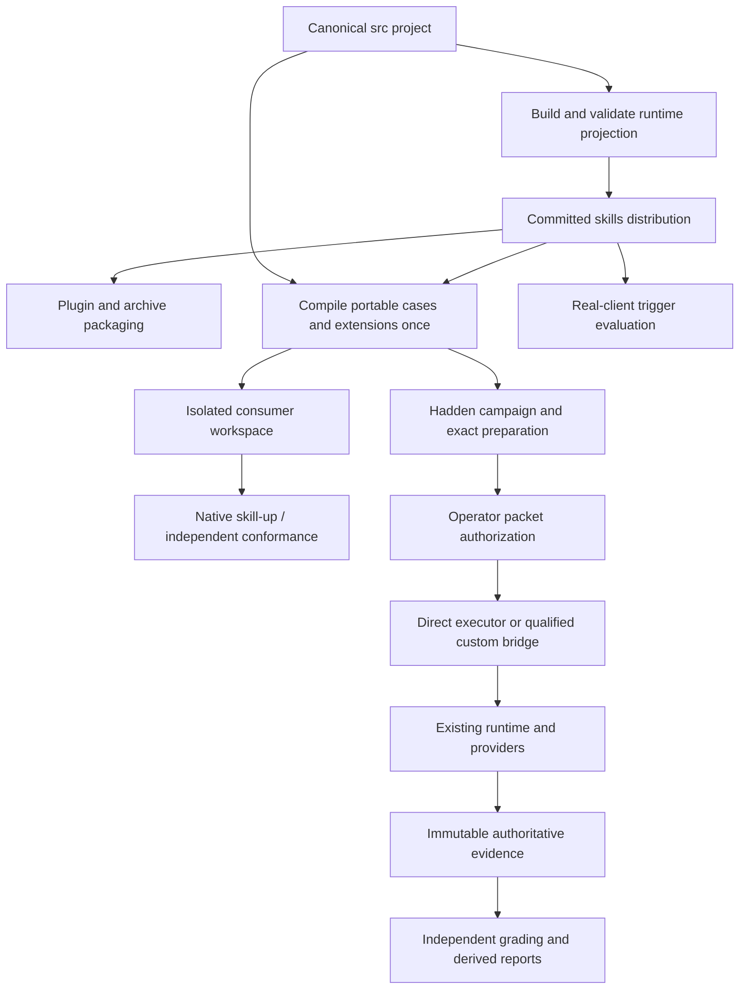

# Evaluation architecture and change dossier

Date: 2026-10-03. Inspected baseline: `75e952a25901a794a11c14e5ef7f7fca6616d6ad`.

Status: researched documentation revision of the user-selected Approach 1. The architecture choice is retained; the implementation and external-tool integrations described here are proposed, not delivered or qualified. This document records the earlier discussion and resolves its remaining technical choices against the current repository. It does not approve configuration changes, install tools, authorize model calls, or approve a release.

Read with the [preservation ledger](2026-10-03-evaluation-preservation-ledger.md), [research and decision record](../research/2026-10-03-evaluation-tooling.md), and [implementation plan](../plans/2026-10-03-evaluation-modernization.md). The original research report remains historical source material. The August build documents describe the implemented hybrid layout; this proposal supersedes that layout only when the relevant migration slice is delivered.

## Purpose and authority

Maintainers should author each skill and evaluation input once, distribute only the intended runtime payload, and use maintained external evaluation tools without losing the repository's existing authorization, isolation, experimental controls, evidence, and recovery behavior. Consumers should be able to distinguish interoperability, behavior, assurance, and actual skill activation.

The user selected complete canonical projects under `src/<skill>/`, committed generated runtime distributions under `skills/<skill>/`, skill-up as the primary ordinary execution/reporting consumer, agent-skills-eval as an independent consumer, and Hadden as the assured execution owner. They required a detailed account of what stays and how it interacts with the changed pipeline. They allowed historical evidence paths to change provided file contents do not. The 2026-10-03 instruction authorizes research-led resolution and documentation, with questions only after first principles, maintained practice, specifications/guidance, and adopted practice have been exhausted.

HISEW's installed `hadden-industries-plan-software-change` procedure supplies the requirements, quality scenarios, vertical slices, traceability, and re-planning structure. Personal applicability was active and engine version `0.1.0.dev16` was observed. No active implementation execution belonged to this task. The retained handoff returned by workflow inspection concerned a different, completed verification-order change; it was not adopted or altered. This is a draft dossier for implementation review, not an engine attestation of acceptance or verification.

### Risk route

**Risk class:** R2 for the proposed pipeline change. This is an engineering assessment, not a newly accepted implementation baseline.

**Decision owner:** Maksy, the repository owner and requesting user.

**Reasoning:** The work changes public distribution boundaries, exact-call authorization integration, durable evidence locations, and execution across independently maintained tools. Those are explicit R2 triggers. The phrase "high assurance" alone does not establish a safety-critical domain or organizational R3 separation-of-duties obligation.

**Potential blast radius:** All four skills, their ordinary installers, the committing-to-git plugin/archive, shared evaluators, maintained historical readers, and Windows/Linux evaluation operators.

**Reversibility:** Source/layout changes can be reversed through reviewed changes while preserving generated payloads. Consumed model authority, external side effects, and observations cannot be undone. Evidence relocation requires an independently checked inverse mapping, never regeneration of old evidence.

**Principal unknowns:** Release-specific bridge behavior on Windows; independent consumer limitations; actual installer selection with both source and distribution present. These have named experiments below, not assumed success.

**Required artifacts:** This dossier, preservation ledger, research record, master/phase plans, migration inventories, consumer qualification receipts, and exact candidate review evidence.

**Required specialist lenses:** Independent verification of the changed execution/evidence boundaries; scoped security assessment when those boundaries are implemented; dependency-rights review at adoption. A planning document does not initiate a scan or delegate implementation.

**Required verification:** Focused characterization and consumer tests for each slice, followed by the full relevant repository gate and independent review. Real provider, host activation, and installation acceptance remain separate from deterministic checks.

**Required human approvals:** The exact R2 implementation baseline; each exact configuration change; each exact external model authorization; any separately requested commit, publication, or new compatibility exception. Existing authorization is reused within its recorded scope.

**Maximum sensible autonomy:** Complete this researched documentation revision and inspect its consistency. Future implementation follows the accepted slice and exact configuration approvals; it cannot weaken an assurance gate to make an external consumer work.

**Next lifecycle step:** Review this concrete dossier and select the first implementation slice. No additional design interview is necessary on the evidence currently available.

## Current repository baseline

| Skill | Behavioral cases | Trigger queries | Implemented execution surface |
| --- | --- | --- | --- |
| `committing-to-git` | 72; IDs 1-77 with 20, 22, 25, 26, 27 retired | 22; 10 positive / 12 negative | Prepared Git campaigns, policy campaigns, domain controller, independent fixture facts, blinded bundles, separate actual-host measurement |
| `defining-concepts` | 16 | 22; 12 positive / 10 negative | Durable prepared campaigns, diagnostic trials, scripted controller, capability reconciliation, blind grading preparation and aggregation |
| `naming-objects-in-software-engineering` | 18 | 32; 16 positive / 16 negative | Legacy direct Antigravity diagnostics and keyword grading; a separate runtime lexical checker |
| `reading-epubs` | 5 | 14; 7 positive / 7 negative | Runtime conversion scripts, deterministic fixture/tests, resource measurement and documented behavioral procedure |

Counts are a baseline observation, not a permanent hardcoded denominator. Git's selected campaign is 27 cases x 3 arms x 1 repetition = 81 sessions. Its active case 77 is outside that selected matrix. Defining-concepts uses 10 cases x 3 arms x 1 repetition = 30 sessions per model/effort profile. Naming's JSON selects five calibration cases, producing ten two-arm sessions; its former README list was stale.

Three changes since the original discussion materially affect this design:

1. `scripted-conversation.js`, `skill-bundle.js`, and `capability-reconciliation.js` already own useful shared contracts. Defining-concepts already implements durable campaign execution, resumption and aggregation. These are reuse targets, not hypothetical new components.
2. Evaluation homes now support native Windows and Linux through a shared path-observation interface. The platform boundary is documented in [evaluation-platform-boundaries.md](../evaluation-platform-boundaries.md). Neither Docker/WSL substitution nor macOS support is implied.
3. Plugin generation and reproducible archive packaging are real downstream consumers. The Git skill also gained native large-snapshot commits, diagnostics, resumable preparation and publication preflight. All must survive distribution migration.

## Requirements and acceptance criteria

These IDs represent the accepted outcome and its researched refinement. The future implementation baseline must bind their exact revision.

| Requirement | Acceptance criterion |
| --- | --- |
| REQ-001: One canonical complete project per skill | AC-001: Every authored runtime file and suite definition has one owner under `src/<skill>`; generated `skills` contains exactly the centrally declared runtime projection. An independent inventory proves no evaluation, credential, maintainer-source or transient file leaks. |
| REQ-002: Lossless evaluation contracts | AC-002: Every active ID, initial prompt, ordered assertion, expected-output text, fixture byte and scripted follow-up survives. Retired IDs remain retired. Every extension is consumed or explicitly reported unsupported; no full-case pass follows a partial projection. |
| REQ-003: Preserve authority and recovery | AC-003: Existing exact authorization, current-state checks, single-use capability and evidence layouts retain behavior, including safe reopening before consumption and prohibition of replay after consumption. New consumers cannot expand it. |
| REQ-004: Preserve providers and homes | AC-004: Existing adapter fingerprints, capability enforcement, credentials boundaries, timeout/closure behavior and Windows/Linux lease/quarantine rules pass existing and new seam tests. |
| REQ-005: Preserve evidence identity | AC-005: Every tracked historical file relocates with identical SHA-256, length and internal relative path. New authoritative records remain immutable and schema-explicit; derived records reference their inputs and cannot upgrade them. |
| REQ-006: Preserve suite-specific meaning | AC-006: The ledger's Git, concept, naming and EPUB rows all have an owner, characterization proof and migration disposition. Existing weaker diagnostics remain honestly labeled. |
| REQ-007: Independent interoperability | AC-007: Pinned skill-up validates generated configurations; its fake engine and judge exercise the projection offline. Published agent-skills-eval independently discovers/loads the assembled skill and exercises its SDK with fake providers, with its documented field/fixture limitations retained. |
| REQ-008: Reproducible, offline deterministic gates | AC-008: Identical inputs and pinned toolchain produce identical portable projection bytes. Missing or mismatched tools fail before model/network activity. Explicit bootstrap is separate from verification and from current-tracking authoring tools. |
| REQ-009: Preserve experimental design | AC-009: Hadden retains campaign selection, randomization, repetitions, arm identities, capability matching, blind mappings and complete outcome denominators. Consumer two-arm defaults cannot redefine a three-arm experiment. |
| REQ-010: Preserve build and package consumers | AC-010: Installed-artifact tests continue to execute `skills`; source tests continue to exercise source. Plugin/archive contents, notices, no-op versions, ASCII/no-wrap gates and scoped-verification omissions remain correct. |
| REQ-011: Preserve permission and privacy boundaries | AC-011: No evaluation dependency, configuration, login, credential transfer, model judge, publication or scan occurs implicitly. External-call inputs and retained evidence exclude credentials and private blind mappings. |
| REQ-012: Explain remaining uncertainty | AC-012: Reports distinguish deterministic conformance, protocol support, behavior, safe closure, source verification and observed activation. Unknown/skipped/ungraded/invalid observations cannot become successful assurance. |

### Quality scenarios

| ID | Stimulus and required observable result |
| --- | --- |
| QA-001 | Submit the same consumed packet twice or race two bridge requests: at most one provider launch, with the second request rejected and retained evidence unchanged. A pre-consumption recovery must remain possible only under the existing runtime rules. |
| QA-002 | Cancel or kill skill-up, the bridge or its child at preparation, launch, active-turn and cleanup boundaries: either independently establish closure or retain unsafe/indeterminate evidence and prevent campaign advancement. Test grandchildren and inherited pipes on both operating systems. |
| QA-003 | Change one fixture byte, assertion index, follow-up, bundle file, tool binary, capability interpretation or generated configuration after preparation: reject before another model launch. |
| QA-004 | Supply traversal, absolute fixture paths, case-colliding paths, a symlink/junction/reparse substitution or an out-of-root output: reject at the responsible boundary with useful diagnostics. Do not claim immunity to hostile concurrent filesystem mutation. |
| QA-005 | Return malformed, partial, stale or successful-looking consumer output after a Hadden failure: preserve the authoritative failure/closure; do not write a false terminal success or discard raw evidence. |
| QA-006 | Remove a pinned tool or introduce ambient credentials, `.env`, user configuration or telemetry settings: fail missing-tool checks or prove the isolated subprocess ignores those inputs; no download or model process occurs during verification. |
| QA-007 | Build in independent roots with the same admitted source bytes/toolchain and locale-independent ordering: generated payloads/configuration match. Run `--check` against a missing, extra or modified output: report it without writing. |
| QA-008 | Install from the explicit generated skill path, repository root and generated plugin/archive in disposable contexts: inspect which copy was selected and all installed bytes. No source evals or duplicate source skill may masquerade as the selected runtime artifact. |
| QA-009 | Interrupt historical relocation: both the old/new inventories and mapping identify each byte-preserved file; no cleanup occurs until counts, lengths, hashes and reader paths reconcile. Ignored local evidence remains separately owned. |
| QA-010 | Present defining case 10 or naming cases 4/7 to a single-turn consumer: it reports unsupported full protocol, rather than flattening turns or returning a full-case pass. |
| QA-011 | Aggregate a campaign containing failures, missing grades, unsupported capabilities or one repetition: preserve exclusions/denominators and limits, enforce critical gates, and avoid unsupported statistical or cross-provider claims. |
| QA-012 | Read an unknown evidence schema or a historical unbound-deadline campaign: reject current execution; retain its historical interpretation without synthesizing missing guarantees. |

## Architecture boundaries

| Lane | Executor/consumer | Claim it can establish |
| --- | --- | --- |
| Ordinary portable behavior | skill-up native engines/runtimes, when separately authorized | Behavior under the declared portable protocol and supported capabilities |
| Independent conformance | agent-skills-eval public SDK and static target/judge providers | Independent parsing/discovery and the explicitly exercised consumer contract; not Hadden assurance |
| Assured behavior | Existing Hadden preparation, controllers, runtime and provider adapters; qualified skill-up custom bridge | Exact bound execution and retained evidence under a named profile |
| Trigger activation | Actual supported client with installed distribution and observed load events | Description-driven activation, positive/negative precision and recall under that host |

Naming's existing model-selected trigger labels remain legacy classifier diagnostics. They do not populate the fourth lane's activation score. Defining's trial integrity verifier does not perform live source reachability or entailment review. Those distinctions follow current implementation, not the proposed tools' names.

Native ordinary runs require a separately approved, frozen experiment identifying target and judge providers/models, transmitted inputs, capability/credential scope, case/arm/repetition count, retry policy, time/cost bounds and evidence destination. They do not inherit or claim the Hadden packet-consumption guarantee. A case requiring that guarantee is eligible only for the assured lane, not a weaker native fallback. The initial native consumer work uses fake targets and deterministic judges; approval of these documents does not authorize a real native target or agent judge. Native bootstrap and environmental defaults must be qualified before a live run.



### Canonical source and generated distributions

The end-state convention is:

```text
src/<skill>/
  SKILL.md
  references/                  # authored runtime references
  assets/                      # authored runtime assets, if any
  scripts/                     # authored deployable scripts, if any
  <registered build roots>/    # existing Git implementation modules stay here
  evals/
    evals.json                 # conventional portable base
    trigger-evals.json         # flat query/should_trigger contract
    files/                     # fixture bytes
    extensions/v1/suite.json   # sparse protocol + assurance extensions
    assurance/v1/              # suite-owned campaign/controller/oracle code
    analysis/                  # maintainer measurement programs, if any
    README.md
skills/<skill>/                # generated, committed runtime payload only
plugins/committing-to-git/     # generated from the skills payload
scripts/evaluation/           # shared compilation, runtime and integrations
evidence/historical/<suite>/   # byte-preserved tracked historical records
evidence/authoritative/<suite>/<run-id>/
evidence/derived/<suite>/<derivation-id>/
```

`src` is a repository maintenance choice, not an Agent Skills standard requirement. The [specification](https://agentskills.io/specification) defines the delivered skill directory and permits additional resources. An evaluation workspace assembles the exact generated distribution with portable evals and fixtures; the bare source project is not promised to contain a generated Git executable or to be directly runnable before building.

Use a closed central projection vocabulary: `SKILL.md`, runtime references/assets/scripts, explicitly registered license/notice resources, and registered transforms. Evaluation and build-only roots are recognized source categories but are never runtime-copy roots. Unknown source categories fail with a location and required disposition. Do not add per-skill packaging manifests or recursive copy-and-exclude rules. Existing Git directories, including `diagnostics`, `evidence`, `publication` and `selection`, retain their paths; no new `implementation/` wrapper is needed.

`buildRepository` continues owning the ordered operation: validate source -> compute intended runtime artifacts -> validate intended payload -> compare/write `skills` -> build/check plugin packages. `--check` is read-only throughout. A fresh build cannot require already-generated files to exist before it can construct them. Accidental outputs and missing license resources fail inventory validation. Writes are limited to registered generated paths after complete validation; unexpected or locally edited output needs an explicit disposition rather than blind recursive deletion.

Keep the existing esbuild transformation, public executable path and options. Node 24 is the runtime floor; `target: node22` is the current emitted-syntax setting, not a competing runtime claim. Changing that setting is a separate behavior/configuration decision. Source-to-distribution copy preserves bytes. The current `.gitattributes` already prescribes LF checkout for text; binary EPUB/evidence bytes are not normalized.

Plugin packaging remains downstream of `skills`, including six existing dependency notices and the MPL license. No-op builds preserve its content-derived version. Correcting the generated package README's source location is an intentional published-byte change and therefore changes the version. Archive fixed timestamps, ordering, CRC readback and refusal to overwrite an existing archive remain intact.

### Authored contracts and the correction for multi-turn cases

The common portable manifest has top-level `skill_name` and `evals`. Each case uses `id`, `prompt`, `expected_output`, `files`, and `assertions`. The initial conversion renames `expectations` while preserving string contents, array order, case IDs and expected-output text. Positive safe-integer IDs need not be contiguous. Retired Git IDs cannot be reused. Fixture paths are skill-root-relative, such as `evals/files/sample.epub`, and resolve to regular confined files.

The earlier phrase "the portable file contains all authored behavioral semantics" is no longer adequate. Exact follow-up turns and required capabilities are already implemented inputs. Keep one sparse, versioned `extensions/v1/suite.json`, keyed by stable case ID, with distinct `protocol` and `assurance` sections. This refines the previously suggested `assurance/v1/profile.json` name because some extensions describe behavior rather than assurance. It does not introduce a second complete case definition.

| Owner | Authored contents |
| --- | --- |
| Portable base | Initial prompt, expected output, ordered assertions, fixture references, stable ID |
| `protocol` extension | Exact ordered follow-up IDs/text and declared case capability requirements that the common format cannot express |
| `assurance` extension | Registered profile/fixture/cost keys, critical assertion indexes, campaign selection/arms/repetitions, exact compatibility interpretations, grading dimensions/strata and domain policy |
| Suite README | Rationale, measurement procedure, limitations and human review protocol |
| Central profile registry | Trusted code-to-profile binding and supported protocol versions; never an executable path selected by sidecar data |

Keep current critical indexes zero-based. A displayed `expectation-01` or assertion ordinal is a separate one-based presentation mapping. Do not change criticality by scanning `[CRITICAL]` prose or silently renumbering indexes. The entire assertion array is digest-bound so an edit/reorder makes stale metadata fail visibly.

The initial property disposition is explicit; preserve values unless a locator is being moved or a field is being renamed as listed:

| Existing input | New owner / mapping |
| --- | --- |
| `skill_name`, case `id`, `prompt`, `expected_output`, `files` | Portable base; only admitted fixture locators change. |
| Case `expectations` | Portable `assertions`, with identical strings and ordering. |
| Case `follow_up_turns`, `required_capabilities` | `protocol.cases`, keyed by the same stable ID. The compiler does not invent capabilities for suites that lack declarations. |
| Git `case_key`, `execution_mode`, `fixture`, `critical_safety`, `cost_profile` | `assurance.cases`; retain executable-versus-policy distinction, the Boolean critical-safety classification and registry keys. A Boolean is not a replacement for per-assertion criticality. |
| Defining case `name`, `renderer`, `profiles`, `research_strata`, `qualitative_dimensions`, `standards_scope` | `assurance.cases`; retain exact labels and applicability, including metadata used only by human graders. |
| Defining `critical_expectation_indexes` | `assurance.cases` as `critical_assertion_indexes`; zero-based values unchanged. Compiled callers adopt the new name coherently; historical records keep the old spelling. |
| Suite `capability_contract` | `assurance` suite policy, preserving exact compatibility text, arm requirements, supported IDs and deny-default uniform policy. Case requirements remain in `protocol`. |
| Suite `renderers`, `profiles`, `qualitative_dimensions`, `critical_failure_classes`, `campaigns`, `metrics` | `assurance` suite metadata; no removal just because a general consumer ignores it. |
| Naming `calibration_case_ids` and campaign choices currently held in runner code | `assurance` campaign definition, with literal before/after schedule fixtures. Ordinary consumer defaults never supply missing experiment choices. |
| Suite `notes` | Retained verbatim in the suite guide or a named provenance field when a machine consumer needs it; never mistaken for executable policy. |
| Old `schemaVersion` / `schema_version` | Recorded in migration provenance and existing historical readers. The portable file gets no invented standards-version field; the new extension has its own explicit schema version. |

Refresh this map against the actual candidate before conversion. Any additional property requires a disposition and proof before cutover, not silent dropping. The complete compiled view includes suite-level policy and experiment identity as well as per-case identity, so a changed campaign or grading policy changes the run identity even when portable case bytes do not.

Use strict JSON Schema 2020-12 for repository-owned extension schemas and Ajv's supported 2020-12 implementation. Reject unknown versions/properties, invalid types and malformed digests. Semantic checks additionally enforce unique IDs, complete joins, valid critical indexes, registered fixtures, execution-mode agreement, retired IDs and explicit capability requirements; JSON Schema alone does not establish those relations. Reject duplicate object keys before reducing authored input to an object using maintained parser diagnostics, and reuse native JSON syntax validation. Do not build a JSON/YAML grammar or reproduce skill-up's schema locally.

### Compilation, identity and projection

One compiler joins the base, extension, fixture inventory, registered profile and verified runtime distribution into a transient immutable JSDoc-typed value. Every consumer uses this join; no second consumer-specific join silently changes semantics. There is no committed intermediate manifest duplicating authored cases.

Reuse `canonicalJsonBytes` and `sha256Hex`. Define the case definition hash over RFC 8785 bytes of the exact portable case. Define an input-set hash over a locale-independent ordered array of `{relativePath, byteLength, sha256}`. Define the portable-case hash over the versioned pair of those hashes. The extension's `portableCaseSha256` deliberately detects stale attachment; a reviewed refresh tool may update it, but must show the underlying semantic diff. Define the complete-case identity from portable-case hash plus exact protocol/assurance extension and registered profile version. This identity includes every follow-up and capability requirement.

A consumer workspace is fresh, outside the repository, and contains only the exact distribution, portable manifest, admitted fixtures and necessary generated consumer configuration. It does not receive the whole source tree, credential homes, historical evidence or private blind map. Assurance control artifacts live in the owned control/evidence destination, not the model-readable fixture tree. Provider workspace/home configuration remains packet-owned.

Every projection produces a field-coverage receipt: emitted, enforced by a named owner, retained as provenance, or unsupported with its effect on eligibility. Unknown fields fail. Unsupported full conversations are visible exclusions from the consumer's full-case claims. Preserve expected output as judge context rather than silently creating an extra assertion. Natural-language assertions require a suitable authorized grader; keyword inclusion is not a semantic equivalent.

Generated YAML uses a maintained emitter/parser with round-trip equality tests for exact prompt, expected-output and assertion strings. Call the pinned consumer's real validator as well. Fixed ordering, schema/projector versions and tool identities make static output deterministic. No timestamps, random workspace names, host absolute paths, locale sorting or ambient environment defaults enter static projection receipts.

Avoid self-hash cycles through this explicit dependency order:

1. Compile source/distribution/case identities and freeze a campaign definition containing schedule and policy, without packet hashes.
2. Allocate the intended run/workspace/session destinations; materialize the actual execution configuration and its projection receipt. The configuration uses predetermined session locators, not a digest of a not-yet-created manifest. The receipt lists payload files, excluding itself.
3. Prepare Hadden packets binding the campaign-definition hash, projection-receipt hash, toolchain, inputs and expected bridge correlation. Host-local materialization is independently hashed; it is not claimed byte-identical across arbitrary host paths.
4. Review packets and obtain exact authorizations. Create an execution index binding packet hashes, authorization locators, sequence and the earlier projection identity. Packets do not hash this later index.
5. Retain the actual invocation/index digest as execution evidence; finalized runtime records and subsequent derivations may refer backward to all these identities. No earlier hash is recomputed to include a later result.

### Assured execution and the custom-engine boundary

Keep Hadden campaign planning, preparation, zero-turn preflight and authorization outside skill-up. A profile exposes preparation, execution of an already-prepared session, and derivation of its disposition. Existing suite functions implement these responsibilities first; extract common orchestration only after equivalent interface tests exist. The stable shared execution owner remains `executeAuthorizedModelSession`.

The bridge loads only a registered profile and selected prepared session. It treats `SessionInput` as untrusted correlation. It cannot obtain provider, executable, model policy, effort, prompt, fixture, treatment, home, capabilities, controller, authorization or output destination authority from that payload. It verifies correlation and delegates the unchanged preparation to the existing runtime, which performs the actual current-state and authorization checks.

For the selected skill-up release, the boundary includes `kwargs`; current website behavior is not the release contract. Only public, non-authoritative correlation values may occupy that map. Authorizations, credential values and private arm mappings never enter it. Reject unexpected `session_id` for the batch profile. Compare all modeled fields against the prepared contract; omissions use only the explicitly tested release serialization rules, not speculative compatibility coercion.

For assured sessions, skill-up gets the initial message and one batch invocation. The existing Hadden controller sends follow-ups at the correct state transitions; future user messages are not flattened into the initial model prompt. Outer `max_turns` is the bridge invocation limit, not the provider's internal turn authority. State this mapping explicitly in the receipt.

Hadden selects one scheduled case/arm/repetition before each invocation. Generate one-case configuration, no framework-managed treatment, no baseline expansion, one iteration, parallelism one and retries zero. Hadden continues capturing and installing/rendering the exact selected treatment. If skill-up's literal `with_skill` carrier variant is used, it has no experimental arm meaning: the prepared Hadden arm and blinded mapping remain authoritative. Raw consumer benchmark comparisons must not be presented as the three-arm result.

The invocation wrapper accepts only the frozen configuration and reviewed run selector. It rejects engine/model/provider/iteration/baseline/retry/parallelism overrides. Runtime single-use authority is still the final safeguard. Existing campaign leases, immutable execution identity and outcome reconciliation own order and resumption; the bridge does not add a competing schedule journal.

The packet-bound Hadden execution deadline stays authoritative. Freeze a separate outer deadline that includes admitted startup and bounded cleanup time. The release clamps the remaining timeout before calling the bridge, so correlation must admit only the predeclared remaining-budget range that still accommodates the Hadden deadline and cleanup; it must not require an impossible clock-identical timeout or silently shorten/extend the packet's deadline. Reject insufficient remaining budget before launch. Tests must cover rounding, delayed startup, cancellation and cleanup overrun.

Return a deliberately limited `SessionResult`: explicit exit code and final message, observed usage/turns/duration where available, permitted transcript/diagnostics and a small evidence-reference artifact. That reference identifies the authoritative run, digest, profile, status and failure/closure without copying credentials or blind identities. It is a derived export. Consumer success, missing artifacts, output truncation or report failure cannot overwrite Hadden's outcome.

Both `legacy-v1` and `evaluation-trial-v1` evidence layouts remain supported through their explicit contracts. Preserve terminal-record-last behavior, existing failure classes, and separate safe/unsafe closure. Pre-consumption reopening, continuing to the next unconsumed campaign session, and retrying a consumed model attempt are three different operations. Only the first two are supported under the existing exact identity rules.

### Platform qualification and cutover

The direct Hadden assured executor remains an ongoing operator boundary until the bridge passes all applicable gates. This is coexistence of two explicitly labeled execution modes, not a forwarding alias hiding a broken contract. Keep preparation, catalog, authorization, recovery and blind-grading CLI capabilities even after skill-up owns ordinary execution/reporting. Move in-repository callers coherently when files move; do not add old-path shims without a separate scoped HISEW NSH-01 decision.

Windows is an explicit qualification risk: skill-up v0.12.0's non-Unix process-group setup does not terminate descendants. A bounded wait or zero exit code does not prove child closure. First test direct local batch integration with fake children and the existing Hadden deadline/home machinery. If abrupt consumer termination can leave uncontained descendants, fail that platform's cutover gate and retain direct execution. Do not silently switch to WSL, disable leases, add a service, or weaken closure. A separate execution-host design or upstream repair would require a new researched design revision.

Linux must pass its own tests; Unix source code is not execution evidence. Preserve the existing supported-filesystem limits and synthetic-versus-live distinction. The build pipeline can migrate before all provider/platform acceptance is complete, because distribution equivalence and assured execution cutover are distinct gates.

## Evidence, grading and historical migration

Keep authoritative raw evidence separate from derived grading, reports and projection workspaces. Actual file paths are storage locators; immutable packet/run identity and declared schemas carry meaning. Moving a historical tree does not give it current guarantees.

At the inspected baseline, tracked results comprise 412 files / 6,028,581 bytes: three Git records and 409 defining-concepts files. Nineteen local naming result files / 4,726,489 bytes are ignored, untracked material. Inventory them separately; never automatically add them to Git or sweep them into a tracked relocation. Counts must be refreshed immediately before a move.

Relocate tracked `evals/<suite>/results/**` into `evidence/historical/<suite>/**` with every internal relative path unchanged. Retain a versioned mapping of old path, new path, Git blob identity where applicable, length and SHA-256. Compare both inventories before/after, including missing/unexpected files and empty-directory observations where relevant. Update current readers and live documentation in the same isolated migration. Leave embedded old absolute paths, transcripts, old aggregates and historical plans unchanged. A fix to an old aggregate creates a new derived record naming its inputs and superseded derivation.

Future runs use new owned destinations under authoritative/derived roots. A schema-versioned terminal record, closed writers, retained input inventory and independent readback are prerequisites for a sealed result; "immutable" is an application rule here, not a claim that ordinary filesystem storage is write-once media. Interrupted or unsafe runs stay visible and protected from automated cleanup.

Preserve suite grading contracts. Git keeps independent fixture facts and scope/controller safety gates. Defining keeps critical checks, applicable dimensions, pairwise blind comparisons, atomic completeness requirements and separate executor retrieval / independent reachability / semantic support judgments. Naming's lexical checker continues to state `semantic_certified: false`; its legacy keyword scores remain diagnostics. Reading retains actual conversion/resource measurements and untested Pandoc status. An optional LLM judge is another external session with its own authorization; it never starts implicitly in CI.

## Verification, integration and retirement rules

Normal deterministic verification contains no paid credentials or live target/judge calls. Explicit bootstrap acquires exact reviewed tool bytes; verification fails on missing/mismatched tools instead of installing them. Keep the existing current-tracking authoring bootstrap separate. Use actual skills-ref, Tessl and the selected consumers' supported interfaces; repository-owned validation adds only local invariants and extension semantics.

Preserve the current verification order: diff, build/static checks, skills-ref, Tessl, then the full Node suite. Proposed consumer conformance can be inserted before the broad test suite only through the exact configuration approval described in the plan. Scoped verification retains its exact selector and honest global omissions, expands ownership to canonical evals and relevant generated packages, and does not accidentally claim all shared-runtime tests ran.

Retirement requires a ledger row with current/end-state owner, passing characterization and seam coverage, relevant consumer qualification, no remaining live caller, and authorized real-provider comparison when behavior changed. Do not delete safety tests in the same change that introduces their replacement. Historical schema readers remain where they have retained evidence consumers. Do not retain obsolete CLI aliases merely for convenience.

Re-plan if a projection loses protocol meaning, a consumer needs broader authority, closure cannot be established, installer discovery selects source, a new release changes the pinned contract, rights remain unresolved at adoption, a historical hash changes, or current code gains a capability absent from this ledger. Upstream contributions may resolve limitations but are a non-blocking backlog; they are not promised prerequisites with invented delivery dates.
