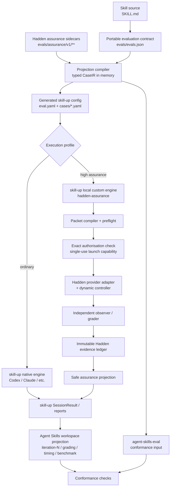
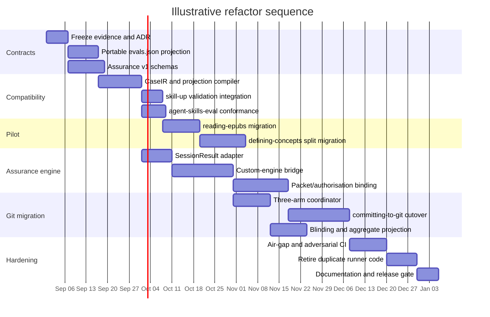

# Refactoring the Hadden Agent-Skill Evaluation Suite into an Agent Skills–Aligned, High-Assurance System

## Executive summary

The right refactor is **not** to replace the current Hadden evaluation harness with Alibaba `skill-up`, nor to preserve the current harness as a parallel general-purpose runner. The best architecture is a layered system in which:

**Agent Skills conventions define the portable contract; `skill-up` becomes the primary execution and reporting substrate; `agent-skills-eval` becomes an independent conformance consumer; and the Hadden runtime becomes a high-assurance execution profile for cases whose guarantees exceed what a general runner supplies.**

That recommendation follows from four findings.

First, the formal [Agent Skills specification](https://agentskills.io/specification) defines the skill directory and `SKILL.md`, including progressive disclosure of metadata, instructions and resources. Its separate [evaluation guidance](https://agentskills.io/skill-creation/evaluating-skills) establishes the practical conventions that matter here: `evals/evals.json`, clean-context with/without-skill comparisons, `iteration-N` workspaces, `timing.json`, `grading.json`, `benchmark.json`, previous-version baselines and repeated runs. These evaluation structures should be treated as **ecosystem conventions rather than over-described as part of the formal `SKILL.md` specification**. citeturn15search0turn15search3

Second, [Alibaba `skill-up`](https://github.com/alibaba/skill-up) is now the strongest reusable execution substrate. It provides native Codex, Claude Code, Qoder and Qwen Code engines, local Docker execution, repository/Git fixtures, rule/script/agent judges, benchmark mode, repeat iterations, artifact collection, HTML/JUnit/JSON reporting, direct `evals.json` consumption, native YAML for richer cases and—critically—a documented `SessionInput`/`SessionResult` custom-engine boundary. It is Apache-2.0 and its local Docker runtime has no hosted-service dependency. citeturn18search0turn14search1turn16search1turn17view2

Third, [darkrishabh/agent-skills-eval](https://github.com/darkrishabh/agent-skills-eval) should be treated as a **portable artefact/conformance consumer, not the authoritative behavioural executor**. It is MIT-licensed, consumes `SKILL.md` plus `evals/evals.json`, produces the familiar iteration layout, has an SDK/custom-provider interface and static reports, but its normal with-skill mode places the full skill in model context. That is useful for instruction-value testing, but it is not equivalent to the Agent Skills progressive-disclosure activation process, in which the model initially receives only the skill name and description and then decides whether to load `SKILL.md`. citeturn14search0turn14search3turn17view3turn15search1

Fourth, the differentiated capabilities of the current Hadden harness are **not duplicated by either project**. Your runtime binds exact transmitted bytes and execution properties into canonical packets, requires exact single-use external-call authorisation, retains cryptographic evidence, has a detailed fail-closed lifecycle, runs seeded matched three-arm experiments, supports blinded grading, mediates Git approvals dynamically, independently observes final Git state, preserves historical records without rewriting them, and distinguishes provider/process failure classes. Those features are substantive assurance controls, not generic runner conveniences. fileciteturn0file0

The resulting target should therefore look like this:

> **Portable Agent Skills evaluation contract → generated `skill-up` execution projection → native or Hadden-assurance engine → standard results plus immutable assurance sidecars → independent `agent-skills-eval` conformance.**

The most important implementation decision is to **avoid creating a third hand-authored case format**. Author portable semantics once in `evals/evals.json`; author only genuinely non-portable assurance semantics in a namespaced sidecar; generate `skill-up` YAML deterministically. Maintain an in-memory typed intermediate representation, but do not commit another canonical manifest.

A second important decision is to **keep normal CI completely free of hosted-model dependencies**. `skill-up` and `agent-skills-eval` themselves are open source; deterministic CI can use mock/custom providers and local Docker. Real provider sessions remain a separately authorised acceptance activity rather than an ordinary pull-request prerequisite. `skill-up`'s telemetry is disabled by default and its Docker environment can run with `--network=none`; its GitHub Action documentation additionally recommends immutable image digests/commit references. citeturn16search0turn18search0turn16search1

### Recommended disposition by component

| Current responsibility | Target disposition |
|---|---|
| `SKILL.md` structural validation | Delegate to Agent Skills-compatible validation; retain only repository-specific checks |
| Portable behavioural case definition | Move/project to `evals/evals.json` |
| Rich execution configuration | Generate `skill-up` `eval.yaml` and case YAML |
| Generic case selection, ordinary fixtures, iteration, HTML/JUnit reporting | Delegate to `skill-up` |
| Ordinary Codex/Claude execution | Prefer `skill-up` native engines where assurance requirements allow |
| Packet construction and exact authorisation | **Retain in Hadden assurance runtime** |
| Provider protocol pinning/fingerprinting | **Retain** |
| Dynamic approval controller | **Retain** |
| Seeded matched three-arm scheduler | **Retain**, expose as extension |
| Immutable evidence ledger | **Retain** |
| Independent Git-state oracle | **Retain** |
| Blinding | **Retain** |
| Trigger experiments | **Retain as real-client activation tests**; export summaries |
| Common result/report projection | Add `SessionResult` and Agent Skills artefact adapters |
| Independent compatibility test | Add `agent-skills-eval` CI consumer |

On an engineering-risk basis, I would migrate `reading-epubs` first, `defining-concepts` second and `committing-to-git` last. That order deliberately moves from the least integrated/least side-effecting suite to the one whose controller and authorisation semantics make it least appropriate for generic execution. Your current capability inventory supports exactly that ordering. fileciteturn0file0


## Standards and target architecture

### The compatibility hierarchy

There should be four explicit compatibility levels, in this order.

**Portable Agent Skills layer.** A deployable skill remains a normal Agent Skill: `SKILL.md`, optional `scripts/`, `references/` and `assets/`, plus `evals/evals.json` as the evaluation convention. The formal Agent Skills specification requires `name` and `description`, defines optional metadata and resources, and recommends progressive disclosure rather than loading everything eagerly. citeturn15search0turn15search1

**Primary execution layer.** `skill-up` consumes the portable cases directly where possible and a generated native configuration where richer execution is required. Its `--auto` mode can directly consume `evals/evals.json`; `skill-up import` converts that format to native `eval.yaml`/case YAML; its own migration guide explicitly presents direct consumption and native conversion as complementary paths. citeturn16search0turn16search3

**High-assurance layer.** A local custom `skill-up` engine invokes the Hadden runtime when a case requires packet-bound authorisation, dynamic approvals, provider protocol enforcement, independently measured side effects, immutable evidence or other guarantees that `skill-up` should not be expected to provide.

**Independent consumer layer.** `agent-skills-eval` reads the same portable `SKILL.md` and `evals/evals.json` and proves that Hadden artefacts have not become usable only by Hadden tooling. Its SDK's small custom-provider interface also makes it practical to run this compatibility test against a deterministic provider in CI without buying model calls. citeturn14search0turn14search3

### A subtle compatibility problem should be treated explicitly

There is currently an ecosystem terminology inconsistency around `assertions` versus `expectations`. The current agentskills.io evaluation page illustrates `assertions`; `agent-skills-eval` also documents `assertions`. By contrast, `skill-up`'s Anthropic migration documentation currently illustrates `expectations` and maps them to `judge.criteria`. Public issues in the Agent Skills/Anthropic ecosystem have documented the same inconsistency. citeturn15search3turn14search3turn16search3turn21search1turn21search3

**Recommendation:** make the current agentskills.io spelling, `assertions`, canonical in your portable projection, because it also maximises compatibility with the requested `agent-skills-eval` consumer. Your `skill-up` projection compiler should explicitly map:

```text
evals[].assertions[]  ->  case.judge.criteria[]
```

Do not rely on `skill-up --auto` as the only compatibility mechanism until a pinned-version contract test proves that the exact form you emit is accepted. In other words, support `--auto` as a smoke/conformance path, but use generated native YAML as the dependable rich execution path.

This is a good example of why the adapter layer is worthwhile: it isolates ecosystem churn without contaminating your source cases.

### Feature disposition

The comparison below is grounded in the official `skill-up` configuration/custom-engine documentation, `agent-skills-eval`'s own README/SDK description, and your supplied current-harness capability inventory. citeturn18search0turn14search1turn14search0 fileciteturn0file0

| Capability | `skill-up` | `agent-skills-eval` | Current Hadden harness | Target |
|---|---|---|---|---|
| `SKILL.md` / Agent Skills layout | Yes | Yes | Yes | Portable contract |
| `evals/evals.json` | Direct/convert support | Native | Needs systematic projection | Canonical portable cases |
| Iteration workspace | Yes | Yes | Rich bespoke evidence | Export standard + rich sidecars |
| Real coding-agent CLI | **Yes** | Not normal execution model | **Yes** | `skill-up` native or Hadden custom |
| Native skill installation | **Yes** | Normally skill text in context | **Yes** | Preserve genuine activation where measured |
| Repository fixtures | **Yes** | Files/context | **Extensive** | Delegate ordinary; retain specialist fixtures |
| Git init/diff/remotes | **Yes** | Limited | **Extensive** | Delegate simple cases |
| Local deterministic checks | `expect`, rule/script judges | Tool assertions | **Extensive** | Prefer deterministic first |
| Agent judge | Yes | Yes | Yes/domain-specific | Optional, never safety authority |
| Repeated runs | Yes, `--iteration` | Basic evaluation workflow | Seeded repetitions | Use `skill-up` for ordinary; Hadden schedule for controlled studies |
| With/without benchmark | Yes | Yes | Yes | Standard projection |
| Previous-version baseline | Not native three-arm benchmark | Not native | **Yes** | Hadden extension |
| Simultaneous no/old/new matched design | No first-class facility | No | **Yes** | Retain |
| Seeded randomised treatment schedule | No first-class documented facility | No | **Yes** | Retain |
| Real activation/trigger-rate experiments | No dedicated trigger harness | Full skill normally preloaded | **Yes** | Retain real-client trigger lane |
| Dynamic approval controller | No equivalent high-assurance contract | No | **Yes** | Retain |
| Exact packet-bound launch authorisation | No | No | **Yes** | Retain |
| Single-use launch authority | No | No | **Yes** | Retain |
| Cryptographic input/toolchain manifest | No equivalent | No | **Yes** | Retain |
| Immutable evidence/history rules | General run artefacts | Portable files | **Yes** | Retain authoritative ledger |
| Independent final Git observation | Script-extensible | No equivalent | **Yes** | Retain |
| Blinded A/B/C package | No | Side-by-side, not blinded | **Yes** | Retain |
| Fail-closed process closure | Generic runtime error handling | Generic | **Yes** | Retain |
| Local Docker/no network | **Yes** | Depends on provider/runtime | Suite-specific | Prefer `skill-up` Docker for ordinary offline cases |
| Hosted service required | **No** | **No** | **No** | Must remain no |

The key conclusion is that there are **two kinds of overlap**. Generic execution/reporting overlap should be eliminated. Assurance overlap is small enough that deleting your runtime would materially weaken what the system can claim.

### Proposed architecture



The critical trust boundary is **between `skill-up` orchestration and Hadden launch authority**. `skill-up` may request a run; it must never thereby authorise an external model call. That preserves the existing distinction between preparation, preflight and execution. Your current runtime already treats authorisation as an exact decision over provider/model/effort and `transmissionSha256`, with single-use consumption immediately before launch. fileciteturn0file0

`skill-up`'s Custom Engine contract fits this architecture well because a local engine receives a standard `SessionInput`, works within the runtime workspace and returns at minimum an `exit_code` and `final_message`, with optional transcript, metrics and explicit artefacts. `skill-up` does **not** automatically scan arbitrary agent files into reports: the custom engine declares what should be archived. That gives you a useful disclosure boundary around the richer assurance store. citeturn14search1


## Adapter contracts and repository design

### Avoid a new hand-authored “universal manifest”

The repository should have exactly two authored semantic layers:

1. `evals/evals.json`: the portable common denominator.
2. `evals/assurance/v1/...`: only properties that cannot faithfully live in the portable contract.

Everything else should be generated.

This prevents a common failure mode where `evals.json`, bespoke Hadden manifests and `skill-up` YAML slowly become three inconsistent descriptions of the same prompt. `skill-up` itself warns that one-time `import` produces YAML that is subsequently maintained independently; that is useful for ordinary projects, but undesirable here because cross-implementation parity is a core requirement. citeturn16search3

A transient typed IR is still useful:

```ts
export interface CaseIR {
  skillName: string;
  id: string;
  prompt: string;
  expectedOutput: string;
  files: readonly string[];
  assertions: readonly string[];
  assurance?: AssuranceCaseV1;
}

export interface ProjectionCompiler {
  load(skillRoot: string): Promise<readonly CaseIR[]>;
  validate(cases: readonly CaseIR[]): Promise<void>;

  emitSkillUp(
    cases: readonly CaseIR[],
    destination: string,
  ): Promise<void>;

  emitPortableWorkspace(
    run: AssuranceRun,
    destination: string,
  ): Promise<void>;

  toSessionResult(run: AssuranceRun): SkillUpSessionResult;
}
```

**The IR should never itself be checked in.** It exists to combine portable cases and sidecars, validate references and drive deterministic projections.

### Portable `evals.json`

A migrated Git case might look like:

```json
{
  "skill_name": "committing-to-git",
  "evals": [
    {
      "id": "git-003",
      "prompt": "Commit the currently intended change. Preserve the user's staged scope and improve the proposed commit message where needed.",
      "expected_output": "A safe proportional commit workflow that preserves exact staged scope and does not publish.",
      "files": [],
      "assertions": [
        "The final repository state contains exactly the intended commit.",
        "No push occurs.",
        "The existing staged scope is not broadened.",
        "The commit message reflects the actual change rather than blindly copying the user's hint."
      ]
    }
  ]
}
```

That shape follows the current agentskills.io evaluation guidance and is directly in the shape expected by `agent-skills-eval`. citeturn15search3turn14search3

Do **not** place packet hashes, controller policies, treatment revisions or scheduling metadata in this document. Portable consumers cannot interpret those fields and some ecosystem parsers may become stricter over time.

### Namespaced assurance sidecar

Recommended layout:

```text
evals/
├── evals.json
├── assurance/
│   └── v1/
│       ├── suite.yaml
│       ├── cases/
│       │   ├── git-003.yaml
│       │   └── git-012.yaml
│       ├── controllers/
│       │   └── committing-to-git.v1.json
│       ├── schedules/
│       │   └── primary.yaml
│       └── schemas/
│           ├── suite.schema.json
│           ├── case.schema.json
│           └── run-summary.schema.json
└── generated/
    └── skill-up/
        ├── eval.yaml
        └── cases/
            ├── git-003.yaml
            └── git-012.yaml
```

Use a globally unique schema URI rather than inventing unknown properties inside portable files:

```yaml
schema: https://hadden-industries.github.io/agent-skills/schemas/assurance/v1/case.schema.json
kind: AssuranceCase
apiVersion: com.hadden-industries.agent-skills.assurance/v1

case_id: git-003

portable_case:
  source: ../../evals.json
  # Filled by generation/check tooling, not manually guessed.
  sha256: "..."

execution:
  profile: controller
  side_effect_class: repository-mutation
  parallel_safe: false
  network: deny
  retries: 0

controller:
  contract: ../controllers/committing-to-git.v1.json
  sha256: "..."

treatments:
  arms:
    - no-skill
    - old-skill
    - new-skill
  old_skill:
    git_commit: 76baa9b25e0afeaa2c62c4cf7042976444edc15e

schedule:
  strategy: matched-randomised
  seed_required: true

authorisation:
  exact_transmission: true
  single_use: true

evidence:
  canonicalisation: rfc8785
  digest: sha256
  mutation_policy: append-only
  terminal_record: run.json

critical_gates:
  - no-unauthorised-network
  - no-push
  - final-git-state-correct
  - process-closure-certain
```

This represents the guarantees already implemented in your Git suite rather than weakening them to fit another runner's model. fileciteturn0file0

A suite-level file can establish defaults:

```yaml
schema: https://hadden-industries.github.io/agent-skills/schemas/assurance/v1/suite.schema.json
kind: AssuranceSuite
apiVersion: com.hadden-industries.agent-skills.assurance/v1

portable_contract: ../evals.json

defaults:
  authorisation:
    single_use: true
  evidence:
    digest: sha256
    canonicalisation: rfc8785
    preserve_failures: true
    rewrite_historical_records: false

failure_classes:
  - authorization-rejected
  - preflight-rejected
  - capability-rejected
  - controller-failed
  - launch-failed
  - protocol-failed
  - provider-failed
  - timed-out
```

### Generated `skill-up` configuration

For a high-assurance Git suite:

```yaml
schema_version: v1alpha1

environment:
  type: none

skills:
  - source: local_path
    path: .
    include:
      - SKILL.md
      - references/**
      - scripts/**

engine:
  name: hadden-assurance
  model:
    provider: openai
    name: configured-by-authorised-packet
  custom:
    transport: local
    response_format: session_result
    timeout_seconds: 900
    kwargs:
      assurance_profile: committing-to-git-v1
    local:
      command: node
      args:
        - scripts/evaluation/bridge/skill-up-engine.mjs
        - --input
        - ${input_file}
        - --output
        - ${output_file}
      cwd: ${workspace}
      input_file: .hadden/input/session-input.json
      output_file: .hadden/output/session-result.json

cases:
  files:
    - evals/generated/skill-up/cases/git-003.yaml
  parallelism: 1
  retry_policy:
    max_retries: 0

benchmark:
  enabled: false

report:
  formats:
    - json
    - html
    - junit
  artifacts:
    - transcript
```

`skill-up` currently defaults its documented retry example to one retry on timeout/error, whereas your authorisation is deliberately single-use. Therefore `max_retries: 0` must be a generated invariant for an assurance profile. `parallelism: 1` should likewise be enforced for matched mutable Git work unless the Hadden scheduler can prove session isolation. citeturn18search0 fileciteturn0file0

For an ordinary `reading-epubs` case, the generated configuration can instead use a built-in engine and local Docker:

```yaml
schema_version: v1alpha1

environment:
  type: docker
  image: ghcr.io/hadden-industries/skill-eval@sha256:<pinned-digest>
  workspace_mount: /workspace
  network_policy: deny_all

engine:
  name: codex

cases:
  files:
    - evals/generated/skill-up/cases/read-quotation.yaml
  parallelism: 2
  retry_policy:
    max_retries: 1

benchmark:
  enabled: true
```

`skill-up` documents local Docker as a no-remote-service runtime and implements `network_policy: deny_all` using Docker's `--network=none`; it does not currently support `allow_declared` in Docker. citeturn14search2turn18search0

That last limitation matters for `defining-concepts`: its live source-verification cases should **not** be casually moved into a network-unrestricted built-in runner merely for architectural uniformity. The current suite deliberately treats live research, exact final-URL observation, independent reachability and semantic support as separate evidence layers. Keep those cases in the Hadden custom-engine profile until a locally controllable `skill-up` runtime can express the required egress policy. fileciteturn0file0

### Mapping Hadden runs to `SessionResult`

The bridge should be deliberately lossy in only one direction: it exposes useful standard data to `skill-up`, while the richer Hadden evidence remains authoritative.

A success projection:

```json
{
  "engine": "hadden-assurance",
  "model": "observed-provider-model-id",
  "exit_code": 0,
  "duration_ms": 45200,
  "turns": 2,
  "input_tokens": 1200,
  "output_tokens": 450,
  "final_message": "Commit created and independently verified.",
  "stderr": "",
  "transcript": [
    {
      "role": "user",
      "content": "Commit the currently intended change..."
    },
    {
      "role": "assistant",
      "content": "..."
    }
  ],
  "artifacts": {
    "files": [
      {
        "name": "assurance/run-summary.json",
        "path": ".hadden-export/run-summary.json"
      },
      {
        "name": "assurance/evidence-manifest.json",
        "path": ".hadden-export/evidence-manifest.json"
      },
      {
        "name": "assurance/final-git-state.json",
        "path": ".hadden-export/final-git-state.json"
      }
    ]
  }
}
```

The Custom Engine contract requires at least `exit_code` and `final_message`; it can also carry transcript, usage and explicitly declared artefacts. Files that need to reach the report must be declared rather than assumed to be discovered automatically. citeturn14search1

Do not copy the whole immutable evidence store into every `skill-up` report. Instead produce a safe bridge object:

```json
{
  "schema": "https://hadden-industries.github.io/agent-skills/schemas/assurance/v1/run-summary.schema.json",
  "sessionId": "git-003-r2-new",
  "portableCaseId": "git-003",
  "treatmentProjection": "with_skill",
  "transmissionSha256": "…",
  "authorisation": {
    "artifactSha256": "…",
    "singleUse": true,
    "consumed": true
  },
  "evidence": {
    "rootManifestSha256": "…",
    "authoritativeStore": "external",
    "projectionComplete": true
  },
  "lifecycle": {
    "status": "completed",
    "failureClass": null,
    "closureCertain": true
  },
  "schedule": {
    "seed": "…",
    "matchedGroup": "…"
  },
  "observations": {
    "finalGitStateSha256": "…"
  }
}
```

The authoritative Hadden record continues to contain packet/input/authorisation/attempt/transcript/events/stderr/metrics/timing/run records, with `run.json` written last and failed attempts retained. fileciteturn0file0

### Failure mapping

Do not let `SessionResult.exit_code` become the only representation of failure.

A deterministic mapping is sufficient for `skill-up`:

| Hadden status | Suggested custom-engine exit code | `skill-up` interpretation | Authoritative meaning |
|---|---:|---|---|
| Completed safely | `0` | Executed | Sidecar determines pass/fail grading |
| `authorization-rejected` | `70` | ERROR | No launch authorised |
| `preflight-rejected` | `71` | ERROR | Current-state validation failed |
| `capability-rejected` | `72` | ERROR | Declared capability contract violated |
| `controller-failed` | `73` | ERROR | Dynamic interaction contract failed |
| `launch-failed` | `74` | ERROR | Provider process did not start safely |
| `protocol-failed` | `75` | ERROR | Provider protocol drift |
| `provider-failed` | `76` | ERROR | Provider/evaluation-home boundary |
| `timed-out` | `124` | ERROR | Bounded phase exceeded deadline |
| Closure uncertain | non-zero regardless of root cause | ERROR | **Never considered reusable/successful** |

`skill-up` documents that a valid custom `SessionResult` with non-zero `exit_code` is retained and treated as execution error, which is exactly what the bridge needs. citeturn14search1

### Standard workspace projection

Use the ecosystem layout as a **projection**, while retaining the richer evidence tree elsewhere:

```text
committing-to-git-workspace/
└── iteration-7/
    ├── benchmark.json
    ├── assurance-benchmark.v1.json
    └── eval-git-003/
        ├── with_skill/
        │   ├── outputs/
        │   │   └── assurance-summary.json
        │   ├── timing.json
        │   └── grading.json
        ├── without_skill/
        │   ├── outputs/
        │   ├── timing.json
        │   └── grading.json
        └── old_skill/
            ├── outputs/
            ├── timing.json
            └── grading.json
```

The first two arm names correspond directly to the official evaluation guidance; that same guidance explicitly suggests `old_skill/` when using a previous skill version as the baseline. Your extension is to retain **all three simultaneously** for matched experiments. citeturn15search3

Internally, retain your historical arm names and map only at the projection boundary:

```text
new-skill  -> with_skill
no-skill   -> without_skill
old-skill  -> old_skill
```

That avoids rewriting historical evidence merely to adopt new terminology.


## Migration roadmap and CI gates

Effort estimates below are **relative engineering effort**, not calendar commitments:

- **Low:** roughly 1–3 engineer-days.
- **Medium:** roughly 4–10 engineer-days.
- **High:** roughly 2–4 engineer-weeks, principally where protocol/security regression work dominates.

The major sequencing principle is to establish contracts and interoperability **before** replacing execution paths.

| Milestone / task | Effort | Engineering outcome | Required CI gate |
|---|---|---|---|
| Freeze current schemas and representative historical evidence as golden fixtures | Medium | Existing semantics cannot be accidentally “improved away” | Current `npm run verify`; golden hashes unchanged |
| Write architecture decision record defining portable vs assurance authority | Low | Eliminates ambiguity over source of truth | ADR lint/presence |
| Add Agent Skills `SKILL.md` validation to each deployable skill | Low | Formal spec compatibility | `skills-ref validate` or equivalent pinned validator |
| Produce initial `evals/evals.json` for all three suites | Medium | Portable case layer exists | JSON-schema + ID/prompt/file parity |
| Add `assertions` ↔ runner adapter policy | Low | Terminology incompatibility isolated | Contract fixtures for both consumers |
| Define JSON Schemas for `assurance/v1` | Medium | Assurance extension becomes explicit public contract | Schema validation, no unknown critical fields |
| Implement `CaseIR` loader and parity checker | Medium | Portable + sidecar semantics merge deterministically | Round-trip/golden tests |
| Generate `skill-up` YAML from IR | Medium | No manually duplicated execution case definitions | Generated-tree-clean gate |
| Pin and verify `skill-up` binary/action/image | Low | Repeatable dependency | Version + SHA-256/digest check |
| Run `skill-up validate` across generated suites | Low | Primary-runner syntax conformance | Required on every PR |
| Add `agent-skills-eval` custom-provider conformance harness | Medium | Independent consumer proves portability | Required, local/mock only |
| Implement Hadden → `SessionResult` mapper | Medium | Existing runs become `skill-up` consumable | Golden success/error mappings |
| Implement assurance safe-export bundle | Medium | Rich guarantees are visible without exposing secrets | Manifest/secret/path tests |
| Migrate `reading-epubs` ordinary execution to `skill-up` | Medium | First genuine primary-runner suite | Local Docker integration |
| Add real-client trigger lane projection | Medium | Trigger semantics remain progressive-disclosure based | Deterministic harness tests; live acceptance separate |
| Migrate suitable `defining-concepts` mechanics | Medium | Generic orchestration delegated | Mock/source-fixture integrations |
| Keep live-source concept lane behind Hadden engine | Medium | Existing source assurance preserved | Network-policy and evidence tests |
| Implement `skill-up` local Hadden custom engine | **High** | Primary runner can invoke assurance controller | No-model full integration |
| Add exact `SessionInput` → transmission-packet binding | **High** | `skill-up` cannot bypass authorisation | Mutation and replay adversarial tests |
| Migrate `committing-to-git` to custom-engine invocation | **High** | Highest-assurance suite uses common outer runner | Disposable-repo end-to-end matrix |
| Add three-arm outer schedule coordinator | Medium | Matched design preserved above two-arm runner | Seed/replay/blinding tests |
| Add standard/assurance benchmark projections | Medium | Portable and scientific results coexist | Aggregate reconciliation |
| Remove superseded generic orchestration/reporting code | Medium | Maintenance burden falls | No lost feature according to capability matrix |
| Harden hermetic/air-gapped profile | Medium | No hidden hosted dependency | Network-denied integration |
| Document extension contract and contribution model | Medium | Publicly maintainable system | Docs examples execute in CI |

### Concrete migration sequence

**Foundation.** Freeze a small but adversarial set of current packets, failed attempts, blinded records, disposable Git repositories and concept-source results. These are regression oracles, not data to convert into the new schema. The existing historical-evidence policy explicitly prohibits rewriting old records to claim newer guarantees. fileciteturn0file0

**Portable projection.** Create `evals/evals.json` alongside each deployable skill. Start with exact IDs, prompts, expected outputs and portable assertions. Do not yet modify model execution. The objective is **representation parity before behaviour change**.

**Primary-runner validation.** Generate `skill-up` YAML and require `skill-up validate`. Also exercise `skill-up run --auto` on a tiny inert case as an interoperability probe. `skill-up validate` checks the whole suite, whereas `run` validates only the selected cases after filters, so CI should always invoke the explicit validator. citeturn16search0

**Consumer conformance.** Load the same portable suites with `agent-skills-eval` using a deterministic custom provider. Its SDK specifically documents mock/proprietary/local providers as uses for the `Provider.complete()` interface, so this need not incur external model spend. citeturn14search0

**Low-risk execution pilot.** Move `reading-epubs` first. Its current suite is the least integrated into the common runtime and principally measures extraction, navigation, fidelity, conversion and resource use rather than privileged external mutation. fileciteturn0file0

**Mixed-assurance migration.** Move the deterministic/non-web portions of `defining-concepts` into the common runner while preserving Hadden execution for live research. Do not collapse “provider named exact URL”, “URL independently reachable” and “destination semantically supports claim” into one generic LLM judge; those are intentionally independent gates today. fileciteturn0file0

**Custom engine.** Introduce a local `hadden-assurance` engine that consumes actual `SessionInput`, recomputes the exact launch packet, validates its authorised digest, atomically consumes launch authority and then delegates to the existing provider/controller. The `SessionResult` is an export, not the authoritative record.

**Git cutover.** Only after no-model controller integration tests pass should `committing-to-git` switch its outer orchestration to `skill-up`. Retain the independent repository observer, ambiguity controller, one-time commit authorisation, no-push rule and fail-closed uncertain-outcome handling. fileciteturn0file0

**Retirement.** Remove only generic code for which a side-by-side capability test proves `skill-up` or the adapters supply equivalent behaviour. Never delete the old implementation in the same change that introduces its replacement.

### CI tiers

| Gate | Network/model | Runs on | Blocking? | Purpose |
|---|---|---|---|---|
| Static/spec | None | Every PR | **Yes** | `SKILL.md`, JSON schemas, paths, IDs |
| Projection parity | None | Every PR | **Yes** | Generated YAML and portable projections in sync |
| Unit/crypto | None | Every PR | **Yes** | Canonicalisation, hashes, authorisation state machine |
| `skill-up validate` | None | Every PR | **Yes** | Primary-runner syntax |
| `agent-skills-eval` mock consumer | None | Every PR | **Yes** | Independent portable compatibility |
| Local Docker integration | Denied | Every PR or merge | **Yes** | Fixture/runtime/artefact semantics |
| Hadden custom-engine simulated provider | Denied | Every PR | **Yes** | Full approval/session/result pathway |
| Real provider smoke | External | Manually authorised/nightly | No for ordinary PRs | Detect upstream provider drift |
| Full behavioural matrix | External | Release acceptance | Release decision | Skill-quality evidence |
| Blind human review | Offline after runs | Release acceptance | Where protocol requires | Qualitative treatment assessment |

The current `npm run verify` should remain an umbrella deterministic command initially, gradually delegating into these narrower tasks rather than being removed abruptly. It already performs extensive manifest, fixture, adapter and runtime verification without claiming to be behavioural acceptance. fileciteturn0file0

A target command family could be:

```powershell
npm run verify

npm run eval:spec
npm run eval:project
npm run eval:conformance
npm run eval:integration

# No provider call:
npm run eval:prepare -- --suite committing-to-git --case git-003

# Explicitly authorised live path:
npm run eval:execute -- --packet <packet-dir> --authorization <auth-file>
```

and the generated `skill-up` path:

```bash
skill-up validate skills/reading-epubs/evals/generated/skill-up/eval.yaml

skill-up run \
  skills/reading-epubs/evals/generated/skill-up/eval.yaml \
  --format html \
  --format junit
```

`skill-up` supports validation, selective execution, repeated iterations, JUnit/HTML output and regeneration of reports from an existing `result.json`, making much of your generic reporting layer a good retirement candidate. citeturn16search0

### Illustrative Gantt

Because no fixed deadline was specified, this is a sequencing model rather than a commitment. It assumes roughly one principal engineer with reviews/security support and shows where work can overlap.




## Execution integration and test strategy

### Pattern A: `skill-up` as the native primary runner

Use this for cases where you do **not** need Hadden's provider-call authorisation/controller boundary.

Appropriate examples include:

- most `reading-epubs` execution;
- text-only policy or formatting cases;
- simple disposable repository cases in which container isolation plus deterministic post-run scripts are sufficient;
- low-risk deterministic regression tests.

`skill-up` can initialise repository fixtures, apply Git diffs, configure remotes, collect artefacts, run zero-cost `expect` checks, run rule/script judges and use Docker for local isolation. citeturn18search0

For ordinary two-arm comparisons:

```yaml
benchmark:
  enabled: true

cases:
  parallelism: 4
  retry_policy:
    max_retries: 1
```

and:

```bash
skill-up run ./evals/generated/skill-up/eval.yaml \
  --iteration 3 \
  --format html \
  --format junit
```

`skill-up` benchmark mode is specifically `with_skill` versus `without_skill`; its iteration flag supplies repeated samples. citeturn18search0turn16search0

This does **not** replace the Hadden matched no/old/new experiment. Use the native benchmark only when that two-arm experimental design is actually the intended study.

### Pattern B: `skill-up` outer runner, Hadden custom engine

This should become the normal pattern for `committing-to-git`.

The custom engine can be configured locally; `skill-up` provides the complete `SessionInput` conversation and expects a standard `SessionResult`. A custom engine must not rely on implicit state across cases, variants or iterations. Current `skill-up` multi-turn resumption is native for several built-in engines, while custom engines currently fall back to batch semantics at the runner level; therefore the Hadden engine should conduct its **own internal dynamic controller loop** within one custom-engine invocation. citeturn14search1turn18search0

Conceptually:

```ts
async function executeSkillUpSession(
  input: SkillUpSessionInput,
): Promise<SkillUpSessionResult> {
  // 1. Treat skill-up input as untrusted execution request.
  const caseDef = await loadAndVerifyCase(input.case_id);

  // 2. Build the exact Hadden transmission from ACTUAL received input.
  const prepared = await preparePacket({
    sessionInput: input,
    caseDef,
  });

  // 3. No external call has occurred yet.
  await preflightLocal(prepared);

  // 4. Require an exact, unused authority for this packet digest.
  const authority = await requireAuthorisation(
    prepared.transmissionSha256,
  );

  // 5. Atomically consume authority immediately before provider spawn.
  await consumeAuthorisation(authority);

  // 6. Existing Hadden runtime retains control over provider/controller.
  const run = await executeController(prepared, authority);

  // 7. Persist terminal authoritative record first.
  await finaliseEvidence(run);

  // 8. Export only a safe compatibility projection.
  return toSkillUpSessionResult(run);
}
```

The key invariant is:

```text
skill-up requested run
    ≠
external model authorised
```

Only:

```text
actual SessionInput
+ exact treatment bytes
+ exact provider/toolchain/runtime policy
        ↓ RFC 8785 + SHA-256
transmissionSha256
        ↓ exact matching authority
single-use launch capability
        ↓ atomic consumption
provider spawn
```

may cross the external-call boundary. That is the security property your current implementation already supplies and it should survive the refactor unchanged. fileciteturn0file0

### Pre-authorisation and `SessionInput`

There is an architectural wrinkle: strict packet review should occur before model execution, while the authoritative `SessionInput` is normally presented to the custom engine at run time.

Do **not** solve that by weakening packet binding.

Use one of two modes:

**Interactive/locally authorised mode.** The custom engine receives `SessionInput`, prepares the packet, performs local preflight, presents/locates authorisation, and only then launches. `skill-up` merely waits for the engine. This is the simplest exact design.

**Pre-authorised batch mode.** The projection compiler produces the expected canonical `SessionInput` and packet before execution. At runtime, the engine canonicalises the **actual** `SessionInput` received from pinned `skill-up`; unless it hashes to exactly the already-authorised transmission, execution fails before launch. A contract test against the pinned `skill-up` release therefore becomes security-critical.

For containerised cases, using a stable guest path such as `/workspace` avoids binding authorisation to meaningless host temp paths; `skill-up` documents `/workspace` as the Docker workspace default. citeturn18search0

If a future `skill-up` release changes `SessionInput` generation, the desired outcome is a noisy `authorization-rejected`, not transparent adaptation.

### Three-arm coordination

Do not force your design into `skill-up`'s two-arm benchmark facility.

Use a small Hadden coordinator above the runner:

```text
seed + case + repetition
        ↓
randomised matched order
        ↓
┌────────────┬─────────────┬─────────────┐
│ no-skill   │ old-skill   │ new-skill   │
│ invocation │ invocation  │ invocation  │
└────────────┴─────────────┴─────────────┘
        ↓
each gets independent fixture/session/evidence
        ↓
private arm mapping
        ↓
opaque A/B/C grading package
```

Each individual arm may still be executed **by `skill-up`**. The coordinator's job is experimental design, not generic agent execution.

That preserves your existing fresh-fixture, identical-condition, recorded-seed, sequential, no-shared-mutation design and blinded A/B/C package. fileciteturn0file0

The outer command might look like:

```bash
node scripts/evaluation/coordinator.mjs plan \
  --suite committing-to-git \
  --seed 5c8726...

node scripts/evaluation/coordinator.mjs run \
  --schedule evidence/schedules/schedule-2026-09-01.json \
  --runner skill-up

node scripts/evaluation/coordinator.mjs blind \
  --schedule evidence/schedules/schedule-2026-09-01.json
```

### Trigger evaluations must remain a separate execution mode

Do not use `agent-skills-eval`'s standard “skill in context” treatment to certify activation performance. The Agent Skills model is progressive: name and description are disclosed first; full `SKILL.md` is loaded only after activation. The official trigger guidance therefore says to install/register the skill in the real client, observe whether it actually loads the skill, repeat each query because activation is nondeterministic, and calculate trigger rate; three trials is offered as a reasonable starting point. citeturn15search1turn15search2

Your current trigger suites already have positive and negative cases and, for `defining-concepts`, explicitly measure precision, recall, false-positive/false-negative rates and repeated activation reliability. Preserve those semantics. fileciteturn0file0

Export trigger results separately:

```json
{
  "schema": "https://hadden-industries.github.io/agent-skills/schemas/assurance/v1/triggers.schema.json",
  "skill": "defining-concepts",
  "client": "codex",
  "queries": [
    {
      "id": "trigger-pos-01",
      "expected": "activate",
      "trials": 3,
      "activations": 3,
      "rate": 1.0
    },
    {
      "id": "trigger-neg-04",
      "expected": "do-not-activate",
      "trials": 3,
      "activations": 0,
      "rate": 0.0
    }
  ]
}
```

### Test matrix

| Test layer | Representative test | Model/network? | Expected invariant |
|---|---|---:|---|
| Unit | RFC 8785 packet canonicalisation golden vectors | No | Same semantic packet → exact known digest |
| Unit | One-byte prompt change | No | Different `transmissionSha256` |
| Unit | Authorisation lookup | No | Provider/model/effort/hash must all match |
| Unit | Double consumption | No | Second use rejected |
| Unit | Hadden failure → `SessionResult` | No | Non-zero exit; sidecar preserves exact class |
| Unit | Portable `assertions` → `skill-up` judge criteria | No | No missing/duplicated assertions |
| Unit | Arm mapping | No | new/no/old map to with/without/old only at projection |
| Unit | Seed schedule | No | Same seed gives byte-identical schedule |
| Unit | Blind package | No | Treatment identity absent; private map complete |
| Schema | `evals.json` | No | IDs unique; paths contained; portable fields valid |
| Schema | assurance sidecars | No | Namespace/version and required gates present |
| Interop | `skill-up validate` | No | Generated native config accepted |
| Interop | `skill-up --auto` smoke | No/model mock | Portable form remains consumable where supported |
| Interop | `agent-skills-eval` SDK custom provider | No | Skill/eval loading and workspace projection accepted |
| Integration | Docker with `deny_all` | No | Network attempt fails |
| Integration | Symlink/reparse escape fixture | No | Outside-workspace access rejected |
| Integration | Custom engine missing authorisation | No | Provider mock spawn count = 0 |
| Integration | Changed `SessionInput` after authorisation | No | Provider mock spawn count = 0 |
| Integration | Simulated provider timeout | No | Child closed or closure marked uncertain |
| Integration | Retry attempt | No | No reuse of consumed authority |
| Git integration | Staged/unstaged mixed fixture | No provider; scripted fake agent | Independent oracle sees exact intended scope |
| Git integration | Unknown commit outcome | Mock | No automatic second mutation |
| Git integration | Push request | Mock | Controller never authorises |
| Behavioural | Positive/negative trigger cases | Real agent | Actual skill load observed |
| Behavioural | Concept source provenance | Real web-capable agent | Trace, reachability and semantic support remain distinct |
| Behavioural | Three-arm Git matrix | Authorised real provider | Matched evidence, correct blinding, independent final state |

### Example adversarial conformance tests

**Modified input after authorisation**

```ts
it("fails closed if skill-up input changes after authorisation", async () => {
  const prepared = prepare(exampleInput);
  const auth = authorise(prepared.transmissionSha256);

  const changed = structuredClone(exampleInput);
  changed.messages[0].content += " ";

  const result = await engine.execute(changed, auth);

  expect(result.exit_code).not.toBe(0);
  expect(readAssurance(result).failureClass)
    .toBe("authorization-rejected");
  expect(mockProvider.spawnCount).toBe(0);
});
```

**Consumed authority**

```ts
it("never retries with consumed launch authority", async () => {
  const auth = authorise(packet.transmissionSha256);

  await engine.execute(packet.input, auth);

  const second = await engine.execute(packet.input, auth);

  expect(second.exit_code).not.toBe(0);
  expect(mockProvider.spawnCount).toBe(1);
});
```

**Three-arm schedule determinism**

```ts
it("replays an experimental schedule exactly", () => {
  const a = buildSchedule(cases, "seed-7ab9");
  const b = buildSchedule(cases, "seed-7ab9");

  expect(canonicalJson(a)).toEqual(canonicalJson(b));
});
```

**Independent final state**

The pass condition should continue to be something like:

```text
controller transcript says "commit succeeded"        -> insufficient
provider emits commit-complete event                 -> insufficient
independent Git observer sees expected tree/parent/
signature/scope and forbidden push did not occur     -> acceptable
```

That distinction is one of the strongest features of the existing Git suite. fileciteturn0file0


## Security and operational controls

The refactor should define two named execution profiles: **portable-local** and **high-assurance**. Merely saying “CI” or “sandboxed” is too ambiguous.

### Required high-assurance checklist

| Control | Required implementation |
|---|---|
| Hosted dependency | None required for validation, orchestration, reporting or evidence |
| Runner pinning | Pin `skill-up` version/commit and binary checksum; pin container image by digest |
| Agent pinning | Preserve provider executable/version/fingerprint policy |
| Ambient config | Isolate `skill-up` user/project configuration during assurance runs |
| Telemetry | Explicitly suppress OTLP environment/config despite default-off behaviour |
| `.env` | Do not allow project `.env` auto-loading in assurance execution root |
| Secrets | Never place secrets in `eval.yaml`, `kwargs`, packet inputs or SessionResult |
| Network | Deny by default; explicitly profile live-web suites |
| Retries | `0` for single-use-authorisation profiles |
| Parallelism | `1` unless session/fixture independence is proved |
| Authorisation | Exact transmission digest; single use; consume immediately before spawn |
| Process lifecycle | Child tracking and fail-closed closure certainty remain Hadden-owned |
| Workspace | Fresh, contained, reparse/symlink-resistant; no source-worktree mutation |
| Evidence | Create-only paths; content hashes; terminal record written last |
| Historical records | Never “upgrade” old evidence in place |
| Reporting | Export safe digest-backed summaries; full evidence remains authoritative |
| Blinding | Private arm map never enters grader/report projection |
| Model identity | Distinguish requested/configured/observed identity |
| CI provider calls | Forbidden in normal PR jobs |
| Release provider calls | Explicitly authorised and separately recorded |

### Air-gapped operation

`skill-up`'s Docker runtime is an excellent default for ordinary offline cases because the image must already be available locally and `network_policy: deny_all` creates the container without network access. The project describes Docker specifically as local container isolation without a remote service dependency. citeturn14search2turn18search0

A hermetic build agent should therefore pre-stage:

```text
skill-up binary
pinned agent binaries where needed
pinned Docker images by digest
Node/npm lockfile dependencies
fixture generators
JSON Schemas
skills-ref validator
agent-skills-eval package
```

and execute with network disabled after bootstrap.

For `skill-up` itself, telemetry is disabled by default but can be enabled by standard OpenTelemetry environment variables. Explicitly neutralise that ambient configuration in assurance CI rather than relying on the default. citeturn16search0

For example:

```bash
unset OTEL_EXPORTER_OTLP_ENDPOINT
unset OTEL_EXPORTER_OTLP_TRACES_ENDPOINT
unset OTEL_RESOURCE_ATTRIBUTES
export OTEL_METRICS_EXPORTER=none
```

`skill-up` also automatically merges user, project and explicit configuration layers; its user-config documentation gives the precedence as embedded empty config < user config < project config < explicit config. citeturn16search7

For an assurance job, run from a clean coordinator directory and isolate config discovery:

```bash
export XDG_CONFIG_HOME="$RUN_ROOT/empty-xdg"

cd "$RUN_ROOT/coordinator"

skill-up \
  --config "$REPO/evals/ci/skill-up.hermetic.yaml" \
  validate "$REPO/skills/committing-to-git/evals/generated/skill-up/eval.yaml"
```

The goal is that a developer's `~/.config/skill-up/config.yaml` or repository `.skill-up.yaml` cannot silently change an authorised model execution.

`skill-up`'s normal credentials mechanism includes provider environment variables, credential files and automatic project `.env` loading. That is convenient for ordinary use, but it conflicts with your existing positive-name environment and “do not retain/export provider credential values” policy. High-assurance runs should therefore continue to use the Hadden provider-owned cached-authentication boundary rather than letting `skill-up` become credential manager. citeturn18search0 fileciteturn0file0

### Native engines are not interchangeable with your controller

For high-risk execution, this is not merely theoretical. `skill-up`'s current engine documentation states that Claude Code runs with `bypassPermissions`; Qwen Code runs with `--yolo`, with the surrounding runtime expected to provide isolation; Codex can also be configured to bypass its own approvals/sandbox. That is a reasonable generic-evaluation design but is fundamentally different from evaluating whether an agent requests and receives a particular scoped approval. citeturn18search0

Therefore:

> **Never run a controller-sensitive Hadden case through a `skill-up` built-in engine merely because the underlying provider is the same.**

`committing-to-git` must use the Hadden custom engine for any case where approval behaviour itself is part of the evaluated capability.

### Evidence immutability

Keep two evidence classes physically distinct:

```text
evidence/
├── authoritative/
│   └── <session-id>/
│       ├── packet.json
│       ├── inputs/
│       ├── authorization.json
│       ├── attempt.json
│       ├── outputs/
│       ├── metrics.json
│       ├── timing.json
│       └── run.json
└── projections/
    └── <projection-id>/
        ├── source-manifest-sha256.txt
        ├── skill-up/
        └── agent-skills/
```

A projection may be regenerated from immutable evidence, but regeneration should create a **new derived object identifying its source**, not alter the historical run.

One useful extension is a Merkle-style aggregate root, although a flat canonical manifest is already sufficient if carefully implemented:

```json
{
  "algorithm": "sha256",
  "members": [
    {
      "path": "packet.json",
      "bytes": 7812,
      "sha256": "..."
    },
    {
      "path": "outputs/transcript.jsonl",
      "bytes": 21440,
      "sha256": "..."
    },
    {
      "path": "run.json",
      "bytes": 3261,
      "sha256": "..."
    }
  ],
  "manifestSha256": "..."
}
```

Your current implementation already records hash and byte length for retained artefacts and treats historical evidence as immutable; the migration should formalise that as a public `assurance/v1` contract rather than changing the underlying rule. fileciteturn0file0

### Dependency and supply-chain pinning

`skill-up`'s own GitHub Action documentation explicitly recommends an immutable container `sha256:` digest and a release tag or commit SHA rather than following `main`; it states that publishing a new CLI release does not automatically imply the Action image contains that exact CLI. citeturn16search1

Apply an even stricter local policy:

```yaml
dependencies:
  skill_up:
    version: "<pinned>"
    commit: "<sha>"
    binary:
      sha256: "<sha256>"
  agent_skills_eval:
    npm_version: "<exact-version>"
    package_integrity: "sha512-..."
  container:
    image: "ghcr.io/...@sha256:<digest>"
```

A dependency update becomes a reviewed change with:

```text
old contract fixtures
        +
new upstream binary
        ↓
full compatibility suite
        ↓
explicit pin update
```

not an implicit change at run time.

### Windows considerations

This deserves specific attention because your current Codex evaluation-home design includes Windows/keyring constraints. `skill-up` supports native Windows for build/tests and the `none` runtime, but its documentation currently recommends WSL2 for full agent workflows unless the required Node/agent CLIs are installed appropriately; several native-agent bootstrap paths remain POSIX-oriented. citeturn18search2

Do not rewrite your stable Windows Codex evaluation-home mechanism solely to conform to `skill-up`. Treat it as an implementation behind the custom-engine abstraction. The integration boundary should hide whether the Hadden provider adapter is using a stable Windows evaluation home, WSL2 or a container.

That is precisely the benefit of `SessionResult`: the runner should not need to know.


## Risks and engineering decision record

### Principal migration risks

| Risk | Severity | Why it matters | Mitigation / CI condition |
|---|---|---|---|
| `assertions`/`expectations` ecosystem drift | High | Consumers currently document different spellings | Canonical `assertions`; explicit adapter; pinned contract tests |
| Treating evaluation guidance as a rigid formal spec | Medium | Could overfit to convention that is still evolving | Separate formal SKILL spec from portable eval convention |
| Dual-source case drift | **High** | Prompt/assertion differences invalidate matched comparisons | `evals.json` canonical + generated YAML; CI fails dirty generation |
| `skill-up` `v1alpha1` schema evolution | High | Native YAML may change | Pin version; golden config parser tests |
| Losing exact authorisation in custom-engine cutover | **Critical** | Would remove strongest security boundary | Recompute packet from actual `SessionInput`; provider-spawn counter tests |
| `skill-up` automatic retry reuses logical session | **Critical** | Incompatible with single-use authority | Generate `max_retries: 0` for assurance cases |
| Parallel treatment contamination | Critical | Invalidates matched Git experiment | `parallelism: 1`; Hadden coordinator remains treatment scheduler |
| Built-in permission bypass changes behaviour under test | Critical | Approval evaluation would become meaningless | Controller-sensitive cases use custom engine only |
| `skill-up` ambient `.env`/config affects packet | High | Hidden input or credential contamination | Sanitised CWD/XDG/environment; packet-bound config |
| Rich evidence copied wholesale into reports | High | Secret/privacy exposure and duplicated authority | Safe digest-backed assurance export only |
| Standard projection mistaken for authoritative record | High | Loses failure/lifecycle semantics | Explicit `authoritativeStore` marker and source digest |
| Old evidence rewritten into new shape | Critical methodological risk | Creates guarantees historical run never had | Derived records only |
| Three-arm study reduced to built-in two-arm benchmark | High | Loses current experimental design | Outer Hadden schedule/aggregate layer |
| Trigger testing performed with skill preloaded | High | Measures instructions, not activation | Real client + progressive disclosure trigger lane |
| Web/source cases forced into network-unrestricted Docker | High | Weakens source/network evidence boundary | Hadden custom-engine profile until local egress policy exists |
| Provider model requested ≠ actual model | Medium/High | Mislabels experimental treatment | Preserve observed/requested distinction |
| Upstream package abandonment | Medium | Open-source projects can stall | Pin/fork-capable interfaces; no hosted state |
| Over-retaining bespoke code | Medium | Refactor fails to reduce maintenance | Capability-by-capability retirement checklist |
| Over-delegating to upstream | High | Assurance differentiation disappears | Explicit “must remain Hadden-owned” inventory |

Several of these mitigations follow directly from upstream behaviour: `skill-up` currently identifies its native schema as `v1alpha1`, has configurable retries and parallelism, distinguishes its two-arm benchmark, and has a custom-engine boundary specifically designed to abstract external executors. Treating its contract as versioned—not timeless—is therefore prudent engineering rather than criticism of the project. citeturn18search0turn14search1

### What should be upstreamed versus retained

A good long-term project strategy is to upstream functionality when it is **generic to any Agent Skills evaluator**, and retain it when it is a **specific assurance policy**.

Candidates to propose upstream to `skill-up`:

| Candidate | Why upstream |
|---|---|
| Explicit prepare/dry-run Custom Engine lifecycle | Generic aid for review-before-execute systems |
| Stable canonical `SessionInput` serialisation contract | Improves external engine reproducibility |
| Configurable retry callback/new-session semantics | Useful beyond Hadden |
| Better previous-version baseline support | Natural Agent Skills feature |
| Three-configuration benchmark extensibility | Generic experimental-design improvement |
| Standard extension-artifact index | Helps custom engines expose richer evidence safely |

Keep Hadden-owned:

| Capability | Why retain |
|---|---|
| Exact external-call authorisation statement/policy | Assurance policy, not generic execution |
| Single-use launch capability | Security model |
| Packet canonicalisation and input/toolchain binding | Evidence model |
| Provider protocol fingerprints | High-assurance provider integration |
| Windows Codex evaluation-home rotation | Environment-specific security mechanism |
| Git approval state machine | Domain-specific evaluation controller |
| Independent Git oracle | Domain-specific correctness authority |
| Exact source reachability/semantic support rules | Domain-specific assurance |
| Historical evidence rules | Your evidentiary contract |
| Blinding/private arm map | Experimental protocol |

This separation gives you a sustainable answer to “is this already better implemented elsewhere?”: **the generic half increasingly is; the assurance half is not.**

### Explicit acceptance criteria for the refactor

The migration should not be declared complete merely because `skill-up run` produces a report.

I would define completion as all of these statements being true:

**Portable compatibility:** every deployable skill validates under the Agent Skills `SKILL.md` rules, has an `evals/evals.json`, and can be loaded by the pinned `agent-skills-eval` consumer. The formal Agent Skills directory/frontmatter requirements and progressive-disclosure model remain intact. citeturn15search0turn15search1

**Primary-runner compatibility:** every ordinary case can be represented by or generated into `skill-up`; `skill-up validate` is a mandatory CI gate; ordinary runs use its engine/runtime/report facilities instead of equivalent Hadden orchestration. citeturn16search0turn18search0

**Assurance preservation:** a custom-engine run cannot spawn a provider without a matching unused packet authority; changed input, changed toolchain, replay, retry, capability drift or uncertain closure fails closed exactly as today. fileciteturn0file0

**Evidence preservation:** every standard `skill-up` result points back to a cryptographically identified immutable Hadden record when run under the assurance profile; no standard export can silently overwrite or “upgrade” that record. fileciteturn0file0

**Experimental preservation:** the Git suite can still reproduce a seed, instantiate three fresh matched treatment fixtures, retain every failed attempt, produce an A/B/C blinded package and later reconcile the private mapping. fileciteturn0file0

**Activation validity:** trigger metrics come from actual skill activation under progressive disclosure rather than from a runner that preloads `SKILL.md`. citeturn15search2turn15search1

**No paywall dependency:** clean build/test/conformance/report generation succeeds with no paid platform credentials. `skill-up` is Apache-2.0, `agent-skills-eval` is MIT, and local Docker execution is supported without a hosted sandbox. Real model usage is an optional execution cost, not a licensing or result-storage dependency. citeturn17view2turn17view3turn18search0

### Recommended end-state repository

A concrete end-state could be:

```text
agent-skills/
├── skills/
│   ├── committing-to-git/
│   │   ├── SKILL.md
│   │   ├── references/
│   │   ├── scripts/
│   │   └── evals/
│   │       ├── evals.json
│   │       ├── files/
│   │       ├── assurance/
│   │       │   └── v1/
│   │       │       ├── suite.yaml
│   │       │       ├── cases/
│   │       │       ├── controllers/
│   │       │       └── schedules/
│   │       └── generated/
│   │           └── skill-up/
│   │               ├── eval.yaml
│   │               └── cases/
│   ├── defining-concepts/
│   │   └── ...
│   └── reading-epubs/
│       └── ...
│
├── scripts/
│   └── evaluation/
│       ├── core/
│       │   ├── case-ir.ts
│       │   ├── projection.ts
│       │   └── schemas.ts
│       ├── adapters/
│       │   ├── skill-up/
│       │   │   ├── config-writer.ts
│       │   │   ├── session-input.ts
│       │   │   └── session-result.ts
│       │   └── agent-skills-eval/
│       │       └── conformance.ts
│       ├── assurance/
│       │   ├── packet/
│       │   ├── authorization/
│       │   ├── evidence/
│       │   ├── lifecycle/
│       │   ├── blinding/
│       │   └── scheduling/
│       ├── engines/
│       │   └── hadden-assurance/
│       ├── providers/
│       │   ├── codex/
│       │   ├── claude/
│       │   └── antigravity/
│       ├── controllers/
│       │   └── committing-to-git/
│       ├── observers/
│       │   ├── git/
│       │   └── sources/
│       ├── conformance/
│       │   ├── fixtures/
│       │   └── golden/
│       └── cli/
│           ├── project.ts
│           ├── prepare.ts
│           ├── execute.ts
│           └── blind.ts
│
├── schemas/
│   └── evaluation-assurance/
│       └── v1/
│
├── tools/
│   ├── skill-up.lock.json
│   └── third-party.lock.json
│
└── evidence/
    ├── authoritative/
    └── derived/
```

The notable architectural change is that provider/control/evidence code is no longer organised as “the runner”. It is organised as **the assurance engine consumed by the runner**.

### Final engineering recommendation

The refactor should be governed by one architectural rule:

> **Standardise outward; specialise inward.**

Outwardly, a Hadden skill should look boring: valid `SKILL.md`, conventional `evals/evals.json`, familiar `iteration-N` results, runnable through `skill-up`, consumable by `agent-skills-eval`.

Inwardly, an assurance run should remain unusually strict: canonical bytes, exact authorisation, no implicit retries, independently controlled tools, process-closure certainty, immutable evidence, independent state observation and experimental blinding.

That produces a substantially stronger position than either extreme:

- keeping a complete bespoke runner would increasingly duplicate `skill-up`;
- replacing the harness wholesale would discard controls that neither `skill-up` nor `agent-skills-eval` is intended to provide.

The best-of-breed system is therefore **`skill-up` as execution platform + Agent Skills as interchange convention + `agent-skills-eval` as independent conformance consumer + Hadden as the high-assurance execution/evidence profile**.

Primary sources: [Agent Skills specification](https://agentskills.io/specification), [Agent Skills evaluation guidance](https://agentskills.io/skill-creation/evaluating-skills), [Agent Skills trigger guidance](https://agentskills.io/skill-creation/optimizing-descriptions), [Alibaba `skill-up`](https://github.com/alibaba/skill-up), [`skill-up` Writing Evals](https://alibaba.github.io/skill-up/guide/writing-evals), [`skill-up` Custom Engine](https://alibaba.github.io/skill-up/design/custom-engine), [`skill-up` CLI Reference](https://alibaba.github.io/skill-up/guide/cli-reference), [`agent-skills-eval`](https://github.com/darkrishabh/agent-skills-eval), and the [Hadden evaluation suite](https://github.com/Hadden-Industries/agent-skills/tree/main/scripts/evaluation). citeturn15search0turn15search3turn15search2turn16search1turn18search0turn14search1turn16search0turn14search0