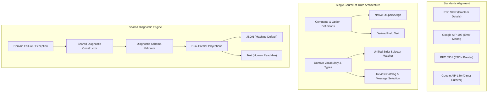

# Validation Report: Committing-to-Git Shared Diagnostic Contract Implementation Plan

**Target Document**: [`docs/plans/2026-09-21-committing-to-git-recovery.md`](../plans/2026-09-21-committing-to-git-recovery.md)  
**Evaluation Date**: 2026-09-21  
**Scope**: Outcome delivery validation, modern best-practice alignment, risk analysis, and proactive architectural recommendations.

---

## Executive Summary & Verdict

The implementation plan proposed in [`docs/plans/2026-09-21-committing-to-git-recovery.md`](../plans/2026-09-21-committing-to-git-recovery.md) is **exceptionally well-conceived, architecturally rigorous, and fully capable of delivering its intended outcomes**.

The plan addresses the root causes behind [issue #3](https://github.com/Hadden-Industries/agent-skills/issues/3) by expanding beyond narrow journey patches into a cohesive, repository-wide diagnostic contract across all 15 commands and dispatch boundaries. It upholds critical safety invariants: preserving explicit user commit authorization, maintaining immutable transaction state, eliminating silent selector matching bugs, and keeping public help and CLI parsing synchronized by construction.

| Evaluation Dimension | Rating | Verdict Summary |
| :--- | :--- | :--- |
| **Outcome Delivery** | **Pass (High Confidence)** | Requirements REQ-001 through REQ-011 and quality scenarios QA-001 through QA-005 are directly traceable to vertical slices SLICE-000 through SLICE-007. |
| **Modern Best Practice** | **Pass (Exemplary Alignment)** | Strong adherence to IETF RFC 9457, Google AIP-193/180/194, RFC 6901, and Node.js >= 24 zero-dependency capabilities. |
| **Delivery Risks** | **Medium (Manageable)** | Gaps identified around wire contract formalization, exit code taxonomy, stream channel semantics (stdout vs stderr), and test suite migration during direct cutover. |

---

## Part 1: Outcome Delivery Validation

### 1.1 Core Journey Recovery (REQ-001 - REQ-004)

The plan directly solves the four failure journeys reported in issue #3 without allowing agents to resort to source inspection or unguided trial-and-error:

1. **Journey 1: Failed-Check Acknowledgement (REQ-001 / AC-001 / SLICE-001)**
   - *Current failure*: `workflow commit` blocks on non-passing checks without structured receipt IDs and explicit remediation flags.
   - *Plan resolution*: Emits structured receipt IDs, identifies the explicit user approval requirement, and formats the valid continuation command (`workflow commit --acknowledge-failed-check <id>`).
   - *Integrity guardrail*: Tests verify that an agent cannot synthesize approval or bypass unacknowledged failures.
2. **Journey 2: Task-Lineage Evidence Submission (REQ-002 / AC-002 / SLICE-002)**
   - *Current failure*: Reusing task lineage requires a non-empty note, but the inline CLI flags provide no `--note` option and fail cryptically.
   - *Plan resolution*: Guides the consumer to the supported `--evidence-plan` JSON contract with complete minimal examples; supports truthful `read-current-task` provenance.
3. **Journey 3: Message Transport Recovery (REQ-003 / AC-003 / SLICE-003)**
   - *Current failure*: Direct subject transport rejection (`MESSAGE_REQUIRES_CHECKED_FILE`) names `message-input.txt` without providing the resolved transaction path or actionable command.
   - *Plan resolution*: Emits the exact transaction-owned path (`message-input.txt` or `content.json`) and the exact valid operation (`message check` or `message finalize`) conditioned on transaction authoring state.
4. **Journey 4: Structured Authoring Recovery (REQ-004 / AC-004 / SLICE-004)**
   - *Current failure*: Schema and validation failures in `content.json` yield generic errors that force agents to inspect internal validators.
   - *Plan resolution*: Preserves content schema v3 while returning failing JSON Pointers (RFC 6901), expected shapes, and bounded examples at each failing path.

### 1.2 Whole-Workflow Shared Contract (REQ-005, REQ-006 / SLICE-005 - SLICE-007)

- **Coverage**: Migrates all 15 commands (`workflow prepare`, `resume`, `extend`, `review-next`, `promote`, `check`, `check-detail`, `commit`, `verify`, `report-detail`, `publish`, `recover`, `cleanup`, `message check`, `message finalize`) and CLI dispatch.
- **Direct Cutover (DEC-007)**: Eliminates legacy adapters, shims, and shadow error envelopes. While aggressive, this is justified under AIP-180 because the skill helper operates within a closed, controlled ecosystem with co-delivered consumers.
- **Truthful State Distinctions**: Crucially, uncertain mutation states (e.g., Git process timeout or remote push in doubt) are strictly classified as `unknown` requiring recovery (`workflow recover`), never defaulted to absent or auto-retried.

### 1.3 Parser, Boundary, and Identity Foundations (REQ-007 - REQ-010 / SLICE-000)

- **Argument Parsing & `--` Delimiter (DEC-008)**:
  - *Observed bug confirmed*: Running `workflow check -- node --transaction package.json` currently causes dispatch to naively inspect child arguments and throw `UNSUPPORTED_ATTEMPT_VERSION`.
  - *Plan resolution*: Parses helper arguments once; treats arguments following `--` as completely opaque child argv.
- **Synchronized Help by Construction (DEC-009)**: Derives both argument parsing and help output from a single command definition map, eliminating the existing three-way drift across parsers, CLI help, and `tests/committing-to-git/help-contract.test.mjs`.
- **Authoritative Identity (DEC-010)**: Adds `--version` reading packaged metadata, solving the current `UNKNOWN_COMMAND` failure when queried outside a Git repository.

### 1.4 Strict Semantic Normalization (REQ-010, REQ-011 / SLICE-002)

- **DRY Domain Vocabulary (DEC-011)**: Consolidates duplicate declarations of `EVIDENCE_POLICIES`, `BASIS_KINDS`, `REUSE_BASIS_KINDS`, `ARRAY_SELECTOR_FIELDS`, and `MAXIMUM_BASIS_NOTE_BYTES` currently duplicated across `reviewCatalog.js` and `changeSelection.js`.
- **Strict Selector Matching (DEC-012)**: Fixes a critical latent defect in `reviewCatalog.js` where non-matching selector values were silently ignored if at least one value matched. The unified matcher rejects *any* unmatched explicit selector value.

---

## Part 2: Modern Best-Practice Alignment

The proposed plan adheres closely to modern engineering principles across distributed systems, CLI interface design, and agentic workflows:



### Key Architectural Strengths

1. **RFC 9457 & AIP-193 Hybrid Model**: Adapts the best of API problem details (standardized machine error codes, structured details, explicit remediation) to a CLI environment without inappropriate HTTP abstractions.
2. **Deterministic Dual Projection (DEC-006)**: Treating JSON and text as pure projections of a single authoritative diagnostic object eliminates discrepancies between what humans and LLMs perceive.
3. **Zero-Dependency Architecture**: Leverages Node 24 standard library primitives (`node:util`, `node:crypto`, `node:fs`, `node:test`) without taking on external CLI framework bloat.
4. **Bounded Diagnostics**: Protects against memory exhaustion and terminal flooding by capping error payloads, string lengths, and output segments.

---

## Part 3: Critical Delivery Risks & Gaps

While the plan's principles are sound, several key operational details are deferred to "at implementation time," introducing delivery risks:

### Risk 1: Underspecified Diagnostic Wire Schema
The plan outlines diagnostic fields conceptually (codes, explanations, recovery commands, pointers), but does not provide an explicit JSON Schema for the diagnostic envelope. Without a pinned schema, developers across SLICE-001 through SLICE-007 may introduce inconsistent field names (e.g., `recoveryCommand` vs `recovery.command`, `details` vs `problemDetails`).

### Risk 2: Exit Code Ambiguity Across Commands
The plan notes that exit codes must distinguish outcomes (0=success, 1=resumable/stopped, 2=invalid input, 4=unknown), but existing commands have divergent exit code semantics (e.g., `workflow check` exit 1 represents a failed child test, whereas `workflow commit` exit 1 represents Git safely not committing). A standardized exit code taxonomy mapped across all 15 commands is missing.

### Risk 3: Undefined Stream Semantics (Stdout vs Stderr)
Currently, `createCommitWorkflow.js` writes text summaries to `stderr` and JSON to `stdout`, while `checkMessageWorkflow.js` writes JSON to `stdout` only, and dispatch writes to both. The plan states: *"Keep stdout/stderr responsibilities and exit codes consistent."* However, it does not define what those responsibilities are. If machine-readable JSON is emitted to `stdout` on error, shell pipelines (`... | jq`) may fail or misroute data.

### Risk 4: Intermediate Test Suite Breakage
Under the "direct cutover with no shims" mandate, existing tests (over 30 test files) that assert on legacy error messages will fail as soon as SLICE-001 introduces the new contract. Without an explicit incremental test migration strategy, the test suite will remain red throughout slices 1 through 7, hampering continuous verification.

---

## Part 4: Proactive Recommendations for Modern Best Practice

To elevate the implementation plan from solid to state-of-the-art, the following concrete enhancements should be adopted:

### 1. Codify the Canonical Diagnostic JSON Schema (AIP-193 / RFC 9457)

Define the exact schema before implementing SLICE-001. Standardize on the following envelope:

```json
{
  "$schema": "https://json-schema.org/draft/2020-12/schema",
  "type": "object",
  "required": ["schemaVersion", "status", "code", "message", "disposition"],
  "properties": {
    "schemaVersion": { "type": "integer", "const": 1 },
    "status": { "type": "string", "enum": ["error", "warning"] },
    "code": { "type": "string", "pattern": "^[A-Z0-9_]+$" },
    "message": { "type": "string" },
    "disposition": {
      "type": "string",
      "enum": ["correct-input", "human-decision", "recover-state", "terminal"]
    },
    "recovery": {
      "type": "object",
      "properties": {
        "nextAction": { "type": ["string", "null"] },
        "requiredInputs": { "type": "array", "items": { "type": "string" } },
        "command": { "type": ["string", "null"] },
        "reference": { "type": ["string", "null"] }
      }
    },
    "details": {
      "type": "array",
      "items": {
        "type": "object",
        "required": ["type"],
        "properties": {
          "type": {
            "type": "string",
            "enum": ["bad-request", "unmet-prerequisite", "resource-info", "internal-error"]
          },
          "pointer": { "type": "string" },
          "field": { "type": "string" },
          "value": {},
          "expectedShape": { "type": "string" },
          "receiptId": { "type": "string" },
          "description": { "type": "string" }
        }
      }
    }
  }
}
```

### 2. Standardize Stream Protocol for Machine and Human Consumption

Adopt standard modern POSIX/CLI stream channel separation:

| Invocation Mode | Exit Status | `stdout` Contents | `stderr` Contents |
| :--- | :--- | :--- | :--- |
| **`--format json` (Default)** | `0` (Success) | Canonical result JSON payload | *Empty* (or progress logs if verbose) |
| **`--format json` (Default)** | `> 0` (Failure) | *Empty* | Diagnostic JSON payload |
| **`--format text`** | `0` (Success) | Human-readable success summary | *Empty* |
| **`--format text`** | `> 0` (Failure) | *Empty* | Human-readable formatted diagnostic |

> [!IMPORTANT]
> **Why this matters for agents**: Emitting diagnostic JSON to `stderr` on non-zero exit codes guarantees that `stdout` remains clean for pipe processing, while agents inspecting tool execution outputs immediately see the structured failure without payload ambiguity.

### 3. Establish a Uniform Exit Code Taxonomy

Replace ad-hoc exit codes with a standardized 6-state taxonomy across all 15 commands:

```js
export const ExitCode = Object.freeze({
  SUCCESS: 0,             // Operation succeeded (or completed with advisory warnings)
  KNOWN_REJECTION: 1,     // Safe, expected domain refusal (e.g. child check failed, Git remote rejected push)
  INVALID_INPUT: 2,       // Syntactic failure (unknown flag, missing required option, malformed JSON)
  PRECONDITION_FAILED: 3, // Semantic block (unmet prerequisite, unacknowledged failed receipts, lock held)
  UNKNOWN_OUTCOME: 4,     // In-doubt mutation requiring recovery (timeout, killed process, uncertain commit)
  INTERNAL_ERROR: 5,      // Unexpected internal exception / system failure
});
```

### 4. Zero-Dependency Subcommand Parsing via `node:util.parseArgs`

Implement `util.parseArgs` with strict subcommand separation and opaque child argument handling:

```javascript
import { parseArgs } from "node:util";

export function parseCliArguments(argv, commandRegistry) {
  // 1. Check top-level help / version
  if (argv.length === 0 || (argv.length === 1 && (argv[0] === "-h" || argv[0] === "--help"))) {
    return { kind: "top-level-help" };
  }
  if (argv.length === 1 && (argv[0] === "-v" || argv[0] === "--version")) {
    return { kind: "version" };
  }

  // 2. Resolve 2-token command (e.g., 'workflow prepare')
  const commandKey = argv.slice(0, 2).join(" ");
  const commandDef = commandRegistry.get(commandKey);
  if (!commandDef) {
    return { kind: "unknown-command", token: commandKey };
  }

  const restArgv = argv.slice(2);
  if (restArgv.length === 1 && (restArgv[0] === "-h" || restArgv[0] === "--help")) {
    return { kind: "command-help", commandDef };
  }

  // 3. Handle child argv boundary (--)
  const separatorIndex = restArgv.indexOf("--");
  const helperArgv = separatorIndex >= 0 ? restArgv.slice(0, separatorIndex) : restArgv;
  const childArgv = separatorIndex >= 0 ? restArgv.slice(separatorIndex + 1) : [];

  if (commandDef.acceptsChildCommand && separatorIndex < 0) {
    throw new DiagnosticError("CHILD_COMMAND_REQUIRED", "Command requires '-- <executable> [args...]'");
  }

  // 4. Parse helper options strictly with native parseArgs
  const { values } = parseArgs({
    args: helperArgv,
    options: commandDef.options,
    strict: true,
    allowPositionals: false,
  });

  return {
    kind: "execute",
    commandDef,
    options: values,
    childArgv,
  };
}
```

### 5. Native Error Cause Chaining (`Error.prototype.cause`)

In Node 24, wrap low-level I/O, Git, and parser errors using standard error cause chaining:

```javascript
export class WorkflowDiagnosticError extends Error {
  /**
   * @param {string} code
   * @param {string} message
   * @param {object} options
   * @param {Error} [options.cause]
   * @param {string} [options.disposition]
   * @param {Array<object>} [options.details]
   */
  constructor(code, message, { cause, disposition = "correct-input", details = [], exitCode = 2 } = {}) {
    super(message, { cause });
    this.name = "WorkflowDiagnosticError";
    this.code = code;
    this.disposition = disposition;
    this.details = details;
    this.exitCode = exitCode;
  }
}
```

*Benefit*: The application captures the full native stack trace and internal root cause for test logs and debug transcripts, while the user/agent-facing renderer emits only bounded, sanitized problem details.

### 6. Actionable Recovery Commands for Agent Autonomy

To maximize agent recovery without guesswork:
- **Pre-interpolate Known State**: In `recovery.command`, interpolate the exact path of the transaction:  
  `workflow resume --transaction .git/committing-to-git/tx-001.json` instead of a template placeholder `<transaction.json>`.
- **Distinguish Human-Only Actions**: When `disposition: "human-decision"` (e.g., commit authorization or acknowledging a failed test check), set `recovery.command: null` and specify `recovery.requiredInputs: ["user-approval"]`. This explicitly signals to LLMs that they must ask the user rather than attempting to forge an authorization flag.

---

## Part 5: Implementation Readiness Checklist

Before authorizing execution, the plan should incorporate the following checkpoints:

- [ ] **Contract Specification Frozen**: Diagnostic JSON schema committed under `src/committing-to-git/schema/diagnosticResult.schema.json`.
- [ ] **Complete Producer Inventory**: Tabulate all 15 commands and every thrown exception / non-success state mapped to its new code, exit code, and disposition.
- [ ] **Test Migration Harness**: Add `assertDiagnostic(result, expectedCode, { disposition, exitCode })` to `tests/committing-to-git/harness.mjs` to streamline test updates across slices.
- [ ] **ASCII Compliance Gate**: Ensure all updated canonical reference files under `skills/committing-to-git/references/` are strictly ASCII (`0x00-0x7F`) per repository rules.
- [ ] **Skill Word & Byte Budgets**: Verify that updates to `skills/committing-to-git/SKILL.md` remain under 1,500 words and 12 KiB.

---

## Conclusion

The implementation plan is sound, follows high-assurance software engineering principles, and will successfully deliver its outcomes. Incorporating the formal diagnostic schema, uniform exit code taxonomy, explicit stream protocol, and native Node 24 error cause chaining will ensure the implementation exemplifies modern best practices.
